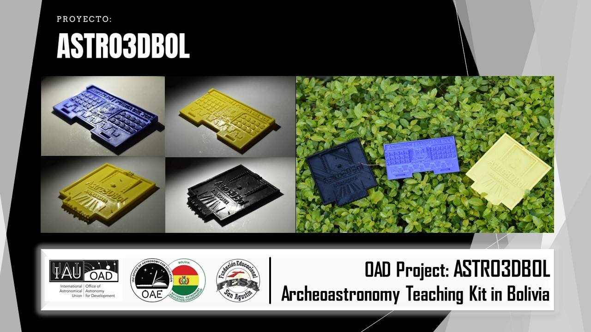

# Astro3DBol

> **Astro3DBol** is an educational Bolivian project that combines astronomy, 3D technology, and cultural heritage to promote inclusive and contextualized learning of Tiwanakotan archaeoastronomy.

---

## Project Mission

Astro3DBol aims to develop educational 3D models for use in introductory astronomy classes, focusing on archaeoastronomy in the context of the Tiwanakotan culture of Bolivia.

The main goals of the project are:

- To create **free educational kits** for teachers, students, and enthusiasts of astronomy and pre-Incan cultures.
- To strengthen interdisciplinary learning through **workshops, visual guides, and tactile models**.
- To involve students and professionals in the design and fabrication of 3D models.

> The project is supported by Fundación FESA, the Office of Astronomy for Development (IAU-OAD), and NAEC Bolivia.

---

## Educational Models

### Model A: Kalasasaya Temple

An architectural representation of the Kalasasaya solar temple, a central structure of the Tiwanaku archaeological site.

**Key Concepts:**

- Positional and temporal astronomy.
- Observation of solstices and equinoxes.
- Solar movement throughout the year.

**Interactions:**

- Visual
- Tactile
- Simulated artificial lighting

---

### Model B: Gate of the Sun

Iconographic representation of the Tiwanakotan conception of time, through the symbolic Gate of the Sun.

**Key Concepts:**

- Cyclical time and astronomical symbolism.
- Iconographic analysis of the Tiwanakotan calendar.

**Interactions:**

- Visual
- Tactile
- Shading/Drawing

---

### Model C: Andean Constellations

Printable worksheets with Andean constellations for interactive classroom use.

**Key Concepts:**

- Sky-culture relationships in the Andes.
- Recognition of cultural shapes in the night sky.

**Interactions:**

- Visual
- Guided drawing activity

---

## Audiovisual Resources

### Instructional Video: How to Use the Educational Kit

This video provides a practical tutorial on how to use the Astro3DBol kit in educational settings.

---

### Results & Impact Video

A presentation of community outreach, workshops, and key results from Astro3DBol, as reported to the IAU-OAD.

---

## Additional Resources

- [Official Website](https://sites.google.com/view/astro3dbol)

---

## Contact

**Project Coordinator:**  
Gabriel Jaimes Illanes  
📧 [g.jaimes.illanes@gmail.com](mailto:g.jaimes.illanes@gmail.com)

---

**The project is registered with SENAPI for intellectual property rights under Administrative Resolution "5-033/2023".**

© 2025 Astro3DBol • Project supported by FESA, NAEC Bolivia, and the IAU Office of Astronomy for Development (OAD)
