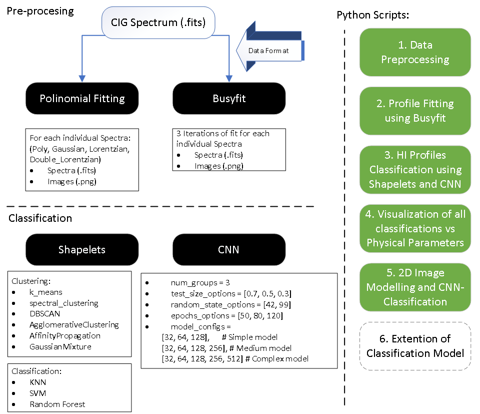
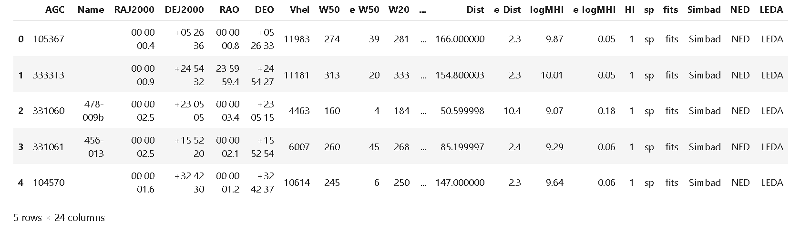
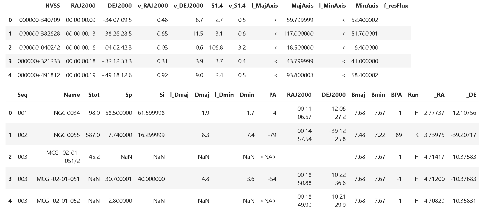
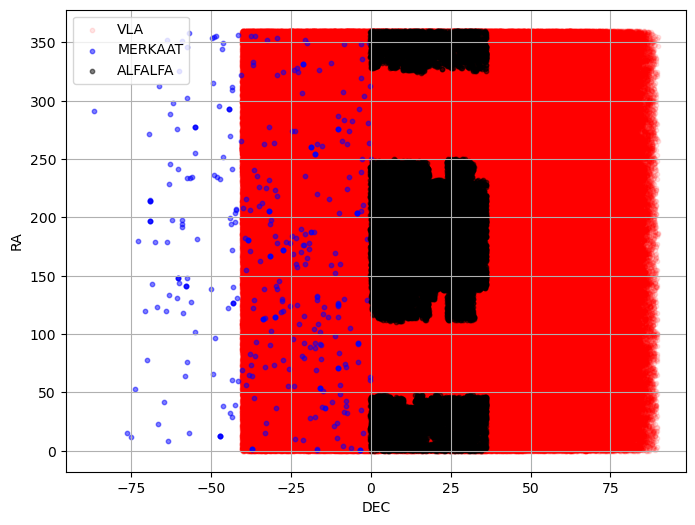
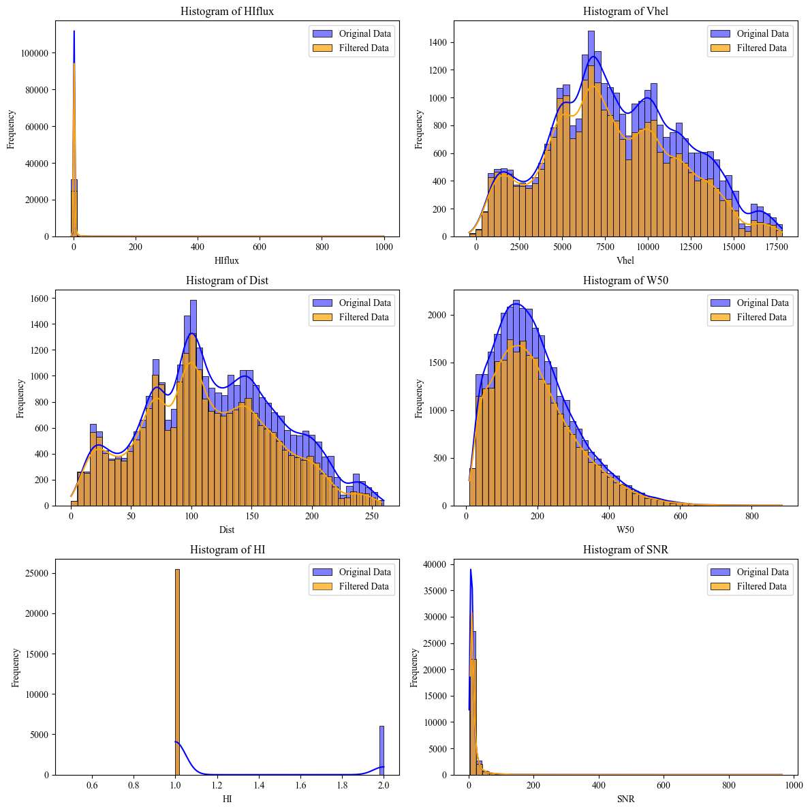
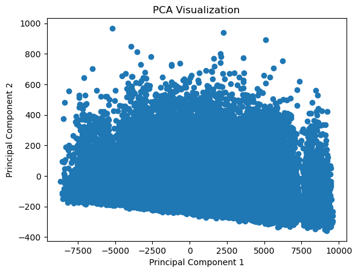
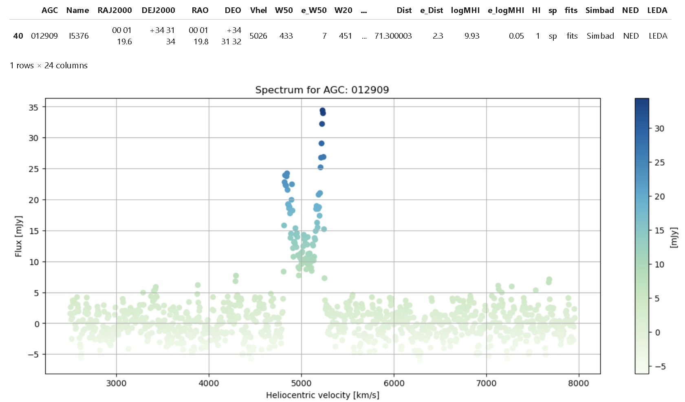
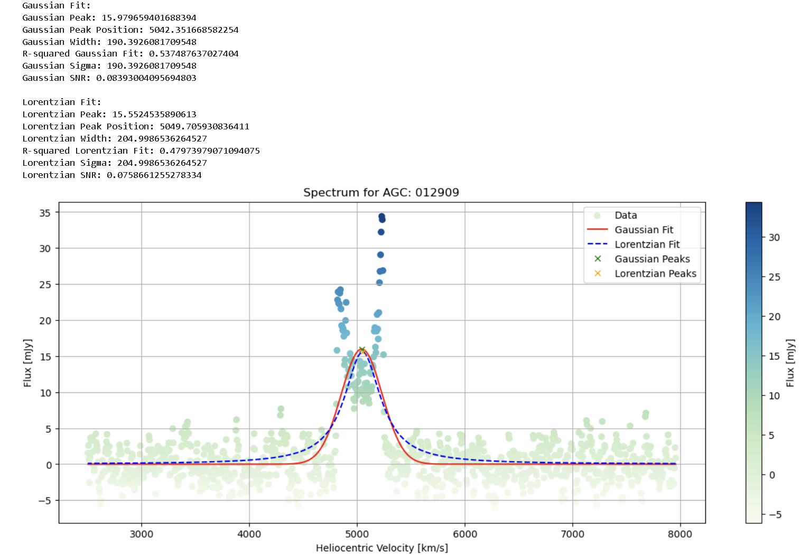
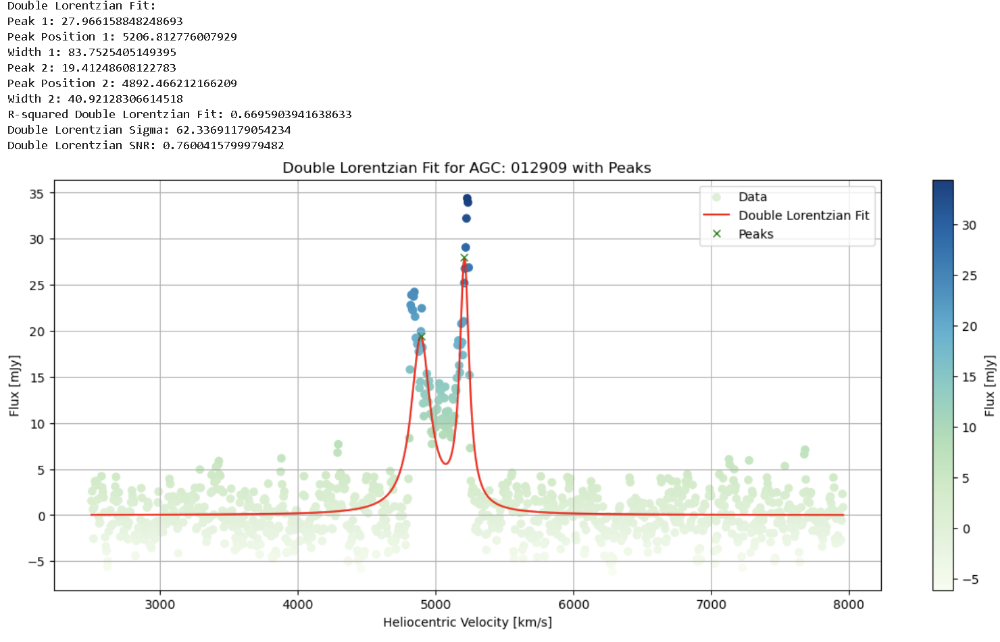
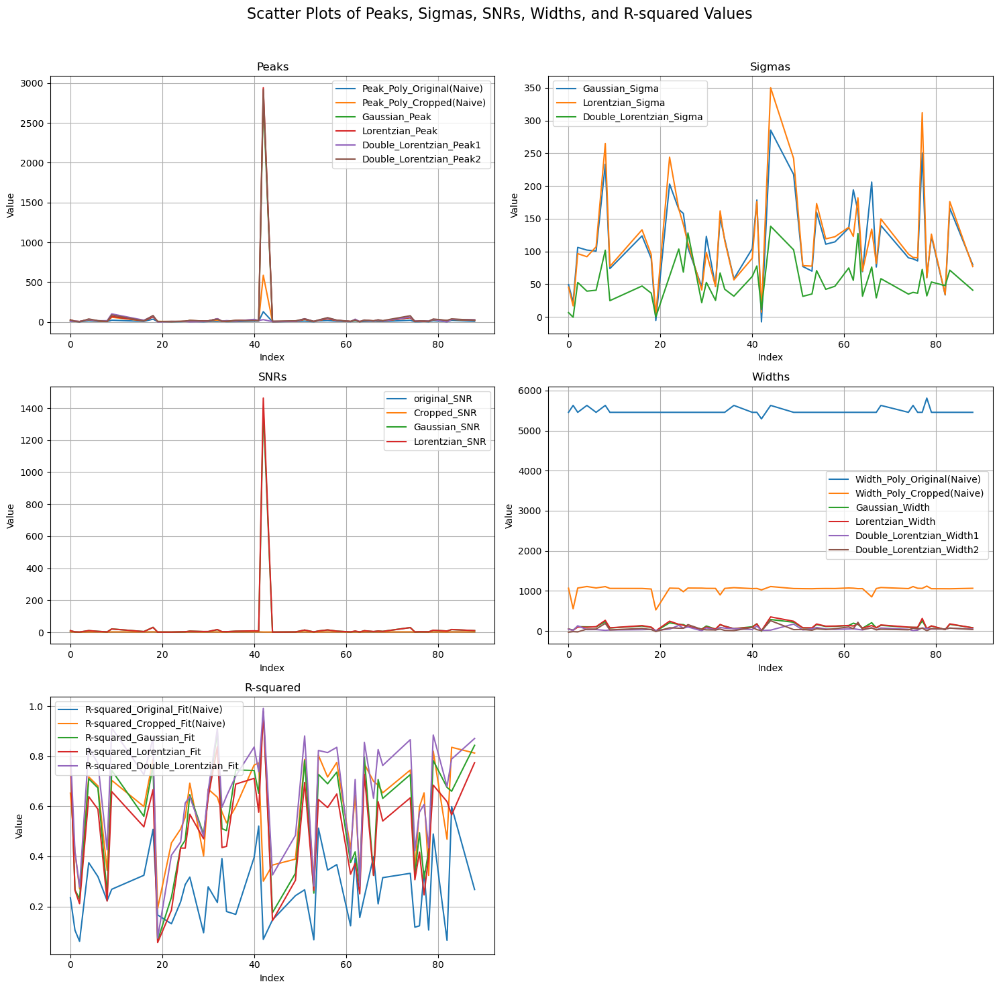

**Introduction**

> **Note:** We present a repository for an HI Profile Classification project developed by *G. Jaimes* (gjaimes@iaa.es) for the AMIGA (*Analysis of the Interstellar Medium in Isolated GAlaxies*) research group at the *Institute of Astrophysics of Andalusía* (IAA).

Our project page is dedicated to the classification of neutral atomic hydrogen (HI) spectral profiles using advanced Machine Learning (ML) techniques. Our research focuses on harnessing the potential of ML to analyze and classify HI profiles, which are crucial for understanding the formation and evolution of galaxies. This project explores the application of Convolutional Neural Networks (CNN) and other ML algorithms to large radio astronomy datasets, with the aim of enhancing the quality and efficiency of scientific analysis in the field.

Link to: [GitHub Repository](https://github.com/gabojaimesillanes/JAE-Intro-ICU-2024-Gabriel-Jaimes-IAA)

Link to: [ADASS - Congress](https://pretalx.com/adass2024/talk/review/H7WC8KKTVYKFNRSK8FZE38C8QHGAYA8B)




# A. HI Classification - CNN and Machine Learning

### Data Preprocessing
The foundation of the project lies in the *meticulous preprocessing* of HI spectral data. We utilized the **Busyfit** package for fitting HI spectrum profiles, a critical step in ensuring accurate data representation. The profiles were further refined through iterative fitting using polynomial, Gaussian, and double-Lorentzian models. This preprocessing stage is vital for preparing the data for subsequent analysis and classification, ensuring that the input to our models is as precise and informative as possible.

### Step 1: Initial Data Download | ALFALFA - VIZIER

In Step 1, an initial inspection of the data in the catalog is performed. These are tabulated in Vizier, with individual access to the HI spectrum. Spatial cross-matching with data from other radio astronomy-related catalogs, MERKAAT, and VLA, is generated. The location of celestial objects from each catalog and their intersection with a tolerance of 1 [arcmin] are visualized. Then, an exploratory analysis of the ALFALFA catalog data is conducted based on the parameters: 'Vhel', 'HIflux', 'Dist', 'W50', 'W20', 'logMHI'. Finally, with these data, a PCA analysis is generated.
a PCA analysis is generated.
a PCA analysis is generated.
PCA analysis is generated.
A analysis is generated.

1. Firt, we install all necesarry packages

``` python 
    !pip install astroquery pandas matplotlib astropy requests beautifulsoup4 scipy seaborn scikit-learn openpyxl
```
2. Following, libraries are loaded
``` python
    from astroquery.vizier import Vizier
    import pandas as pd
    import os
    import requests
    from bs4 import BeautifulSoup
    from urllib.parse import urljoin
    import matplotlib.pyplot as plt
```
3. Using Vizier Python library, route to ALFALFA data is defined, loaded into pandas and first 5 row displayed.
``` python
    route = "J/ApJ/861/49"               
    vizier = Vizier(columns=['*'], row_limit=-1)       #Access from Vizier Portal.   To include more than 50 rows include:  (row_limit=-1)
    data = vizier.get_catalogs(route)
    data = data[0].to_pandas()           #Format to Panda

    display(data.head())                 #First 5 Rows are shown
```

4. We load also VLA and MerKAAT catalogs
```python
    route = "VIII/65/nvss"  # VLA
    vizier = Vizier(columns=['*'])
    data = vizier.get_catalogs(route)
    data = data[0].to_pandas()

    display(data.head())  

    route = "J/ApJS/257/35/table3"  #  MERKAAT
    vizier = Vizier(columns=['*'])
    data = vizier.get_catalogs(route)
    data = data[0].to_pandas()

    display(data.head()) 
```

5. Next, we make a coordinates cross matchingfor ALFALFA, VLA and MERKAAT catalogs:
    - Angle tolerance of 1 arcmin = 60 arsecs
    - Fortmat of Coordinates in J2000 (ALFALFA & VLA) , and icrs (MERKAAT)
    - Plot shows location of each object

```python
    from astroquery.vizier import Vizier
    import pandas as pd
    from astropy.coordinates import SkyCoord
    from astropy import units as u

    # -------- 1. Retrieving data from Vizier catalog -----------

    route_alfalfa = "J/ApJ/861/49/table2"  # Route of the ALFALFA catalog
    route_vla = "VIII/65/nvss"  # Route of the VLA catalog
    route_merkaat = "J/ApJS/257/35/table3"  # Route of the Merkaat catalog

    vizier = Vizier(columns=['*'], row_limit=-1)

    data_alfalfa = vizier.get_catalogs(route_alfalfa)  # ALFALFA Catalog
    data_alfalfa = data_alfalfa[0].to_pandas()
    data_vla = vizier.get_catalogs(route_vla)  # VLA Catalog
    data_vla = data_vla[0].to_pandas()
    data_merkaat = vizier.get_catalogs(route_merkaat)  # Merkaat Catalog
    data_merkaat = data_merkaat[0].to_pandas()

    print('Number of objects:')
    print(f'ALFALFA: {len(data_alfalfa)}')
    print(f'VLA: {len(data_vla)}')
    print(f'MERKAAT: {len(data_merkaat)}')

    # -------- 2. Converting coordinates -----------

    alfa_coords = SkyCoord(ra=data_alfalfa['RAJ2000'], dec=data_alfalfa['DEJ2000'], unit=(u.hourangle, u.deg))
    vla_coords = SkyCoord(ra=data_vla['RAJ2000'], dec=data_vla['DEJ2000'], unit=(u.hourangle, u.deg))
    merkaat_coords = SkyCoord(ra=data_merkaat['_RA'], dec=data_merkaat['_DE'], unit=(u.hourangle, u.deg))
    merkaat_coords = merkaat_coords.transform_to('fk5')  # Conversion from ICRS to J2000

    # -------- 3. Cross matching catalogs -----------

    # Cross matching between ALFALFA and VLA
    idx_alfa, idx_vla, _, _ = alfa_coords.search_around_sky(vla_coords, 60*1000*u.mas)
    if len(idx_alfa) > 0 and len(idx_vla) > 0:  # Verify if there are matches
        valid_idx_alfa = idx_alfa[idx_alfa < len(data_alfalfa)]
        valid_idx_vla = idx_vla[idx_vla < len(data_vla)]
        
        alfa_matched_vla = data_alfalfa.iloc[valid_idx_alfa].reset_index(drop=True)
        vla_matched = data_vla.iloc[valid_idx_vla].reset_index(drop=True)
        alfalfa_plus_vla = pd.concat([alfa_matched_vla, vla_matched], axis=1)
    else:
        alfalfa_plus_vla = pd.DataFrame()

    # Cross matching between ALFALFA and Merkaat
    idx_alfa, idx_merkaat, _, _ = alfa_coords.search_around_sky(merkaat_coords, 60*1000*u.mas)
    if len(idx_alfa) > 0 and len(idx_merkaat) > 0:  # Verify if there are matches
        valid_idx_alfa = idx_alfa[idx_alfa < len(data_alfalfa)]
        valid_idx_merkaat = idx_merkaat[idx_merkaat < len(data_merkaat)]
        
        alfa_matched_merkaat = data_alfalfa.iloc[valid_idx_alfa].reset_index(drop=True)
        merkaat_matched = data_merkaat.iloc[valid_idx_merkaat].reset_index(drop=True)
        alfalfa_plus_merkaat = pd.concat([alfa_matched_merkaat, merkaat_matched], axis=1)
    else:
        alfalfa_plus_merkaat = pd.DataFrame()

    # Cross matching between VLA and Merkaat
    idx_vla_merkaat, idx_merkaat_vla, _, _ = vla_coords.search_around_sky(merkaat_coords, 60*1000*u.mas)
    if len(idx_vla_merkaat) > 0 and len(idx_merkaat_vla) > 0:  # Verify if there are matches
        valid_idx_vla_merkaat = idx_vla_merkaat[idx_vla_merkaat < len(data_vla)]
        valid_idx_merkaat_vla = idx_merkaat_vla[idx_merkaat_vla < len(data_merkaat)]
        
        vla_plus_merkaat = data_vla.iloc[valid_idx_vla_merkaat].reset_index(drop=True)
        merkaat_plus_vla = data_merkaat.iloc[valid_idx_merkaat_vla].reset_index(drop=True)
        vla_plus_merkaat = pd.concat([vla_plus_merkaat, merkaat_plus_vla], axis=1)
    else:
        vla_plus_merkaat = pd.DataFrame()

    # -------- 4. Plotting on Sky -----------

    plt.figure(figsize=(8, 6))
    plt.scatter(vla_coords.dec, vla_coords.ra, s=10, alpha=0.1, color="red", label='VLA')
    plt.scatter(merkaat_coords.dec, merkaat_coords.ra, s=10, alpha=0.5, color="blue", label='MERKAAT')
    plt.scatter(alfa_coords.dec, alfa_coords.ra, s=10, alpha=0.5, color="black", label='ALFALFA')
    plt.xlabel('DEC')
    plt.ylabel('RA')
    plt.legend()
    plt.grid(True)
    plt.show()

    # -------- 5. Printing and displaying results -----------

    print("Matches between ALFALFA and VLA:")
    print(len(alfalfa_plus_vla))
    print("\nMatches between ALFALFA and Merkaat:")
    print(len(alfalfa_plus_merkaat))
    print("\nMatches between VLA and Merkaat:")
    print(len(vla_plus_merkaat))

    display(alfalfa_plus_vla.head())
    display(alfalfa_plus_merkaat.head())
    display(vla_plus_merkaat.head())

```

Number of objects:
ALFALFA: 31502
VLA: 1773484
MERKAAT: 349

6. For the next part, we develop an exploratory analysis by quartils of data collected in ALFALFA Catalog
```python
    import seaborn as sns
    import matplotlib.pyplot as plt
    from astroquery.vizier import Vizier
    import pandas as pd

    # Set the desired row limit
    Vizier.ROW_LIMIT = -1  # -1 for no limit, or a specific number for a fixed limit
    plt.rcParams['font.family'] = 'Times New Roman'

    # ALFALFA catalog route
    route_alfalfa = "J/ApJ/861/49/table2"

    # Get the catalog
    data_alfalfa = Vizier.get_catalogs(route_alfalfa)
    data_alfalfa = data_alfalfa[0].to_pandas()

    # Define ranges for each parameter (you can change the values as needed)
    range_filters = {
        'HIflux': (float('-inf'), float('inf')),
        'Vhel': (float('-inf'), float('inf')),
        'Dist': (float('-inf'), float('inf')),
        'W50': (float('-inf'), float('inf')),
        'HI': (0,1),
        'SNR': (float('-inf'), float('inf'))
    }

    num_bins = 50  # Adjust this value as needed

    # Filter the data according to the defined ranges
    filtered_data = data_alfalfa.copy()
    for column, (min_val, max_val) in range_filters.items():
        filtered_data = filtered_data[(filtered_data[column] >= min_val) & (filtered_data[column] <= max_val)]

    # Save the filtered data to an Excel file
    filtered_data.to_excel('filtered_data_alfalfa.xlsx', index=False)

    # Descriptive statistics of the filtered DataFrame
    statistics = filtered_data.describe()

    # Create subplots and plots
    fig, axes = plt.subplots(3, 2, figsize=(12, 12))
    axes = axes.flatten()

    columns_to_plot = ['HIflux', 'Vhel', 'Dist', 'W50', 'HI', 'SNR']

    # Define the number of bins
    for i, column in enumerate(columns_to_plot):
        sns.histplot(data=data_alfalfa, x=column, ax=axes[i], bins=num_bins, kde=True, color='blue', label='Original Data', alpha=0.5)
        sns.histplot(data=filtered_data, x=column, ax=axes[i], bins=num_bins, kde=True, color='orange', label='Filtered Data', alpha=0.7)
        axes[i].set_title(f'Histogram of {column}')
        axes[i].set_xlabel(column)
        axes[i].set_ylabel('Frequency')
        axes[i].legend()

    for j in range(len(columns_to_plot), len(axes)):
        axes[j].axis('off')

    plt.tight_layout()
    plt.show()

```

7. Finally, to find correlations between ALFALFA columns, a PCA Analysis is made for: **'Vhel', 'HIflux', 'Dist', 'W50', 'W20', 'logMHI'**
```python
    import matplotlib.pyplot as plt
    from sklearn.decomposition import PCA

    def plot_pca(X, n_components):

        pca = PCA(n_components=n_components)
        pca.fit(X)
        X_pca = pca.transform(X)
        
        # Plot PCA visualization
        plt.scatter(X_pca[:, 0], X_pca[:, 1])
        plt.xlabel('Principal Component 1')
        plt.ylabel('Principal Component 2')
        plt.title('PCA Visualization')
        plt.show()

    statistics = data_alfalfa.describe()

    columns_to_plot = ['Vhel', 'HIflux', 'Dist', 'W50', 'W20', 'logMHI']
    X_selected_columns = data_alfalfa[columns_to_plot]
    plot_pca(X_selected_columns, n_components=2)

```


### Step 2: HI Emission Spectrum Download | ALFALFA - VIZIER

---

In Step 2, the individual spectra are downloaded in .fits format for each row of the catalog. For this, the library “lib_prepross.py” is used, thus downloading from the “sp” folder of the Vizier repository.

**Spectrum catalog: [Spectrum Catalog](http://cdsarc.cds.unistra.fr/ftp/cats/J/ApJ/861/49//)**

1. Installing all packages needed

```python
    import re
    import os
    import numpy as np
    from astropy.io import fits
    import matplotlib.pyplot as plt
```
2. Next, Spectrum data is downloaded on *.fits* format from *"ALFALFA extragalactic HI source catalog; corrected version: (August 2019)[spectrum/fits]spectrum"*. For doing this we call the function "download_fits_files" in the "lib_prepross" library (lib_prepross.py).

Files .fits are located at Vizier directory *J/ApJ/861/49/sp*
### Step 3: Statistics for an Individual spectrum | PYTHON 3.0
***
In Step 3, an individual analysis per ALFALFA object is conducted. It begins with linking between the .fits spectra and the tabulated information from Vizier, thereby visualizing a reference spectrum. Following this, the aim is to identify a “peak” of reference that will correspond to the HI emission line in the spectrum, done by a 1st polynomial fit of the “original” data. The major peak is located, and reference parameters are obtained that will be used subsequently as a “cropped” window for the region of interest. A 2nd polynomial fit is made on the “cropped” data, and quality statistics for each fit are obtained. Then, for the “cropped” data window, it is analyzed which type of function fits best, applying a Gaussian and Lorentzian fit, and based on this, parameters of “Peak”, “Peak Position”, “Width”, and fit quality are obtained. Finally, as it involves a line shifted by the Doppler effect due to galaxy rotation, a double Lorentzian fit is analyzed for the “cropped” window, and parameters of interest are obtained.
1. A sample spectrum is visualized. Here Flux vs Heliocentric Velocity is ploted: 
```python
    import os
    from astropy.io import fits
    import matplotlib.pyplot as plt
    from astroquery.vizier import Vizier

    # -------- 1. Retrieving data from Vizier catalog -----------

    route = "J/ApJ/861/49"               
    vizier = Vizier(columns=['*'], row_limit=-1)  # Access from Vizier Portal. To include more than 50 rows include: (row_limit=-1)
    data = vizier.get_catalogs(route)
    data = data[0].to_pandas()     

    folder_path = "sp"
    agc_identifier = '012909'  # AGC identifier
    result = data[data['AGC'] == agc_identifier]

    display(result)

    # -------- 2. Searching for the FITS file corresponding to the AGC identifier -----------

    fits_files = [f for f in os.listdir(folder_path) if f.startswith('A') and f.endswith('.fits') and f.split('.')[0][1:] == agc_identifier]
    if len(fits_files) == 0:
        print("No FITS files found for AGC identifier:", agc_identifier)
        exit()

    fits_file = fits_files[0]
    file_path = os.path.join(folder_path, fits_file)
    data = fits.getdata(file_path)

    v_helio = data['VHELIO']  # Heliocentric velocity
    flux = data['FLUX']  # Flux

    # -------- 3. Plotting the spectrum -----------

    plt.figure(figsize=(15, 6))
    plt.scatter(v_helio, flux, c=flux, cmap='GnBu', marker='o')
    plt.colorbar(label='[mJy]')
    plt.xlabel(r'Heliocentric velocity [km/s]')
    plt.ylabel(r'Flux [mJy]')
    plt.grid(True)
    plt.title('Spectrum for AGC: ' + agc_identifier)  # Add the AGC identifier to the title of the plot
    plt.show()

```

2. An First Polinomial fitting is made to the spectrum to locate HI lines:
 - A search of reference location of the HI line is made, using the peak of the fitting data.
 - A tolerance window in [km/s] is allocated to each side of peak's center.<br>
 
Once the windows is stablished we "crop" the data for Heliocentric velocity. Following, a Second *Polinomial Fitting* is made to the *cropped data*. Then is plotted:
 - Scatter of original data
 - First polinomial fitting
 - Second polinomial fitting of cropped data
We generate a *preliminary statistics* of the curve of a spectrum

```python
    import numpy as np
    import matplotlib.pyplot as plt
    from sklearn.metrics import mean_squared_error, r2_score

    # -------- 1. Retrieving data from Vizier catalog -----------

    route = "J/ApJ/861/49"               
    vizier = Vizier(columns=['*'], row_limit=-1)  # Access from Vizier Portal. To include more than 50 rows include: (row_limit=-1)
    data = vizier.get_catalogs(route)
    data = data[0].to_pandas()     
    agc_identifier = '012909'
    result = data[data['AGC'] == agc_identifier]
    display(result)

    # -------- 2. Polynomial fitting to the data -----------

    # Polynomial Fit
    degree = 15  # Degree of fitting
    coefficients = np.polyfit(v_helio, flux, degree)  
    polynomial_function = np.poly1d(coefficients)

    flux_fit = polynomial_function(v_helio)

    # Find peak
    peak_max_index = np.argmax(flux_fit)
    tolerance = 100
    peak_base = np.arange(peak_max_index - tolerance, peak_max_index + tolerance)

    v_helio_cropped = v_helio[peak_base]  
    flux_cropped = flux[peak_base]

    # -------- 3. New polynomial fitting to cropped data -----------

    # New Polynomial Fitting to Cropped Data
    degree = 15  
    coefficients_cropped = np.polyfit(v_helio_cropped, flux_cropped, degree)
    polynomial_function_cropped = np.poly1d(coefficients_cropped)
    flux_fit_cropped = polynomial_function_cropped(v_helio_cropped)

    # Calculate Mean Squared Error and R-squared for the original fit and cropped fit
    mse_original = mean_squared_error(flux, flux_fit)
    mse_cropped = mean_squared_error(flux_cropped, flux_fit_cropped)
    r2_original = r2_score(flux, flux_fit)
    r2_cropped = r2_score(flux_cropped, flux_fit_cropped)

    # -------- 4. Plotting the results -----------

    # Plotting
    plt.figure(figsize=(15, 6))
    plt.scatter(v_helio, flux, c=flux, cmap='GnBu', marker='o', label='Data')
    plt.plot(v_helio, flux_fit, color='red', label='Original Fit Curve (Polynomial)')
    plt.plot(v_helio_cropped, flux_fit_cropped, color='blue', linestyle='--', label='Cropped Fit Curve (Polynomial)')
    plt.colorbar(label='[mJy]')
    plt.xlabel(r'$\mathit{Heliocentric\,velocity}$ [km/s]')
    plt.ylabel(r'$\mathit{Flux}$ [mJy]')
    plt.legend()
    plt.grid(True)
    plt.show()

    # -------- 5. Printing evaluation metrics -----------

    print("Mean Squared Error | Original Fit:", mse_original)
    print("R-squared | Original Fit:", r2_original)
    print("Mean Squared Error | Cropped Fit:", mse_cropped)
    print("R-squared | Cropped Fit:", r2_cropped)

```

3. Emission lines are better fitted using a Lorentz function. Therefore we will use the cropped data to generate a Lorentz curve fitting. Following, within *cropped* data, we develop two fits: *Gaussian* and *Lorentzian*. Coeficients such as *R squared* and parameters are calcualted for: *Peak*,*Peak Position*,*Width*,*Sigma* and *SNR*. 

```python
    import os
    import numpy as np
    import matplotlib.pyplot as plt
    from astropy.io import fits
    from scipy.optimize import curve_fit
    from scipy.signal import find_peaks
    from sklearn.metrics import r2_score

    #-------- 1. Defining fitting functions and file path -----------

    # Define fitting functions
    def gaussian(x, peak, center, width):
        return peak * np.exp(-(x - center)**2 / (2 * width**2))

    def lorentzian(x, peak, center, width):
        return (peak / np.pi) * (width / ((x - center)**2 + width**2))

    # Folder path and FITS file
    folder_path = "sp"
    fits_file = "A012909.fits"
    file_path = os.path.join(folder_path, fits_file)

    #-------- 2. Reading data from the FITS file -----------

    # Get data from the FITS file
    data_fits = fits.getdata(file_path)
    flux = data_fits['FLUX']
    v_helio = data_fits['VHELIO']

    #-------- 3. Fitting Gaussian and Lorentzian curves -----------

    # Fit Gaussian curve
    popt_gaussian, _ = curve_fit(gaussian, v_helio, flux, p0=[np.max(flux), np.mean(v_helio), np.std(v_helio)])
    gaussian_fit = gaussian(v_helio, *popt_gaussian)

    # Fit Lorentzian curve
    popt_lorentzian, _ = curve_fit(lorentzian, v_helio, flux, p0=[np.max(flux), np.mean(v_helio), np.std(v_helio)])
    lorentzian_fit = lorentzian(v_helio, *popt_lorentzian)

    # Find peaks in Gaussian and Lorentzian fits
    gaussian_peaks, _ = find_peaks(gaussian_fit)
    lorentzian_peaks, _ = find_peaks(lorentzian_fit)

    #-------- 4. Calculating and printing necessary variables -----------

    # Calculate necessary variables for Gaussian fit
    gaussian_peak = popt_gaussian[0]
    gaussian_peak_pos = popt_gaussian[1]
    gaussian_width = popt_gaussian[2]
    r2_gaussian = r2_score(flux, gaussian_fit)
    sigma_gaussian = gaussian_width
    snr_gaussian = gaussian_peak / sigma_gaussian

    # Calculate necessary variables for Lorentzian fit
    lorentzian_peak_index = lorentzian_peaks[0]  # Get index of the first peak
    lorentzian_peak = float(lorentzian_fit[lorentzian_peak_index])
    lorentzian_peak_pos = popt_lorentzian[1]
    lorentzian_width = popt_lorentzian[2]
    r2_lorentzian = r2_score(flux, lorentzian_fit)
    sigma_lorentzian = lorentzian_width
    snr_lorentzian = lorentzian_peak / sigma_lorentzian

    # Print variables for Gaussian fit
    print("Gaussian Fit:")
    print("Gaussian Peak:", gaussian_peak)
    print("Gaussian Peak Position:", gaussian_peak_pos)
    print("Gaussian Width:", gaussian_width)
    print("R-squared Gaussian Fit:", r2_gaussian)
    print("Gaussian Sigma:", sigma_gaussian)
    print("Gaussian SNR:", snr_gaussian)

    # Print variables for Lorentzian fit
    print("\nLorentzian Fit:")
    print("Lorentzian Peak:", lorentzian_peak)
    print("Lorentzian Peak Position:", lorentzian_peak_pos)
    print("Lorentzian Width:", lorentzian_width)
    print("R-squared Lorentzian Fit:", r2_lorentzian)
    print("Lorentzian Sigma:", sigma_lorentzian)
    print("Lorentzian SNR:", snr_lorentzian)

    #-------- 5. Visualizing the fits -----------

    # Visualization of the fits
    plt.figure(figsize=(15, 6))
    plt.scatter(v_helio, flux, c=flux, cmap='GnBu', marker='o', label='Data')
    plt.plot(v_helio, gaussian_fit, color='red', label='Gaussian Fit')
    plt.plot(v_helio, lorentzian_fit, color='blue', linestyle='--', label='Lorentzian Fit')
    plt.plot(v_helio[gaussian_peaks], gaussian_fit[gaussian_peaks], "x", color='green', label='Gaussian Peaks')
    plt.plot(v_helio[lorentzian_peaks], lorentzian_fit[lorentzian_peaks], "x", color='orange', label='Lorentzian Peaks')
    plt.colorbar(label='Flux [mJy]')
    plt.xlabel('Heliocentric Velocity [km/s]')
    plt.ylabel('Flux [mJy]')
    plt.legend()
    plt.title(f'Spectrum for AGC: 012909')
    plt.grid(True)
    plt.show()

```

4. Next, as it involves a line shifted by the Doppler effect due to galaxy rotation, a *Double Lorentzian* fit is analyzed for the “cropped” window, and parameters of interest are obtained.

```python
    import os
    import numpy as np
    import matplotlib.pyplot as plt
    from astropy.io import fits
    from scipy.optimize import curve_fit
    from scipy.signal import find_peaks
    from sklearn.metrics import r2_score

    #-------- 1. Defining the double Lorentzian function and file path -----------

    # Define double Lorentzian function
    def double_lorentzian(x, amp1, cen1, wid1, amp2, cen2, wid2):
        return (amp1 / np.pi) * (wid1 / ((x - cen1)**2 + wid1**2)) + (amp2 / np.pi) * (wid2 / ((x - cen2)**2 + wid2**2))

    # Folder path and FITS file
    folder_path = "sp"
    fits_file = "A012909.fits"
    file_path = os.path.join(folder_path, fits_file)

    #-------- 2. Reading data from the FITS file -----------

    # Get data from the FITS file
    data_fits = fits.getdata(file_path)
    flux = data_fits['FLUX']
    v_helio = data_fits['VHELIO']

    #-------- 3. Fitting the double Lorentzian curve -----------

    # Fit double Lorentzian curve
    popt_double_lorentzian, _ = curve_fit(double_lorentzian, v_helio, flux, 
                                        p0=[np.max(flux), np.mean(v_helio), np.std(v_helio),
                                            np.max(flux), np.mean(v_helio), np.std(v_helio)])

    double_lorentzian_fit = double_lorentzian(v_helio, *popt_double_lorentzian)

    # Find peaks in the double Lorentzian fit
    peaks, _ = find_peaks(double_lorentzian_fit)

    #-------- 4. Calculating and printing necessary variables -----------

    # Calculate necessary variables for printing
    if len(peaks) == 2:
        peak1_index = peaks[0]
        peak2_index = peaks[1]
        lorentzian_peak1 = double_lorentzian_fit[peak1_index]
        lorentzian_peak_pos1 = v_helio[peak1_index]
        lorentzian_width1 = popt_double_lorentzian[2]
        lorentzian_peak2 = double_lorentzian_fit[peak2_index]
        lorentzian_peak_pos2 = v_helio[peak2_index]
        lorentzian_width2 = popt_double_lorentzian[5]
        r2_double_lorentzian = r2_score(flux, double_lorentzian_fit)
        sigma_double_lorentzian = (lorentzian_width1 + lorentzian_width2) / 2
        snr_double_lorentzian = (lorentzian_peak1 + lorentzian_peak2) / sigma_double_lorentzian
    else:
        lorentzian_peak1 = lorentzian_peak_pos1 = lorentzian_width1 = None
        lorentzian_peak2 = lorentzian_peak_pos2 = lorentzian_width2 = None
        r2_double_lorentzian = None
        sigma_double_lorentzian = None
        snr_double_lorentzian = None

    # Print variables
    print("Double Lorentzian Fit:")
    print("Peak 1:", lorentzian_peak1)
    print("Peak Position 1:", lorentzian_peak_pos1)
    print("Width 1:", lorentzian_width1)
    print("Peak 2:", lorentzian_peak2)
    print("Peak Position 2:", lorentzian_peak_pos2)
    print("Width 2:", lorentzian_width2)
    print("R-squared Double Lorentzian Fit:", r2_double_lorentzian)
    print("Double Lorentzian Sigma:", sigma_double_lorentzian)
    print("Double Lorentzian SNR:", snr_double_lorentzian)

    #-------- 5. Visualizing the double Lorentzian fit with peaks -----------

    # Visualization of the double Lorentzian fit with peaks
    plt.figure(figsize=(15, 6))
    plt.scatter(v_helio, flux, c=flux, cmap='GnBu', marker='o', label='Data')
    plt.plot(v_helio, double_lorentzian_fit, color='red', label='Double Lorentzian Fit')
    plt.plot(v_helio[peaks], double_lorentzian_fit[peaks], "x", color='green', label='Peaks')
    plt.colorbar(label='Flux [mJy]')
    plt.xlabel('Heliocentric Velocity [km/s]')
    plt.ylabel('Flux [mJy]')
    plt.legend()
    plt.title(f'Double Lorentzian Fit for AGC: 012909 with Peaks')
    plt.grid(True)
    plt.show()

```

### Step 4: Processing spectrum data base | PYTHON 3.0
***
In Step 4, the procedures conducted up to this point for the ALFALFA spectra database are applied. Adjustments of the type: Polynomial_original (Naive), Polynomial_cropped (Naive), Gaussian, Lorentzian, and Double_Lorentzian are made. Thus obtaining parameters of: “MSE”, “R-squared”, “sigma”, “SNR”, “Peak”, “Peak_Position”, and “Width”. The parameter “sigma_no” corresponds to the region within the original data, but outside of “cropped” data, therefore, have a reference SNR for the HI emission line in each case. Each curve of individual fits is saved as .JPEG and .FITS for further use, and each parameter is appended as a table into “metrics_data_with_result.xlsx”

1. Complete code for the analysis as follows:

```python
    import os
    import random
    from astropy.io import fits
    import numpy as np
    import matplotlib.pyplot as plt
    import pandas as pd
    from sklearn.metrics import mean_squared_error, r2_score
    from astroquery.vizier import Vizier
    from scipy.optimize import curve_fit
    from scipy.signal import find_peaks
    from astropy.stats import sigma_clip

    #-------- 1. Define the folder path and degree of polynomial fitting ----------
    folder_path = "sp"
    internal_directory = "sp_im"
    degree = 15  # Reduced degree to improve stability

    #-------- 2. Define Gaussian and Lorentzian functions ----------
    def gaussian(x, peak, center, width):
        return peak * np.exp(-(x - center)**2 / (2 * width**2))

    def lorentzian(x, peak, center, width):
        return (peak / np.pi) * (width / ((x - center)**2 + width**2))

    def double_lorentzian(x, amp1, cen1, wid1, amp2, cen2, wid2):
        return (amp1 / np.pi) * (wid1 / ((x - cen1)**2 + wid1**2)) + (amp2 / np.pi) * (wid2 / ((x - cen2)**2 + wid2**2))

    #-------- 3. Query Vizier ----------
    route = "J/ApJ/861/49"
    vizier = Vizier(columns=['*'], row_limit=-1)
    data = vizier.get_catalogs(route)
    data = data[0].to_pandas()

    #-------- 4. Get the list of FITS files and process the first 40 FITS files ----------
    fits_files = [f for f in os.listdir(folder_path) if f.endswith('.fits')]
    def extract_number(f):
        return int(f.split('.')[0][1:])
    fits_files = sorted(fits_files, key=extract_number)
    #fits_files = fits_files[4623:4630]  # Process the first 40 FITS files
    fits_files = fits_files[:1000]  # Process the first 40 FITS files
    fits_files_sorted = sorted(fits_files, key=extract_number)
    results = []

    for fits_file in fits_files_sorted:
        file_path = os.path.join(folder_path, fits_file)
        data_fits = fits.getdata(file_path)
        
        flux = flux_ori = data_fits['FLUX']
        v_helio = v_helio_ori = data_fits['VHELIO']

        mask = ~np.isnan(v_helio) & ~np.isnan(flux)
        v_helio = v_helio[mask]
        flux = flux[mask]

        try:
            # flux = sigma_clip(flux, sigma=3, maxiters=5)    #  Apply sigma-clipping to the data 
            # mask_clipped = ~flux.mask
            # v_helio = v_helio[mask_clipped]
            # flux = flux.data[mask_clipped]

            #-------- 6. Polynomial fitting for original data ----------
            coefficients = np.polyfit(v_helio, flux, degree)
            polynomial_function = np.poly1d(coefficients)
            flux_fit = polynomial_function(v_helio)     
            flux_fit_ori = flux_fit
            v_helio_ori = v_helio

            num_segments = 10
            segment_length = len(v_helio) // num_segments
            start_index = segment_length  # Starting index after the 1st segment
            end_index = -segment_length   # Ending index before the 10th segment
            
            v_helio = v_helio[start_index:end_index]
            flux_fit = flux_fit[start_index:end_index]

            # Calculate peak, peak position, and width (Naive)
            peak_naive = np.max(flux_fit)
            peak_naive_index = np.argmax(flux_fit)
            peak_position_naive = v_helio[np.argmax(flux_fit)]
            width_naive = np.ptp(v_helio)

            flux_fit = flux_fit_ori
            v_helio = v_helio_ori
            
            # Calculate Mean Squared Error and R-squared for the original fit (Naive)
            mse_original_naive = mean_squared_error(flux, flux_fit)
            r2_original_naive = r2_score(flux, flux_fit)
            
            #-------- 6. Polynomial fitting for cropped data ----------
            
            #peak_max_index = np.argmax(flux_fit)  # Find Peak9
            peak_max_index = peak_naive_index + start_index  # Find Peak
            tolerance = 100
            peak_base = np.arange(max(0, peak_max_index - tolerance), min(len(v_helio), peak_max_index + tolerance))
            v_helio_cropped = v_helio[peak_base]
            flux_cropped = flux[peak_base]
            peak_no_base = np.ones(len(v_helio), dtype=bool)
            peak_no_base[peak_base] = False
            v_helio_no_cropped = v_helio[peak_no_base]
            flux_no_cropped = flux[peak_no_base]
            
            coefficients_cropped = np.polyfit(v_helio_cropped, flux_cropped, degree)
            polynomial_function_cropped = np.poly1d(coefficients_cropped)
            flux_fit_cropped = polynomial_function_cropped(v_helio_cropped)
            
            # Calculate Mean Squared Error and R-squared for the cropped fit (Naive)
            mse_cropped_naive = mean_squared_error(flux_cropped, flux_fit_cropped)
            r2_cropped_naive = r2_score(flux_cropped, flux_fit_cropped)
            sigma_original= np.std(flux)
            sigma_cropped = np.std(flux_cropped)
            sigma_no_cropped = np.std(flux_no_cropped)
            
            # Calculate peak, with and peak position into orighinal data (1st Poly)
            peak_original = np.max(flux_fit)
            peak_position_original = v_helio[np.argmax(flux_fit)]
            width_original = np.ptp(v_helio)
            snr_original  = peak_original / sigma_original
            
            # Calculate peak, with and peak position into cropped data (2nd Poly)
            peak_cropped = np.max(flux_fit_cropped)
            peak_position_cropped = v_helio_cropped[np.argmax(flux_fit_cropped)]
            width_cropped = np.ptp(v_helio_cropped)
            snr_cropped = peak_cropped / sigma_cropped
            
            #-------- 7. Fit Gaussian and Lorentzian to cropped data ----------
            """popt_gaussian, _ = curve_fit(gaussian, v_helio_cropped, flux_cropped, p0=[np.max(flux_cropped), v_helio_cropped[np.argmax(flux_cropped)], np.std(v_helio_cropped)],maxfev=8000)
            gaussian_fit_cropped = gaussian(v_helio_cropped, *popt_gaussian)
            
            popt_lorentzian, _ = curve_fit(lorentzian, v_helio_cropped, flux_cropped, p0=[np.max(flux_cropped), v_helio_cropped[np.argmax(flux_cropped)], np.std(v_helio_cropped)],maxfev=8000)
            lorentzian_fit_cropped = lorentzian(v_helio_cropped, *popt_lorentzian)
            """
            try:
                popt_gaussian, _ = curve_fit(gaussian, v_helio_cropped, flux_cropped, p0=[np.max(flux_cropped), v_helio_cropped[np.argmax(flux_cropped)], np.std(v_helio_cropped)], maxfev=8000)
                gaussian_fit_cropped = gaussian(v_helio_cropped, *popt_gaussian)
                print("Gaussian Fit Succesful")
            except RuntimeError as e:
                print("Gaussian Fit Unsuccesful:", e)
                popt_gaussian = None
            
            try:
                popt_lorentzian, _ = curve_fit(lorentzian, v_helio_cropped, flux_cropped, p0=[np.max(flux_cropped), v_helio_cropped[np.argmax(flux_cropped)], np.std(v_helio_cropped)], maxfev=8000)
                lorentzian_fit_cropped = lorentzian(v_helio_cropped, *popt_lorentzian)
                print("Lorentzian Fit Succesful")
            except RuntimeError as e:
                print("Lorentzian Fit Unsuccesful:", e)
                popt_lorentzian = None
        
            # Find peaks in the Lorentzian fit
            lorentzian_peaks, _ = find_peaks(lorentzian_fit_cropped)
            if len(lorentzian_peaks) > 0:
                lorentzian_peak_index = lorentzian_peaks[0]  # Get the index of the first peak
                lorentzian_peak = float(lorentzian_fit_cropped[lorentzian_peak_index])
                
            #-------- 8. Fit double Lorentzian to cropped data ----------
            try:
                coefficients_poly15 = np.polyfit(v_helio_cropped, flux_cropped, 15)
                poly15_function = np.poly1d(coefficients_poly15)
                flux_polyfit_cropped = poly15_function(v_helio_cropped)
                peaks_index = np.argsort(flux_polyfit_cropped)[-2:]
                peak_positions = v_helio_cropped[peaks_index]
                initial_guess_double_lorentzian = [
                    flux_cropped[peaks_index[0]], peak_positions[0], 5,
                    flux_cropped[peaks_index[1]], peak_positions[1], 5
                ]
                popt_double_lorentzian, _ = curve_fit(double_lorentzian, v_helio_cropped, flux_cropped, p0=initial_guess_double_lorentzian)
                double_lorentzian_fit_cropped = double_lorentzian(v_helio_cropped, *popt_double_lorentzian)
                
                # Find peaks in the double Lorentzian fit
                double_lorentzian_peaks, _ = find_peaks(double_lorentzian_fit_cropped)
                if len(double_lorentzian_peaks) > 0:
                    double_lorentzian_peak_index = double_lorentzian_peaks[0]  # Get the index of the first peak
                    double_lorentzian_peak = float(double_lorentzian_fit_cropped[double_lorentzian_peak_index])
                
                # Get reference values for double Lorentzian peaks based on found peaks
                lorentzian_peaks, _ = find_peaks(double_lorentzian_fit_cropped)
                if len(lorentzian_peaks) >= 2:
                    lorentzian_peak_index1 = lorentzian_peaks[0]
                    lorentzian_peak_index2 = lorentzian_peaks[1]
                    lorentzian_peak1 = float(double_lorentzian_fit_cropped[lorentzian_peak_index1])
                    lorentzian_peak2 = float(double_lorentzian_fit_cropped[lorentzian_peak_index2])
                    lorentzian_peak_pos1 = v_helio_cropped[lorentzian_peak_index1]
                    lorentzian_peak_pos2 = v_helio_cropped[lorentzian_peak_index2]
                    lorentzian_width1 = popt_double_lorentzian[2]
                    lorentzian_width2 = popt_double_lorentzian[5]
                
                else:
                    # Si no se encuentran suficientes picos, asigna valores predeterminados o None
                    lorentzian_peak1 = lorentzian_peak2 = lorentzian_peak_pos1 = lorentzian_peak_pos2 = lorentzian_width1 = lorentzian_width2 = None
            
                        
                r2_double_lorentzian = r2_score(flux_cropped, double_lorentzian_fit_cropped)
            
            except RuntimeError:
                print(f"Double Lorentzian fit failed for {fits_file}.")
                lorentzian_peak1 = lorentzian_peak_pos1 = lorentzian_width1 = None
                lorentzian_peak2 = lorentzian_peak_pos2 = lorentzian_width2 = None
                r2_double_lorentzian = None
            
            #-------- 9. Get reference values for Gaussian and Lorentzian fit, r2 and SNR ----------
            if popt_gaussian is not None:
                gaussian_peak = popt_gaussian[0]
                gaussian_peak_pos = popt_gaussian[1]
                gaussian_width = popt_gaussian[2]

                r2_gaussian = r2_score(flux_cropped, gaussian_fit_cropped)
                sigma_gaussian = popt_gaussian[2] 
                snr_gaussian = popt_gaussian[0] / sigma_no_cropped 
            
            if popt_lorentzian is not None:
                lorentzian_peak_pos = popt_lorentzian[1]
                lorentzian_width = popt_lorentzian[2]
        
                r2_lorentzian = r2_score(flux_cropped, lorentzian_fit_cropped)
                sigma_lorentzian = popt_lorentzian[2]  
                snr_lorentzian = lorentzian_peak / sigma_no_cropped 

            # Double Lorentzian
            if popt_double_lorentzian is not None:
                sigma_lorentzian1 = popt_double_lorentzian[2]  # Ancho de la Lorentziana 1
                sigma_lorentzian2 = popt_double_lorentzian[5]  # Ancho de la Lorentziana 2
                sigma_double_lorentzian = (sigma_lorentzian1 + sigma_lorentzian2) / 2  # Tomando el promedio de ambos
                snr_double_lorentzian = (popt_double_lorentzian[0] + popt_double_lorentzian[3]) / sigma_no_cropped  # Promedio de SNR para ambas Lorentzianas
            
            #-------- 10. Append results to list ----------
            agc_identifier = fits_file.split('A')[-1].split('.')[0]
            df = pd.DataFrame(data[data['AGC'] == agc_identifier])
            
            # Add columns for peak, peak position, width, polynomial fits, and metrics
            df['Peak_Poly_Original(Naive)'] = peak_naive
            df['Peak_Position_Poly_Original(Naive)'] = peak_position_naive
            df['Width_Poly_Original(Naive)'] = width_naive
            df['MSE_Original_Fit(Naive)'] = mse_original_naive
            df['R-squared_Original_Fit(Naive)'] = r2_original_naive
            df['sigma_original'] = sigma_original 
            df['original_SNR'] = snr_original
            df['sigma_no_cropped'] = sigma_no_cropped 
            df['Peak_Poly_Cropped(Naive)'] = peak_cropped
            df['Peak_Position_Poly_Cropped(Naive)'] = peak_position_cropped
            df['Width_Poly_Cropped(Naive)'] = width_cropped
            df['MSE_Cropped_Fit(Naive)'] = mse_cropped_naive
            df['R-squared_Cropped_Fit(Naive)'] = r2_cropped_naive
            df['sigma_cropped'] = sigma_cropped 
            df['Cropped_SNR'] = snr_cropped
            df['Gaussian_Peak'] = gaussian_peak
            df['Gaussian_Peak_Position'] = gaussian_peak_pos
            df['Gaussian_Width'] = gaussian_width
            df['R-squared_Gaussian_Fit'] = r2_gaussian
            df['Gaussian_Sigma'] = sigma_gaussian
            df['Gaussian_SNR'] = snr_gaussian
            df['Lorentzian_Peak'] = lorentzian_peak
            df['Lorentzian_Peak_Position'] = lorentzian_peak_pos
            df['Lorentzian_Width'] = lorentzian_width
            df['R-squared_Lorentzian_Fit'] = r2_lorentzian
            df['Lorentzian_Sigma'] = sigma_lorentzian
            df['Lorentzian_SNR'] = snr_lorentzian
            if popt_double_lorentzian is not None:
                df['Double_Lorentzian_Peak1'] = lorentzian_peak1
                df['Double_Lorentzian_Peak_Position1'] = lorentzian_peak_pos1
                df['Double_Lorentzian_Width1'] = lorentzian_width1
                df['Double_Lorentzian_Peak2'] = lorentzian_peak2
                df['Double_Lorentzian_Peak_Position2'] = lorentzian_peak_pos2
                df['Double_Lorentzian_Width2'] = lorentzian_width2
                df['R-squared_Double_Lorentzian_Fit'] = r2_double_lorentzian
                df['Double_Lorentzian_Sigma'] = sigma_double_lorentzian
                df['Double_Lorentzian_SNR'] = snr_double_lorentzian
            else:
                df['Double_Lorentzian_Sigma'] = None
                df['Double_Lorentzian_SNR'] = None
            
            results.append(df)
            
            #-------- 11. Generate and save plots ----------
            # Visualization
            plt.figure(figsize=(15, 6))
            plt.scatter(v_helio, flux, c=flux, cmap='GnBu', marker='o', label='Data')
            plt.plot(v_helio, flux_fit, color='red', label='Original Fit Curve Polynomial')
            plt.plot(v_helio_cropped, flux_fit_cropped, color='blue', linestyle='--', label='Cropped Fit Curve Polynomial')
            if popt_gaussian is not None:
                plt.plot(v_helio_cropped, gaussian_fit_cropped, color='orange', linestyle='-', label='Gaussian Fit')
            if popt_lorentzian is not None:    
                plt.plot(v_helio_cropped, lorentzian_fit_cropped, color='green', linestyle='--', label='Lorentzian Fit')
            if len(v_helio_cropped) == len(double_lorentzian_fit_cropped):
                plt.plot(v_helio_cropped, double_lorentzian_fit_cropped, color='purple', linestyle='-', label='Double Lorentzian Fit')
            plt.colorbar(label='[mJy]')
            plt.xlabel(r'Heliocentric_velocity [km/s]')
            plt.ylabel(r'Flux [mJy]')
            plt.legend()
            plt.grid(True)
            plt.title(f'Spectrum for AGC{agc_identifier}')
            plt.show()

            #-------- 11.1 Save curves as FITS 
            if not os.path.exists(internal_directory):
                    os.makedirs(internal_directory)
            subdirectories = ["_original", "_cropped", "_gaussian", "_lorentzian", "_double_lorentzian","_all"]
            for subdir in subdirectories:
                subdir_path = os.path.join(internal_directory, internal_directory + subdir)
                if not os.path.exists(subdir_path):
                    os.makedirs(subdir_path)
                
            file_path_original_fits = os.path.join(internal_directory, internal_directory + "_original", fits_file.split('.')[0] + '_original.fits')
            fits_data_original = np.array([flux_fit])
            fits.writeto(file_path_original_fits, fits_data_original, overwrite=True)
            
            file_path_cropped_fits = os.path.join(internal_directory, internal_directory + "_cropped", fits_file.split('.')[0] + '_cropped.fits')
            fits_data_cropped = np.array([flux_fit_cropped])
            fits.writeto(file_path_cropped_fits, fits_data_cropped, overwrite=True)
            
            if popt_gaussian is not None:
                file_path_gaussian_fits = os.path.join(internal_directory, internal_directory + "_gaussian", fits_file.split('.')[0] + '_gaussian.fits')
                fits_data_gaussian = np.array([gaussian_fit_cropped])
                fits.writeto(file_path_gaussian_fits, fits_data_gaussian, overwrite=True)
            if popt_lorentzian is not None:
                file_path_lorentzian_fits = os.path.join(internal_directory, internal_directory + "_lorentzian", fits_file.split('.')[0] + '_lorentzian.fits')
                fits_data_lorentzian = np.array([lorentzian_fit_cropped])
                fits.writeto(file_path_lorentzian_fits, fits_data_lorentzian, overwrite=True)
            if popt_double_lorentzian is not None:
                file_path_double_lorentzian_fits = os.path.join(internal_directory, internal_directory + '_double_lorentzian', fits_file.split('.')[0] + '_double_lorentzian.fits')
                fits_data_double_lorentzian = np.array([double_lorentzian_fit_cropped])
                fits.writeto(file_path_double_lorentzian_fits, fits_data_double_lorentzian, overwrite=True)
            
            #-------- 11.2 Save curves as JPEG
            # Original
            file_path_original_jpeg = os.path.join(internal_directory, internal_directory + "_original", fits_file.split('.')[0] + '_original.jpeg')
            sorted_indices = np.argsort(v_helio)
            plt.figure(figsize=(10, 5))
            plt.plot(v_helio[sorted_indices], flux_fit[sorted_indices], color='red')
            #plt.title('{} Original'.format(fits_file.split('.')[0]))
            plt.axis('off')
            plt.savefig(file_path_original_jpeg, format='jpeg')
            plt.close()
            
            # Cropped
            file_path_cropped_jpeg = os.path.join(internal_directory, internal_directory + "_cropped", fits_file.split('.')[0] + '_cropped.jpeg')
            sorted_indices_cropped = np.argsort(v_helio_cropped)
            plt.figure(figsize=(10, 5))
            plt.plot(v_helio_cropped[sorted_indices_cropped], flux_fit_cropped[sorted_indices_cropped], color='blue', linestyle='--')
            #plt.title('{} Cropped'.format(fits_file.split('.')[0]))
            plt.axis('off')
            plt.savefig(file_path_cropped_jpeg, format='jpeg')
            plt.close()
            
            # Gaussian fit
            if popt_gaussian is not None:
                file_path_gaussian_jpeg = os.path.join(internal_directory, internal_directory + "_gaussian", fits_file.split('.')[0] + '_gaussian.jpeg')
                plt.figure(figsize=(10, 5))
                plt.plot(v_helio_cropped[sorted_indices_cropped], gaussian_fit_cropped[sorted_indices_cropped], color='orange')
                #plt.title('{} Gaussian'.format(fits_file.split('.')[0]))
                plt.axis('off')
                plt.savefig(file_path_gaussian_jpeg, format='jpeg')
                plt.close()
            
            # Lorentzian fit
            if popt_lorentzian is not None:
                file_path_lorentzian_jpeg = os.path.join(internal_directory, internal_directory + "_lorentzian", fits_file.split('.')[0] + '_lorentzian.jpeg')
                plt.figure(figsize=(10, 5))
                plt.plot(v_helio_cropped[sorted_indices_cropped], lorentzian_fit_cropped[sorted_indices_cropped], color='green')
                #plt.title('{} Lorentzian'.format(fits_file.split('.')[0]))
                plt.axis('off')
                plt.savefig(file_path_lorentzian_jpeg, format='jpeg')
                plt.close()
        
            # Double Lorentzian fit
            if popt_double_lorentzian is not None:
                file_path_double_lorentzian_jpeg = os.path.join(internal_directory, internal_directory + '_double_lorentzian', fits_file.split('.')[0] + '_double_lorentzian.jpeg')
                plt.figure(figsize=(10, 5))
                if (len(v_helio_cropped) > max(sorted_indices_cropped)) and (len(double_lorentzian_fit_cropped) > max(sorted_indices_cropped)):
                    plt.plot(v_helio_cropped[sorted_indices_cropped], double_lorentzian_fit_cropped[sorted_indices_cropped], color='purple', linestyle='-')
                    #plt.title('{} Double Lorentzian'.format(fits_file.split('.')[0]))
                    plt.axis('off')
                    plt.savefig(file_path_double_lorentzian_jpeg, format='jpeg')
                if lorentzian_peak_pos1 is not None:
                    plt.text(lorentzian_peak_pos1, lorentzian_peak1, '1', fontsize=12, color='purple', ha='center')
                if lorentzian_peak_pos2 is not None:
                    plt.text(lorentzian_peak_pos2, lorentzian_peak2, '2', fontsize=12, color='purple', ha='center')
                plt.close()

            # Graphic of all fits
            file_path_all_jpeg = os.path.join(internal_directory, internal_directory + "_all", fits_file.split('.')[0] + '_all.jpeg')
            plt.figure(figsize=(15, 6))
            plt.scatter(v_helio[sorted_indices], flux[sorted_indices], c=flux[sorted_indices], cmap='GnBu', marker='o', label='Data')
            plt.plot(v_helio[sorted_indices], flux_fit[sorted_indices], color='red', label='Original Fit Curve Polynomial')
            plt.plot(v_helio_cropped[sorted_indices_cropped], flux_fit_cropped[sorted_indices_cropped], color='blue', linestyle='--', label='Cropped Fit Curve Polynomial')
            if popt_gaussian is not None:
                plt.plot(v_helio_cropped[sorted_indices_cropped], gaussian_fit_cropped[sorted_indices_cropped], color='orange', linestyle='-', label='Gaussian Fit')
            if popt_lorentzian is not None:
                plt.plot(v_helio_cropped[sorted_indices_cropped], lorentzian_fit_cropped[sorted_indices_cropped], color='green', linestyle='--', label='Lorentzian Fit')
            if (len(v_helio_cropped) > max(sorted_indices_cropped)) and (len(double_lorentzian_fit_cropped) > max(sorted_indices_cropped)):
                plt.plot(v_helio_cropped[sorted_indices_cropped], double_lorentzian_fit_cropped[sorted_indices_cropped], color='purple', linestyle='-', label='Double Lorentzian Fit')
            if lorentzian_peak_pos1 is not None:
                plt.text(lorentzian_peak_pos1, lorentzian_peak1, '1', fontsize=12, color='purple', ha='center', va='bottom')
            if lorentzian_peak_pos2 is not None:
                plt.text(lorentzian_peak_pos2, lorentzian_peak2, '2', fontsize=12, color='purple', ha='center', va='bottom')
            plt.colorbar(label='[mJy]')
            plt.xlabel(r'Heliocentric_velocity [km/s]')
            plt.ylabel(r'Flux [mJy]')
            plt.legend()
            plt.grid(True)
            plt.title(f'Spectrum for AGC{agc_identifier}')
            plt.savefig(file_path_all_jpeg, format='jpeg')
            plt.close()
            
                
        except np.linalg.LinAlgError:
            print(f"Fit failed for {fits_file} due to linear algebra error. Skipping...")
            continue
            
    #-------- 12. Convert results to DataFrame and save to Excel ----------
    final_df = pd.concat(results)
    file_name = "metrics_data_with_result.xlsx"
    final_df.to_excel(file_name, index=False)
    print("Data saved to file:", file_name)

    # Display the header of the resulting DataFrame (first 5 rows)
    print("First 5 rows of the resulting DataFrame:")
    display(final_df.head())

```
2. Based on data generated, histograms for each of the derived parameters are shown in Histogram.

```python
    import pandas as pd
    import matplotlib.pyplot as plt

    #-------- 1. Loading the Data and Specifying Columns of Interest ----------
    file_name = "metrics_data_with_result.xlsx"
    df = pd.read_excel(file_name)

    columns_of_interest = [
        'Peak_Poly_Original(Naive)', 'Peak_Position_Poly_Original(Naive)', 'Width_Poly_Original(Naive)',
        'MSE_Original_Fit(Naive)', 'R-squared_Original_Fit(Naive)', 'sigma_original', 'original_SNR',
        'sigma_no_cropped', 'Peak_Poly_Cropped(Naive)', 'Peak_Position_Poly_Cropped(Naive)',
        'Width_Poly_Cropped(Naive)', 'MSE_Cropped_Fit(Naive)', 'R-squared_Cropped_Fit(Naive)',
        'sigma_cropped', 'Cropped_SNR', 'Gaussian_Peak', 'Gaussian_Peak_Position', 'Gaussian_Width',
        'R-squared_Gaussian_Fit', 'Gaussian_Sigma', 'Gaussian_SNR', 'Lorentzian_Peak',
        'Lorentzian_Peak_Position', 'Lorentzian_Width', 'R-squared_Lorentzian_Fit', 'Lorentzian_Sigma',
        'Lorentzian_SNR', 'Double_Lorentzian_Peak1', 'Double_Lorentzian_Peak_Position1',
        'Double_Lorentzian_Width1', 'Double_Lorentzian_Peak2', 'Double_Lorentzian_Peak_Position2',
        'Double_Lorentzian_Width2', 'R-squared_Double_Lorentzian_Fit', 'Double_Lorentzian_Sigma',
        'Double_Lorentzian_SNR'
    ]

    #-------- 2. Filtering the Data ----------
    for column in columns_of_interest:
        df = df[df[column].notna() & (df[column] != 0)]

    #-------- 3. Setting Up the Histogram Parameters ----------
    bins = 10
    num_plots = len(columns_of_interest)
    num_rows = (num_plots + 1) // 2

    fig, axes = plt.subplots(num_rows, 2, figsize=(15, num_rows * 5))

    #-------- 4. Generating the Histograms ----------
    for i, column in enumerate(columns_of_interest):
        row = i // 2
        col = i % 2
        ax = axes[row, col]
        ax.hist(df[column], bins=bins, edgecolor='black', alpha=0.7)
        ax.set_title(f'Histogram of {column}', fontsize=14)
        ax.set_xlabel(column, fontsize=12)
        ax.set_ylabel('Frequency', fontsize=12)
        ax.grid(True)

    #-------- 5. Handling Any Additional Plots if Number of Columns is Odd ----------
    if num_plots % 2 != 0:
        fig.delaxes(axes[num_rows - 1, 1])

    #-------- 6. Final Layout Adjustments and Display ----------
    plt.tight_layout()
    plt.show()

```

3. Finally, based on keywords such as "Peak", "SNR" or "Sigma", plots for analysis of the sequence of pre-processing is made.

```python
    import matplotlib.pyplot as plt

    #-------- 1. Loading the Data and Specifying Columns of Interest ----------
    file_name = "metrics_data_with_result.xlsx"
    df = pd.read_excel(file_name)

    columns_of_interest = [
        'Peak_Poly_Original(Naive)', 'Peak_Position_Poly_Original(Naive)', 'Width_Poly_Original(Naive)',
        'MSE_Original_Fit(Naive)', 'R-squared_Original_Fit(Naive)', 'sigma_original', 'original_SNR',
        'sigma_no_cropped', 'Peak_Poly_Cropped(Naive)', 'Peak_Position_Poly_Cropped(Naive)',
        'Width_Poly_Cropped(Naive)', 'MSE_Cropped_Fit(Naive)', 'R-squared_Cropped_Fit(Naive)',
        'sigma_cropped', 'Cropped_SNR', 'Gaussian_Peak', 'Gaussian_Peak_Position', 'Gaussian_Width',
        'R-squared_Gaussian_Fit', 'Gaussian_Sigma', 'Gaussian_SNR', 'Lorentzian_Peak',
        'Lorentzian_Peak_Position', 'Lorentzian_Width', 'R-squared_Lorentzian_Fit', 'Lorentzian_Sigma',
        'Lorentzian_SNR', 'Double_Lorentzian_Peak1', 'Double_Lorentzian_Peak_Position1',
        'Double_Lorentzian_Width1', 'Double_Lorentzian_Peak2', 'Double_Lorentzian_Peak_Position2',
        'Double_Lorentzian_Width2', 'R-squared_Double_Lorentzian_Fit', 'Double_Lorentzian_Sigma',
        'Double_Lorentzian_SNR'
    ]

    #-------- 2. Filtering the Data ----------
    for column in columns_of_interest:
        df = df[df[column].notna() & (df[column] != 0)]

    #-------- 3. Grouping Columns by Keywords ----------
    groups = {
        'Peak': [col for col in columns_of_interest if 'Peak' in col],
        'Sigma': [col for col in columns_of_interest if 'Sigma' in col],
        'SNR': [col for col in columns_of_interest if 'SNR' in col],
        'Width': [col for col in columns_of_interest if 'Width' in col],
        'R-squared': [col for col in columns_of_interest if 'R-squared' in col]
    }

    #-------- 4. Setting Up Scatter Plots ----------
    fig, axes = plt.subplots(3, 2, figsize=(15, 15))
    fig.suptitle('Scatter Plots of Peaks, Sigmas, SNRs, Widths, and R-squared Values', fontsize=16)

    # Plot for Peaks
    ax = axes[0, 0]
    ax.set_title('Peaks')
    for column in groups['Peak']:
        if column != 'Double_Lorentzian_Peak_Position2' and column != 'Double_Lorentzian_Peak_Position1'and column != 'Gaussian_Peak_Position'and column != 'Lorentzian_Peak_Position'and column != 'Double_Lorentzian_Peak_Position1'and column != 'Peak_Position_Poly_Original(Naive)'and column != 'Peak_Position_Poly_Cropped(Naive)':
            try:
                ax.plot(df.index, df[column], label=column)
            except KeyError:
                print(f"Column '{column}' not found in the dataframe.")
        
    ax.set_xlabel('Index')
    ax.set_ylabel('Value')
    ax.legend()
    ax.grid(True)

    # Plot for Sigmas
    ax = axes[0, 1]
    ax.set_title('Sigmas')
    for column in groups['Sigma']:
        ax.plot(df.index, df[column], label=column)
    ax.set_xlabel('Index')
    ax.set_ylabel('Value')
    ax.legend()
    ax.grid(True)

    # Plot for SNRs
    ax = axes[1, 0]
    ax.set_title('SNRs')
    for column in groups['SNR']:
        if column != 'Double_Lorentzian_SNR':
            try:
                ax.plot(df.index, df[column], label=column)
            except KeyError:
                print(f"Column '{column}' not found in the dataframe.")
    ax.set_xlabel('Index')
    ax.set_ylabel('Value')
    ax.legend()
    ax.grid(True)

    # Plot for Widths
    ax = axes[1, 1]
    ax.set_title('Widths')
    for column in groups['Width']:
        ax.plot(df.index, df[column], label=column)
    ax.set_xlabel('Index')
    ax.set_ylabel('Value')
    ax.legend()
    ax.grid(True)

    # Plot for R-squared
    ax = axes[2, 0]
    ax.set_title('R-squared')
    for column in groups['R-squared']:
        ax.plot(df.index, df[column], label=column)
    ax.set_xlabel('Index')
    ax.set_ylabel('Value')
    ax.legend()
    ax.grid(True)

    # Remove the empty subplot
    fig.delaxes(axes[2, 1])

    #-------- 5. Final Layout Adjustments and Display ----------
    plt.tight_layout(rect=[0, 0, 1, 0.96])
    plt.show()
```



