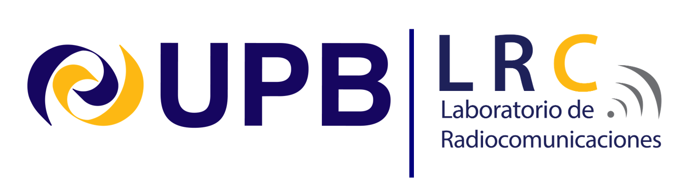

## About The Project

---

### Objectives

---

**General Objective**

To conduct astronomical research and train students in advanced observation techniques through the use of remote telescopes, thus promoting education in science, astronomy, instrumentation and software in Bolivia.

**Specific Objectives**

i) To train students in the use of remote telescopes and in the reduction of astronomical data.

ii) To conduct planned astronomical observations for specific studies such as supernova monitoring and astrophotography..

### Justification

---

**Background and Description of the Problem**

Bolivia faces challenges in the field of science, especially in astronomical research, due to the lack of advanced scientific infrastructure and limited access to professional telescopes. This project addresses these limitations by proposing the use of remote telescopes located in various parts of the world, with the aim of conducting astrophysical research and training Bolivian students in astronomical observation techniques. Access to these telescopes is critical, since astronomical observation requires specialized equipment, ideal environmental conditions, and a high operating cost, which are currently not available in the country.

**Goals and Purposes of the Intervention**

The project seeks to promote scientific research in astronomy and improve academic training in Bolivia. Specifically, it is intended to develop advanced skills in astronomical observation amongstudents, and contribute to the development of educational material in astrophotography. 

**i) Affected Actors and Participants**

The main beneficiaries are students, school teachers, amateur astronomers and other educational institutions that participate in the training workshops. In addition, the Bolivian scientific community will benefit from having greater resources for research. The actors involved in the project include Mgr. Gabriel Jaimes as principal investigator, Las Cumbres Observatory Network (LCO) that facilitates instrumentation access to remote telescopes network, and the UPB as the organizing and executing entity of the training and scientific production.

**ii) Available Knowledge and Existing Gaps**

Currently, knowledge in astronomical observation in Bolivia is limited due to the lack of access to advanced technology and the scarcity of training programs in astronomy techniques. This project seeks to fill these gaps by training students in the use of remote telescopes and in carrying out relevant scientific research.

**iii) Boundary Conditions and Limitations**

The main challenge is the lack of local infrastructure and the high cost of telescopes, which limits the available observation time. 

**iv) Strategy and Methodologies**

The central strategy of the project is to use remote telescopes located in Hawaii, the Canary Islands, Chile, Australia, and South Africa to carry out scientific and educational studies. Virtual training in advanced astronomical observation techniques and photometric data reduction will be implemented.

### Developers

---

**NAEC - BOLIVIA | OAE-IAU**

The NAEC (National Astronomy Education Coordinator) of the IAU (International Astronomical Union) is part of the IAU's efforts to promote astronomy education and outreach globally. NAECs work to enhance public understanding of astronomy and facilitate collaboration among educators, researchers, and institutions. In Bolivia, the NAEC-IAU network aims to strengthen the country’s astronomical capabilities by providing resources, training, and support for educators and institutions involved in astronomy. This network encourages research, fosters partnerships, and helps develop educational programs that inspire interest in astronomy among students and the general public. Overall, the NAEC-IAU plays a vital role in advancing astronomical education and outreach, contributing to the development of a knowledgeable community that appreciates the importance of astronomy.

**Las Cumbres Observatory (LCO)**

This project would not have been possible without the invaluable support and infrastructure provided by Las Cumbres Observatory through its Global Sky Partners program. Their commitment to fostering collaborative astronomical research and facilitating access to professional observational resources has greatly enhanced our ability to conduct meaningful studies. The partnership has allowed us to leverage advanced technology and expertise, enabling us to achieve our goals in the field of sicence, photometry and astrophotography. We are deeply grateful for their ongoing support and collaboration.

**Radiocommunications Laboratory (LRC)**

The Radiocommunications Laboratory (LRC) is a research group from the Universidad Privada Boliviana (UPB). It focuses on Remote connectivity instrumentation, implementing systems and tools that enable remote data collection and communication. This facilitates real-time monitoring and analysis of communication networks. Additionally, the lab conducts analysis, measurement, and characterization of propagation effects in terrestrial and satellite communication systems, and offers educational programs in Electronic Engineering and Telecommunications, covering subjects such as Satellite Communications, Mobile Communications, and Wireless Communications.

