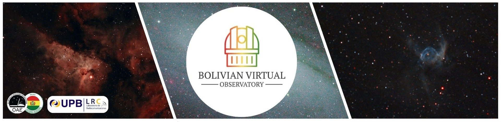

## 2024 Call for Beneficiaries

---

### Invitation Video & Application Formulary

The Bolivian Virtual Observatory (BVO) opens its 2024 Call for the implementation of free workshops on the study of transient astronomical phenomena and the processing of astrophotography.

---

    <iframe width="560" height="315" src="https://www.youtube.com/embed/GRWzn4Jot9o" title="YouTube video player" frameborder="0" allow="accelerometer; autoplay; clipboard-write; encrypted-media; gyroscope; picture-in-picture; web-share" allowfullscreen></iframe>

---

The project will allow research to be carried out through the use of remote telescopes located in sites with optimal sky quality, such as Hawaii, the Canary Islands, Chile.

---

    <a href="https://docs.google.com/forms/d/e/1FAIpQLSemPWR3MyGJgLDYHwUHn0bVYO0fDS5_bjOURhBbxmhKesrxSA/closedform" class="button">
        Inscription Formulary
    </a>

---

### Participation Modalities
The free training programs considers following modalities:

- Program for School Teachers, Educators and Amateur Astronomers
- University Students
- School Students (from 15 years old)

---

### Requirements

To participate, you will need:

- Platform: [Zoom](https://zoom.us/es/download)

1. Computer with video call capability.
2. Install [ALADIN](https://aladin.cds.unistra.fr/java/nph-aladin.pl?frame=downloading)
3. Install [FITS Liberator (optional)](https://noirlab.edu/public/es/products/fitsliberator/)
4. Install [FitsWork](https://www.fitswork.de/software/softw_es.php)
5. Have 1GB of free space on your PC for the tools.

---

### Project Activities

- Training in astronomical observation and metadata processing.
- Use of astronomical software and programming in Jupyter Notebook.
- Photometric reduction processes.
Data processing to make Astrophotography.
- Training Programs
Photometry of transient astronomical phenomena.
- Deep sky astrophotography.

---

Beneficiaries will have access to the images and data acquired by the BVO astronomical observation team, using the network of remote telescopes.

---

Collaborators and Duration
The project is a collaboration with various international and national institutions in Bolivia, including the National Coordination of Astronomy for Education (NAEC).

---

This initiative is developed by a team of volunteers and researchers with training in astrophysics, electronics, aeronautics, telecommunications, geology, computer science.

---