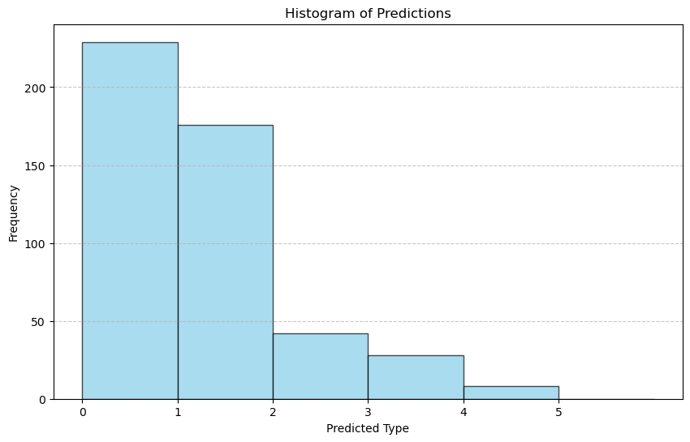
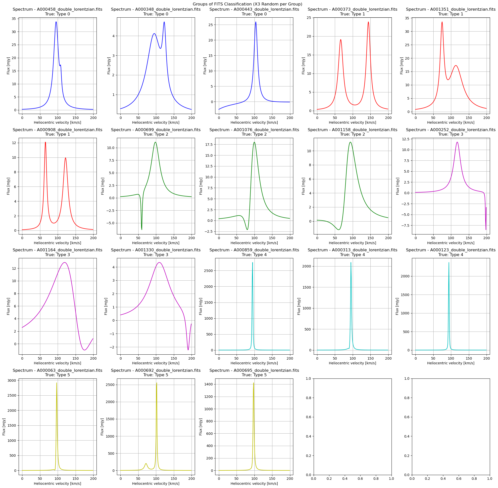
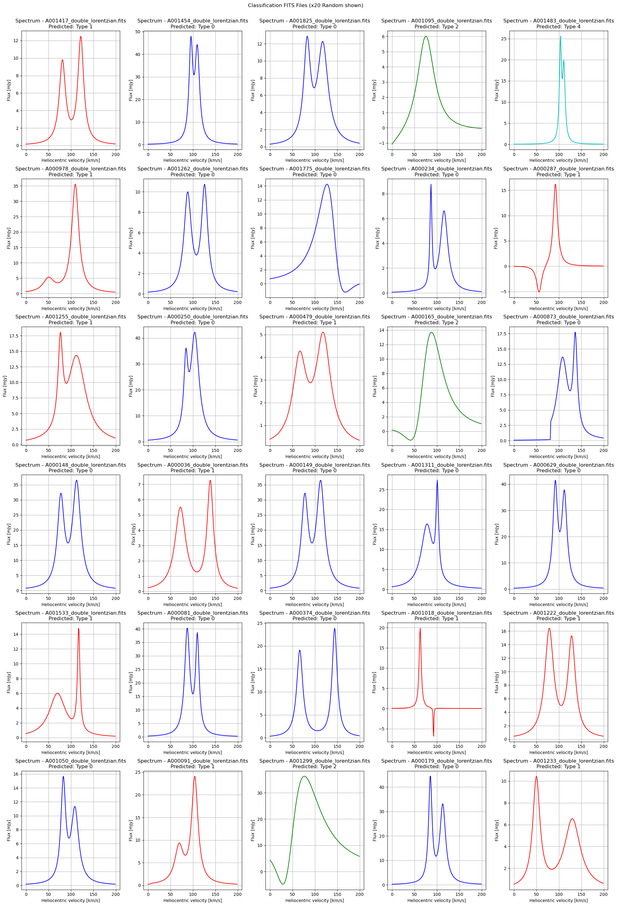
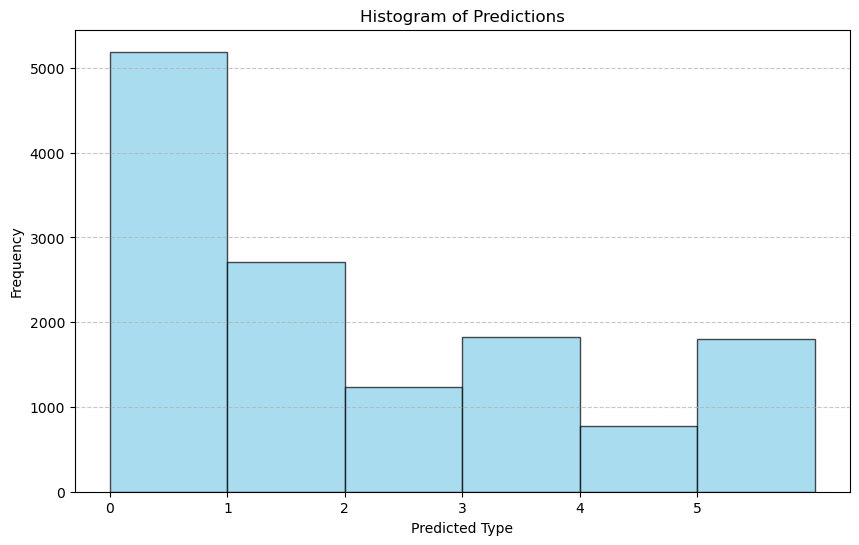
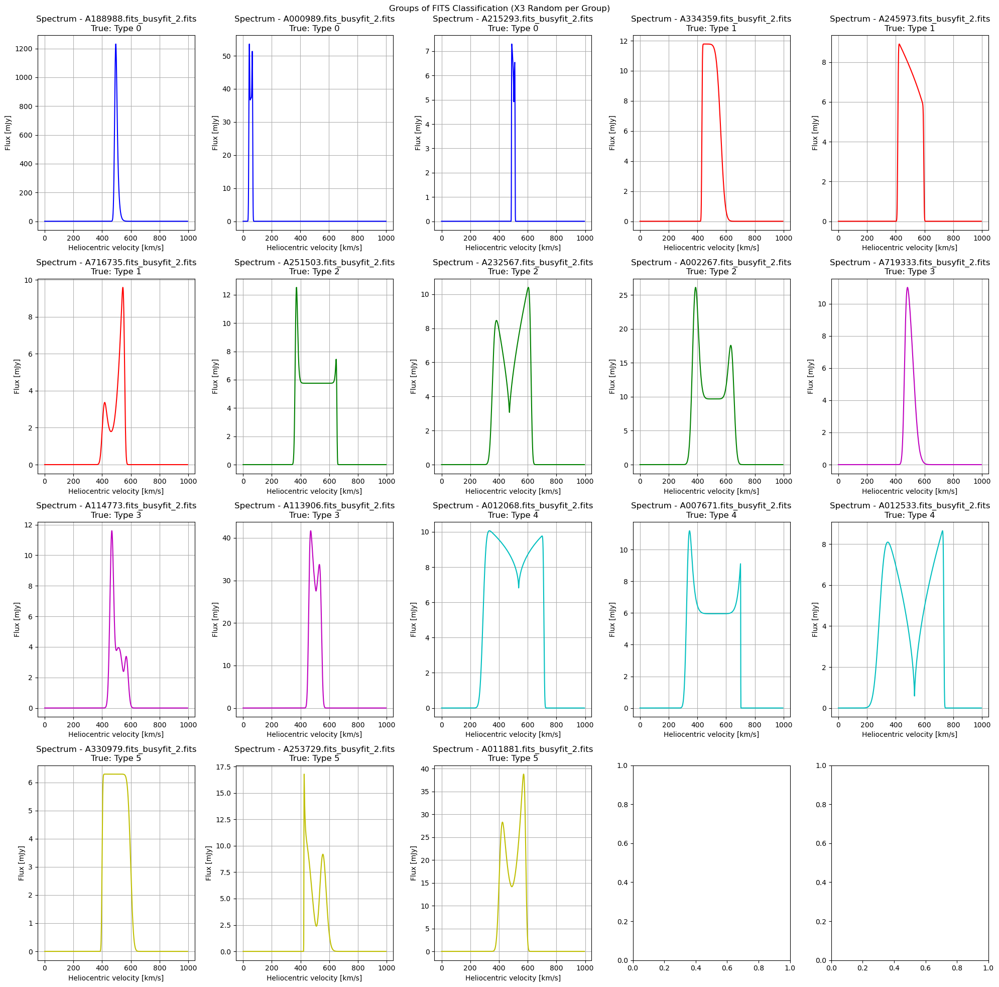
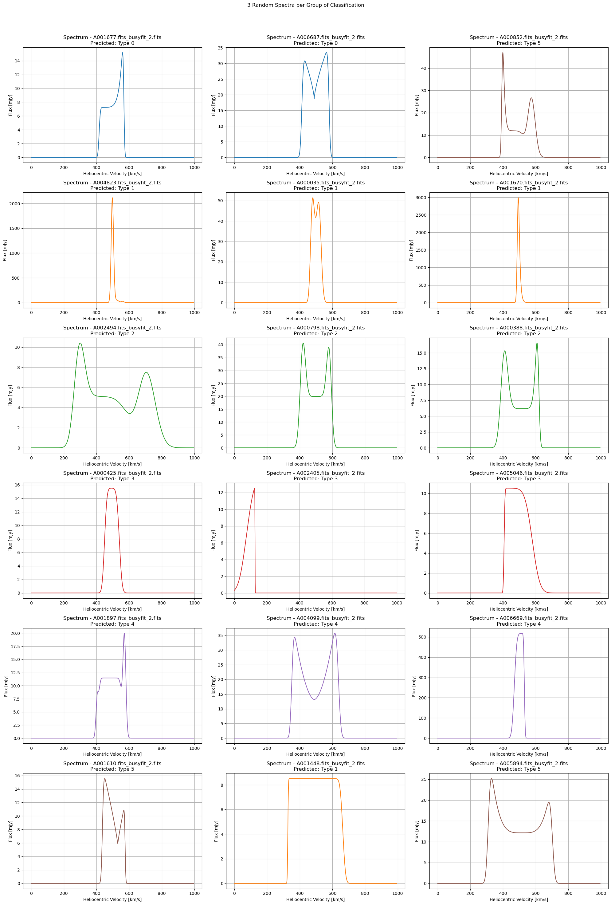
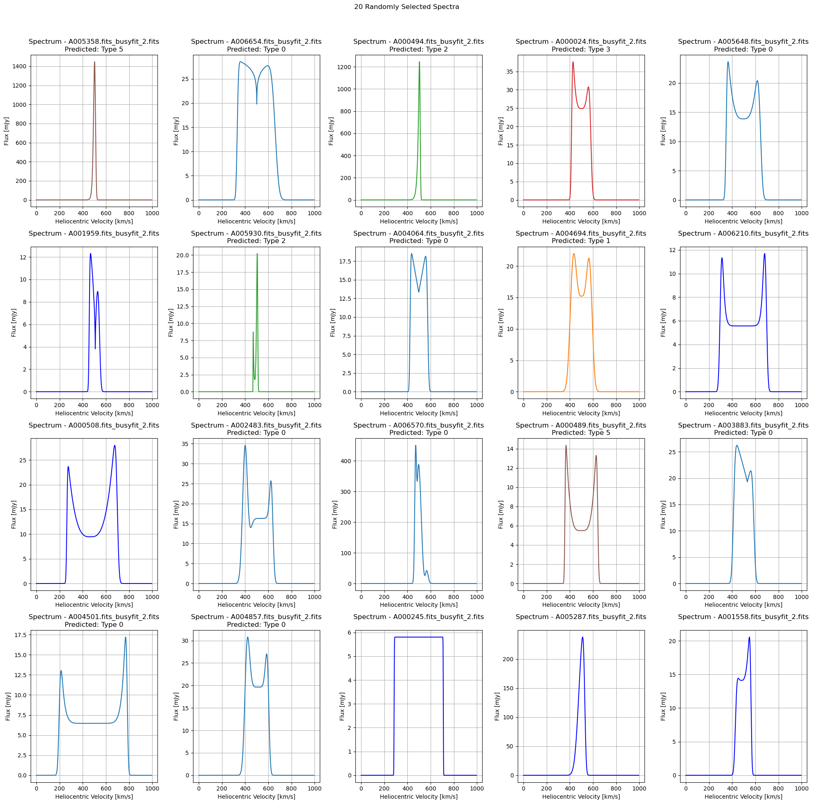
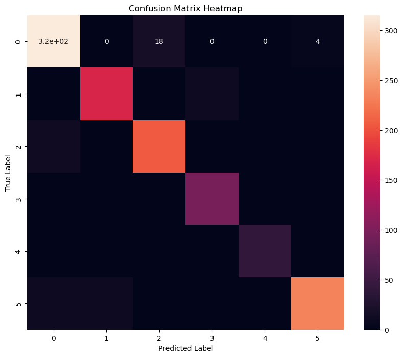
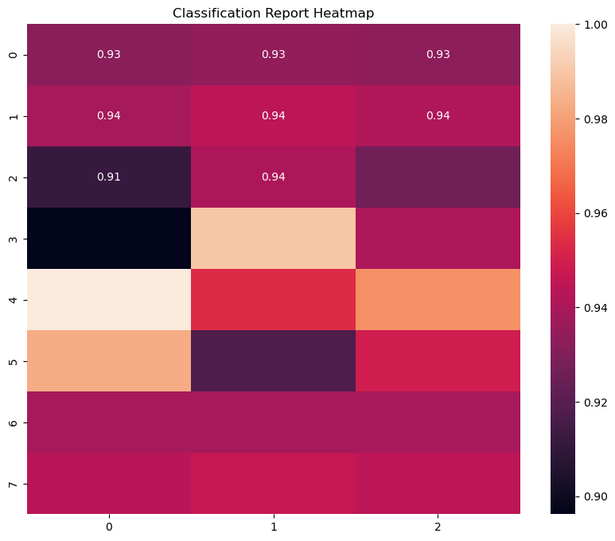
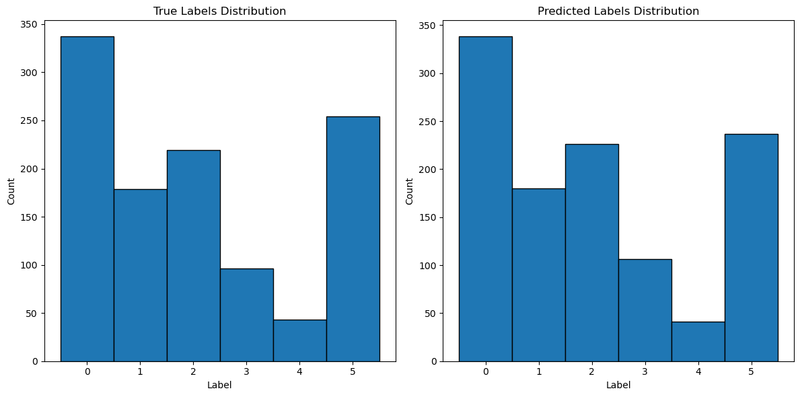

# 3. HI Profiles Classification using Shapelets and CNN
Our approach to HI profile classification integrates unsupervised ML techniques with CNNs. We implemented various clustering algorithms such as K-means, spectral clustering, DBSCAN, and agglomerative clustering to detect and extract features from the profiles. These features serve as the foundation for our classification models, which include K-Nearest Neighbors (KNN), Support Vector Machines (SVM), and Random Forest classifiers. To further optimize classification performance, we explored different CNN configurations, rigorously evaluating their impact on accuracy and reliability.

---

### Step 1: KNN Classification - Shapelets | ALFALFA

This code performs classification and clustering of astronomical data from FITS files using various machine learning techniques. It begins by importing necessary libraries, loading the FITS data, and filtering the files based on AGC IDs from an Excel file. After pre-filtering, it shuffles and splits the data for training and testing. The data is normalized, and different clustering methods such as K-Means, DBSCAN, or Spectral Clustering are applied to group the data. A Shapelets model is then trained for classification using a K-Nearest Neighbors (KNN) algorithm. The results are evaluated with confusion matrices and classification reports, and the final results, including visualizations, are saved in a PDF file.

```python
    !pip install numpy pandas astropy scikit-learn tslearn matplotlib openpyxl

```
```python
    import numpy as np
    import pandas as pd
    from astropy.io import fits
    from tslearn.shapelets import LearningShapelets
    from tslearn.preprocessing import TimeSeriesScalerMinMax
    from sklearn.cluster import KMeans, DBSCAN, AgglomerativeClustering, MeanShift, AffinityPropagation, SpectralClustering
    from sklearn.mixture import GaussianMixture
    from sklearn.neighbors import KNeighborsClassifier
    from sklearn.metrics import classification_report, confusion_matrix
    import matplotlib.pyplot as plt
    import glob
    import os
    import random

    # Training variables
    clustering_method = "spectral_clustering"  # Specify clustering method: "k_means", "spectral_clustering", "DBSCAN", "AgglomerativeClustering", "MeanShift", "AffinityPropagation", "GaussianMixture"
    type_of_classification = "double_lorentzian"   #1 , 2 , 3 o double_lorentzian
    number_max_fits = 35000
    percentage_training = 0.25
    ngroups = 6

    # Change to the FITS data directory
    #fits_data_directory = 'D:/1. JAE Intro ICU/sp_im_busyfit/'
    fits_data_directory = 'D:/1. JAE Intro ICU/sp_im/sp_im_double_lorentzian/'
    os.chdir(fits_data_directory)
    print("Current Directory:", os.getcwd())

    # Function to load data from FITS files
    def load_fits_data(file_path):
        with fits.open(file_path) as hdul:
            data = hdul[0].data[0]  # Get data from the first HDU
        return data

    # Pre-filter based on 'AGC' column in the .xlsx file
    alfalfa_df = pd.read_excel("filtered_data_alfalfa_1.xlsx")
    agc_ids = alfalfa_df['AGC'].astype(str).tolist()
    formatted_agc_ids = [f"A{agc_id.zfill(6)}" for agc_id in agc_ids]

    print(f"Total AGC IDs to filter by: {len(formatted_agc_ids)}")
    print("First 20 AGC IDs to filter by:")
    print(formatted_agc_ids[:20])

    # List and filter FITS files based on AGC IDs
    #file_paths_total = glob.glob(f'*.fits_busyfit_{type_of_classification}.fits')
    file_paths_total = glob.glob(f'*_{type_of_classification}.fits')
    print(f"Total FITS files found before filtering: {len(file_paths_total)}")

    filtered_file_paths = [fp for fp in file_paths_total if any(agc_id in fp for agc_id in formatted_agc_ids)]
    print(f"Total FITS files after filtering: {len(filtered_file_paths)}")

    # Limit the number of files to process (if needed)
    filtered_file_paths = filtered_file_paths[:number_max_fits]
    print(f"Total FITS files after limiting to {number_max_fits}: {len(filtered_file_paths)}")

    # Verify some of the filtered FITS files
    for fp in filtered_file_paths[:10]:
        print(fp)

    # Randomly shuffle and split the filtered FITS files into training and classification sets
    random.shuffle(filtered_file_paths)
    training_size = round(len(filtered_file_paths) * percentage_training)
    file_paths_for_groups = filtered_file_paths[:training_size]
    file_paths = filtered_file_paths[training_size:]

    print("Selected method for Classification:", clustering_method)
    print("Total number of samples:", len(filtered_file_paths))
    print(f"Number of samples for group generation ({percentage_training}):", len(file_paths_for_groups))
    print(f"Number of samples for classification ({1 - percentage_training}):", len(file_paths))

    # Number of files per group (1/4 of FITS)
    lgroups = round(len(file_paths) * percentage_training / ngroups)

    # Ensure there are enough files for the defined groups
    assert ngroups * lgroups <= len(file_paths), "Not enough files for the defined groups"

    # Processing additional steps as needed...

    #-------- 2. Data Preprocessing ----------
    def preprocess_data(file_paths):
        X_all = []
        max_length = 0
        for file in file_paths:
            data = load_fits_data(file)
            if data is not None and len(data) > 0:
                X_all.append(data)
                if len(data) > max_length:
                    max_length = len(data)
        # Pad or truncate sequences
        X_all = [seq[:max_length] if len(seq) > max_length else np.pad(seq, (0, max_length - len(seq))) for seq in X_all]
        return X_all, max_length

    X_all, max_length = preprocess_data(file_paths)

    # Normalization
    scaler = TimeSeriesScalerMinMax()
    X_all_scaled = scaler.fit_transform(np.array(X_all, dtype=np.float64))

    # Ensure X_all_scaled is two-dimensional
    X_all_scaled = X_all_scaled.reshape(X_all_scaled.shape[0], -1)

    # Apply selected clustering method
    if clustering_method == "k_means":
        # Apply K-means clustering to group spectra with similar characteristics
        clustering_model = KMeans(n_clusters=ngroups, random_state=0)
    elif clustering_method == "spectral_clustering":
        # Apply Spectral Clustering
        try:
            clustering_model = SpectralClustering(n_clusters=ngroups, random_state=0, affinity='nearest_neighbors', n_neighbors=10)
        except ValueError as e:
            print(f"Error applying SpectralClustering: {e}")
            clustering_model = None
    elif clustering_method == "DBSCAN":
        # Apply DBSCAN
        clustering_model = DBSCAN(eps=0.5, min_samples=5)
    elif clustering_method == "AgglomerativeClustering":
        # Apply Agglomerative Clustering
        clustering_model = AgglomerativeClustering(n_clusters=ngroups)
    elif clustering_method == "MeanShift":
        # Apply Mean Shift
        clustering_model = MeanShift()
    elif clustering_method == "AffinityPropagation":
        # Apply Affinity Propagation
        clustering_model = AffinityPropagation()
    elif clustering_method == "GaussianMixture":
        # Apply Gaussian Mixture Model
        clustering_model = GaussianMixture(n_components=ngroups)
    else:
        raise ValueError("Unsupported clustering method specified.")

    if clustering_method in ["MeanShift", "AffinityPropagation", "GaussianMixture"]:
        # Fit the model and predict
        clustering_model.fit(X_all_scaled)
        if clustering_method == "GaussianMixture":
            y_all = clustering_model.predict(X_all_scaled)
        else:
            y_all = clustering_model.predict(X_all_scaled)
    else:
        # Fit the model and predict
        y_all = clustering_model.fit_predict(X_all_scaled)

    # Check if clustering was successful
    if len(set(y_all)) < ngroups:
        raise ValueError("El método de clustering no generó suficientes grupos.")

    # Select the first `ngroups * lgroups` files for training
    X_train = []
    y_train = []
    for group in range(ngroups):
        indices = np.where(y_all == group)[0][:lgroups]
        if len(indices) > 0:
            X_train.extend([X_all[idx] for idx in indices])
            y_train.extend([group] * len(indices))
        else:
            print(f"Grupo {group} está vacío y no se incluirá en el entrenamiento.")

    # Use the remaining files for testing
    X_test = [X_all[idx] for idx in range(len(X_all)) if idx not in np.concatenate([np.where(y_all == group)[0][:lgroups] for group in range(ngroups)])]

    # Ensure all sequences have the same length
    X_train = [seq[:max_length] if len(seq) > max_length else np.pad(seq, (0, max_length - len(seq))) for seq in X_train]
    X_test = [seq[:max_length] if len(seq) > max_length else np.pad(seq, (0, max_length - len(seq))) for seq in X_test]

    # Verify if X_train and y_train are not empty
    if not X_train or not y_train:
        raise ValueError("X_train or y_train are empty. Check input data.")

    # Ensure X_train is a 2D array
    X_train = np.array(X_train, dtype=np.float64)
    if X_train.ndim == 1:
        X_train = X_train.reshape(-1, 1)

    # Verify the length of y_train
    if len(y_train) != len(X_train):
        raise ValueError("The length of y_train does not match the length of X_train.")

    # Convert y_train to a numpy array if it is not already
    y_train = np.array(y_train)

    # Define colors for each group
    colors = ['b', 'r', 'g', 'm', 'c', 'y', 'k', 'orange']  # Extend this list if you have more than 8 groups

    #-------- 3. Model Training ----------
    # Train shapelets model
    model = LearningShapelets(n_shapelets_per_size={100: 10, 50: 8, 30: 5, 10: 3}, max_iter=350, batch_size=10, scale=True)
    model.fit(X_train, y_train)


    #-------- 4. FITS Files Visualization ----------
    def plot_fits_spectra(file_paths, title, labels=None, predictions=None, num_columns=5):
        num_files = len(file_paths)
        num_rows = (num_files + num_columns - 1) // num_columns
        fig, axes = plt.subplots(num_rows, num_columns, figsize=(20, 5 * num_rows))
        fig.suptitle(title)
        for i, file_path in enumerate(file_paths):
            with fits.open(file_path) as fits_file:
                spectrum_data = fits_file[0].data
                spectrum_data = np.squeeze(spectrum_data)
            wavelength = np.arange(len(spectrum_data))
            ax = axes[i // num_columns, i % num_columns]
            if predictions is not None:
                color = colors[predictions[i]]
                label = f'Predicted: Type {predictions[i]}'
            elif labels is not None:
                color = colors[labels[i]]
                label = f'True: Type {labels[i]}'
            else:
                color = 'b'
                label = ''
            ax.plot(wavelength, spectrum_data, color=color)
            ax.set_xlabel('Heliocentric velocity [km/s]')
            ax.set_ylabel('Flux [mJy]')
            ax.set_title(f'Spectrum - {file_path}\n{label}')
            ax.grid(True)
        plt.tight_layout()
        plt.subplots_adjust(top=0.95)
        return fig
    def plot_fits_spectra_random(file_paths, title, labels=None, predictions=None, num_columns=5, num_plots=30):
        num_rows = (num_plots + num_columns - 1) // num_columns
        fig, axes = plt.subplots(num_rows, num_columns, figsize=(20, 5 * num_rows))
        fig.suptitle(title)
        random_indices = np.random.choice(len(file_paths), num_plots, replace=False)
        for i, idx in enumerate(random_indices):
            file_path = file_paths[idx]
            with fits.open(file_path) as hdul:
                data_spectrum = hdul[0].data
                data_spectrum = np.squeeze(data_spectrum)
            velocity = np.arange(len(data_spectrum))
            ax = axes[i // num_columns, i % num_columns]
            if predictions is not None:
                color = colors[predictions[idx]]
                label = f'Predicted: Type {predictions[idx]}'
            elif labels is not None:
                color = colors[labels[idx]]
                label = f'True: Type {labels[idx]}'
            else:
                color = 'b'
                label = ''
            ax.plot(velocity, data_spectrum, color=color)
            ax.set_xlabel('Heliocentric velocity [km/s]')
            ax.set_ylabel('Flux [mJy]')
            ax.set_title(f'Spectrum - {file_path}\n{label}')
            ax.grid(True)
        plt.tight_layout()
        plt.subplots_adjust(top=0.95)
        return fig

    def plot_random_samples_per_group(file_paths, y_all, y_train, ngroups, num_samples=3):
        selected_files = []
        selected_labels = []
        
        for group in range(ngroups):
            group_indices = np.where(y_all == group)[0]
            actual_num_samples = min(num_samples, len(group_indices))
            
            if actual_num_samples > 0:
                selected_indices = np.random.choice(group_indices, actual_num_samples, replace=False)
                selected_files.extend([file_paths[idx] for idx in selected_indices])
                selected_labels.extend([group] * actual_num_samples)
            else:
                print(f"Warning: Group {group} does not have enough elements to select {num_samples} samples.")
        
        return plot_fits_spectra(selected_files, title="Groups of FITS Classification (X3 Random per Group)", labels=selected_labels)


    #-------- 5. Model Evaluation ----------
    X_test_scaled = scaler.transform(np.array(X_test, dtype=np.float64))
    X_test_transformed = model.transform(X_test_scaled)

    # Classification using KNN
    knn = KNeighborsClassifier(n_neighbors=1)
    knn.fit(model.transform(X_train), y_train)
    y_pred = knn.predict(X_test_transformed)

    # Visualize test data with predictions
    test_file_paths = [file_paths[idx] for idx in range(len(file_paths)) if idx not in np.concatenate([np.where(y_all == group)[0][:lgroups] for group in range(ngroups)])]
    #plot_fits_spectra_random(test_file_paths, title="Classification FITS Files (x20 Random shown)", predictions=y_pred, num_columns=5, num_plots=30)

    #-------- 6. Classification Results ----------

    # Create a dictionary to map files to their classifications
    file_to_classification = {file: prediction for file, prediction in zip(test_file_paths, y_pred)}

    # Initialize the 'Classification' column with None
    alfalfa_df['Classification'] = None

    # Assign classifications to the corresponding AGC IDs in the DataFrame
    for idx, row in alfalfa_df.iterrows():
        agc_id = str(row['AGC'])
        # Find the FITS file containing the AGC ID
        matched_file = next((file for file in file_paths_total if agc_id in file), None)
        if matched_file and matched_file in file_to_classification:
            alfalfa_df.at[idx, 'Classification'] = file_to_classification[matched_file]

    # Check for any missing classifications
    missing_classifications = alfalfa_df[alfalfa_df['Classification'].isna()]
    if not missing_classifications.empty:
        print("Files with missing classifications found:")
        print(missing_classifications)

    # Save the updated DataFrame to an Excel file
    result_file_path = f"filtered_data_alfalfa_POLY_classification_results_shapelets_{clustering_method}_{type_of_classification}.xlsx"
    alfalfa_df.to_excel(result_file_path, index=False)

    print(f"\nClassifications saved to: {result_file_path}")

    # Print the confusion matrix and classification report
    print("\nConfusion Matrix:")
    print(confusion_matrix(y_train, model.predict(X_train)))
    print("\nClassification Report:")
    print(classification_report(y_train, model.predict(X_train)))

    # Visualize the histogram of predictions
    plt.figure(figsize=(10, 6))
    plt.hist(y_pred, bins=range(ngroups + 1), color='skyblue', edgecolor='black', alpha=0.7)
    plt.title('Histogram of Predictions')
    plt.xlabel('Predicted Type')
    plt.ylabel('Frequency')
    plt.xticks(range(ngroups))
    plt.grid(axis='y', linestyle='--', alpha=0.7)
    plt.show()

    plot_random_samples_per_group(file_paths, y_all, y_train, ngroups)
    plot_fits_spectra_random(test_file_paths, title="Classification FITS Files (x20 Random shown)", predictions=y_pred, num_columns=5, num_plots=30)

    #-------- 7. Save as PDF Document ----------
    from matplotlib.backends.backend_pdf import PdfPages
    from reportlab.pdfgen import canvas
    from reportlab.lib.pagesizes import letter
    from io import BytesIO
    from PyPDF2 import PdfReader, PdfWriter  # Ensure you have PyPDF2 installed

    # Create a PDF file
    output_pdf_path = f"filtered_data_alfalfa_POLY_classification_results_shapelets_{clustering_method}_{type_of_classification}.pdf"

    # Create a buffer for the text
    packet = BytesIO()
    can = canvas.Canvas(packet, pagesize=letter)

    # Add text to the PDF
    can.drawString(72, 720, f"Current Directory: {fits_data_directory}")
    can.drawString(72, 705, f"Total AGC IDs to filter by: {len(formatted_agc_ids)}")
    can.drawString(72, 690, "First 20 AGC IDs to filter by:")
    for i, agc_id in enumerate(formatted_agc_ids[:20]):
        can.drawString(72, 675 - i*15, agc_id)

    can.drawString(72, 360, f"Total FITS files found before filtering: {len(file_paths_total)}")
    can.drawString(72, 345, f"Total FITS files after filtering: {len(filtered_file_paths)}")
    can.drawString(72, 330, f"Total FITS files after limiting to {number_max_fits}: {len(filtered_file_paths)}")

    random.shuffle(filtered_file_paths)
    training_size = round(len(filtered_file_paths) * percentage_training)
    file_paths_for_groups = filtered_file_paths[:training_size]
    file_paths = filtered_file_paths[training_size:]

    can.drawString(72, 315, f"Selected method for Classification: {clustering_method}")
    can.drawString(72, 300, f"Total number of samples: {len(filtered_file_paths)}")
    can.drawString(72, 285, f"Number of samples for group generation ({percentage_training}): {len(file_paths_for_groups)}")
    can.drawString(72, 270, f"Number of samples for classification ({1 - percentage_training}): {len(file_paths)}")

    lgroups = round(len(file_paths) * percentage_training / ngroups)
    can.drawString(72, 255, f"Number of files per group: {lgroups}")

    # Add additional text
    can.drawString(72, 240, f"Train shapelets model:")
    can.drawString(72, 225, f"model = LearningShapelets(n_shapelets_per_size={{100: 10, 50: 8, 30: 5, 10: 3}}, max_iter=350, batch_size=10, scale=True)")
    can.drawString(72, 210, f"model.fit(X_train, y_train)")

    can.drawString(72, 195, f"Classification using KNN:")
    can.drawString(72, 180, f"knn = KNeighborsClassifier(n_neighbors=1)")
    can.drawString(72, 165, f"knn.fit(model.transform(X_train), y_train)")
    can.drawString(72, 150, f"y_pred = knn.predict(X_test_transformed)")

    can.save()
    packet.seek(0)

    # Read the content of the created text page
    new_pdf = PdfReader(packet)
    first_page = new_pdf.pages[0]

    # Generate all the plots

    # Create and save plots in the final PDF file
    with PdfWriter(output_pdf_path) as pdf_writer:
        # Add the text page
        pdf_writer.add_page(first_page)
        
        # Create a buffer to save plots
        plot_buffer = BytesIO()
        with PdfPages(plot_buffer) as pdf:
            # Save generated plots

            fig1 = plot_random_samples_per_group(file_paths, y_all, y_train, ngroups)
            pdf.savefig(fig1)
            plt.close(fig1)  # Close the plot to free memory
            
            fig2 = plot_fits_spectra_random(test_file_paths, title="Classification FITS Files (x20 Random shown)", predictions=y_pred, num_columns=5, num_plots=30)
            pdf.savefig(fig2)
            plt.close(fig2)  # Close the plot to free memory

            # Save the histogram of predictions
            fig3 = plt.figure(figsize=(10, 6))
            plt.hist(y_pred, bins=range(ngroups + 1), color='skyblue', edgecolor='black', alpha=0.7)
            plt.title('Histogram of Predictions')
            plt.xlabel('Predicted Type')
            plt.ylabel('Frequency')
            plt.xticks(range(ngroups))
            plt.grid(axis='y', linestyle='--', alpha=0.7)
            pdf.savefig(fig3)
            plt.close(fig3)  # Close the histogram to free memory

        # Read the content of the plot buffer and add to the final PDF
        plot_buffer.seek(0)
        plot_pdf = PdfReader(plot_buffer)
        for page in plot_pdf.pages:
            pdf_writer.add_page(page)

    # Print a message indicating that the PDF file has been saved
    print(f'Plots and text saved in {output_pdf_path}')


```
Selected method for Classification: spectral_clustering
Total number of samples: 844
Number of samples for group generation (0.25): 211
Number of samples for classification (0.75): 633





---

### Step 2: SVM Classification - Shapelets | ALFALFA

This code performs classification of high-dimensional data using Support Vector Machines (SVM). It begins by importing necessary libraries and loading the dataset, followed by pre-processing steps such as handling missing values and scaling the features. The data is then shuffled and split into training and testing sets. The SVM model is trained with a radial basis function (RBF) kernel to capture non-linear patterns in the data. After training, the model's performance is evaluated using confusion matrices and classification reports, measuring accuracy, precision, and recall. Finally, visualizations such as decision boundaries and support vectors are generated to illustrate the model's behavior, with the results saved to a PDF file for further analysis.

```python
    import numpy as np
    import pandas as pd
    from astropy.io import fits
    from tslearn.shapelets import LearningShapelets
    from tslearn.preprocessing import TimeSeriesScalerMinMax
    from sklearn.cluster import KMeans, DBSCAN, AgglomerativeClustering, MeanShift, AffinityPropagation, SpectralClustering
    from sklearn.mixture import GaussianMixture
    from sklearn.neighbors import KNeighborsClassifier
    from sklearn.metrics import classification_report, confusion_matrix
    import matplotlib.pyplot as plt
    import glob
    import os
    import random

    # Training variables
    clustering_method = "AgglomerativeClustering"  # Specify clustering method: "k_means", "spectral_clustering", "DBSCAN", "AgglomerativeClustering", "MeanShift", "AffinityPropagation", "GaussianMixture"
    type_of_classification = "2"
    number_max_fits = 35000
    percentage_training = 0.25
    ngroups = 6

    # Change to the FITS data directory
    fits_data_directory = 'D:/1. JAE Intro ICU/sp_im_busyfit/'
    os.chdir(fits_data_directory)
    print("Current Directory:", os.getcwd())

    # Function to load data from FITS files
    def load_fits_data(file_path):
        with fits.open(file_path) as hdul:
            data = hdul[0].data[0]  # Get data from the first HDU
        return data

    # Pre-filter based on 'AGC' column in the .xlsx file
    alfalfa_df = pd.read_excel("filtered_data_alfalfa_1.xlsx")
    agc_ids = alfalfa_df['AGC'].astype(str).tolist()
    formatted_agc_ids = [f"A{agc_id.zfill(6)}" for agc_id in agc_ids]

    print(f"Total AGC IDs to filter by: {len(formatted_agc_ids)}")
    print("First 20 AGC IDs to filter by:")
    print(formatted_agc_ids[:20])

    # List and filter FITS files based on AGC IDs
    file_paths_total = glob.glob(f'*.fits_busyfit_{type_of_classification}.fits')
    print(f"Total FITS files found before filtering: {len(file_paths_total)}")

    filtered_file_paths = [fp for fp in file_paths_total if any(agc_id in fp for agc_id in formatted_agc_ids)]
    print(f"Total FITS files after filtering: {len(filtered_file_paths)}")

    # Limit the number of files to process (if needed)
    filtered_file_paths = filtered_file_paths[:number_max_fits]
    print(f"Total FITS files after limiting to {number_max_fits}: {len(filtered_file_paths)}")

    # Verify some of the filtered FITS files
    for fp in filtered_file_paths[:10]:
        print(fp)

    # Randomly shuffle and split the filtered FITS files into training and classification sets
    random.shuffle(filtered_file_paths)
    training_size = round(len(filtered_file_paths) * percentage_training)
    file_paths_for_groups = filtered_file_paths[:training_size]
    file_paths = filtered_file_paths[training_size:]

    print("Selected method for Classification:", clustering_method)
    print("Total number of samples:", len(filtered_file_paths))
    print(f"Number of samples for group generation ({percentage_training}):", len(file_paths_for_groups))
    print(f"Number of samples for classification ({1 - percentage_training}):", len(file_paths))

    # Number of files per group (1/4 of FITS)
    lgroups = round(len(file_paths) * percentage_training / ngroups)

    # Ensure there are enough files for the defined groups
    assert ngroups * lgroups <= len(file_paths), "Not enough files for the defined groups"

    # Processing additional steps as needed...

    #-------- 2. Data Preprocessing ----------
    def preprocess_data(file_paths):
        X_all = []
        max_length = 0
        for file in file_paths:
            data = load_fits_data(file)
            if data is not None and len(data) > 0:
                X_all.append(data)
                if len(data) > max_length:
                    max_length = len(data)
        # Pad or truncate sequences
        X_all = [seq[:max_length] if len(seq) > max_length else np.pad(seq, (0, max_length - len(seq))) for seq in X_all]
        return X_all, max_length

    X_all, max_length = preprocess_data(file_paths)

    # Normalization
    scaler = TimeSeriesScalerMinMax()
    X_all_scaled = scaler.fit_transform(np.array(X_all, dtype=np.float64))

    # Ensure X_all_scaled is two-dimensional
    X_all_scaled = X_all_scaled.reshape(X_all_scaled.shape[0], -1)

    # Apply selected clustering method
    if clustering_method == "k_means":
        # Apply K-means clustering to group spectra with similar characteristics
        clustering_model = KMeans(n_clusters=ngroups, random_state=0)
    elif clustering_method == "spectral_clustering":
        # Apply Spectral Clustering
        try:
            clustering_model = SpectralClustering(n_clusters=ngroups, random_state=0, affinity='nearest_neighbors', n_neighbors=10)
        except ValueError as e:
            print(f"Error applying SpectralClustering: {e}")
            clustering_model = None
    elif clustering_method == "DBSCAN":
        # Apply DBSCAN
        clustering_model = DBSCAN(eps=0.5, min_samples=5)
    elif clustering_method == "AgglomerativeClustering":
        # Apply Agglomerative Clustering
        clustering_model = AgglomerativeClustering(n_clusters=ngroups)
    elif clustering_method == "MeanShift":
        # Apply Mean Shift
        clustering_model = MeanShift()
    elif clustering_method == "AffinityPropagation":
        # Apply Affinity Propagation
        clustering_model = AffinityPropagation()
    elif clustering_method == "GaussianMixture":
        # Apply Gaussian Mixture Model
        clustering_model = GaussianMixture(n_components=ngroups)
    else:
        raise ValueError("Unsupported clustering method specified.")

    if clustering_method in ["MeanShift", "AffinityPropagation", "GaussianMixture"]:
        # Fit the model and predict
        clustering_model.fit(X_all_scaled)
        if clustering_method == "GaussianMixture":
            y_all = clustering_model.predict(X_all_scaled)
        else:
            y_all = clustering_model.predict(X_all_scaled)
    else:
        # Fit the model and predict
        y_all = clustering_model.fit_predict(X_all_scaled)

    # Check if clustering was successful
    if len(set(y_all)) < ngroups:
        raise ValueError("El método de clustering no generó suficientes grupos.")

    # Select the first `ngroups * lgroups` files for training
    X_train = []
    y_train = []
    for group in range(ngroups):
        indices = np.where(y_all == group)[0][:lgroups]
        if len(indices) > 0:
            X_train.extend([X_all[idx] for idx in indices])
            y_train.extend([group] * len(indices))
        else:
            print(f"Grupo {group} está vacío y no se incluirá en el entrenamiento.")

    # Use the remaining files for testing
    X_test = [X_all[idx] for idx in range(len(X_all)) if idx not in np.concatenate([np.where(y_all == group)[0][:lgroups] for group in range(ngroups)])]

    # Ensure all sequences have the same length
    X_train = [seq[:max_length] if len(seq) > max_length else np.pad(seq, (0, max_length - len(seq))) for seq in X_train]
    X_test = [seq[:max_length] if len(seq) > max_length else np.pad(seq, (0, max_length - len(seq))) for seq in X_test]

    # Verify if X_train and y_train are not empty
    if not X_train or not y_train:
        raise ValueError("X_train or y_train are empty. Check input data.")

    # Ensure X_train is a 2D array
    X_train = np.array(X_train, dtype=np.float64)
    if X_train.ndim == 1:
        X_train = X_train.reshape(-1, 1)

    # Verify the length of y_train
    if len(y_train) != len(X_train):
        raise ValueError("The length of y_train does not match the length of X_train.")

    # Convert y_train to a numpy array if it is not already
    y_train = np.array(y_train)

    # Define colors for each group
    colors = ['b', 'r', 'g', 'm', 'c', 'y', 'k', 'orange']  # Extend this list if you have more than 8 groups

    #-------- 3. Model Training ----------
    # Train shapelets model
    model = LearningShapelets(n_shapelets_per_size={100: 10, 50: 8, 30: 5, 10: 3}, max_iter=350, batch_size=10, scale=True)
    model.fit(X_train, y_train)


    #-------- 4. FITS Files Visualization ----------
    def plot_fits_spectra(file_paths, title, labels=None, predictions=None, num_columns=5):
        num_files = len(file_paths)
        num_rows = (num_files + num_columns - 1) // num_columns
        fig, axes = plt.subplots(num_rows, num_columns, figsize=(20, 5 * num_rows))
        fig.suptitle(title)
        for i, file_path in enumerate(file_paths):
            with fits.open(file_path) as fits_file:
                spectrum_data = fits_file[0].data
                spectrum_data = np.squeeze(spectrum_data)
            wavelength = np.arange(len(spectrum_data))
            ax = axes[i // num_columns, i % num_columns]
            if predictions is not None:
                color = colors[predictions[i]]
                label = f'Predicted: Type {predictions[i]}'
            elif labels is not None:
                color = colors[labels[i]]
                label = f'True: Type {labels[i]}'
            else:
                color = 'b'
                label = ''
            ax.plot(wavelength, spectrum_data, color=color)
            ax.set_xlabel('Heliocentric velocity [km/s]')
            ax.set_ylabel('Flux [mJy]')
            ax.set_title(f'Spectrum - {file_path}\n{label}')
            ax.grid(True)
        plt.tight_layout()
        plt.subplots_adjust(top=0.95)
        return fig
    def plot_fits_spectra_random(file_paths, title, labels=None, predictions=None, num_columns=5, num_plots=30):
        num_rows = (num_plots + num_columns - 1) // num_columns
        fig, axes = plt.subplots(num_rows, num_columns, figsize=(20, 5 * num_rows))
        fig.suptitle(title)
        random_indices = np.random.choice(len(file_paths), num_plots, replace=False)
        for i, idx in enumerate(random_indices):
            file_path = file_paths[idx]
            with fits.open(file_path) as hdul:
                data_spectrum = hdul[0].data
                data_spectrum = np.squeeze(data_spectrum)
            velocity = np.arange(len(data_spectrum))
            ax = axes[i // num_columns, i % num_columns]
            if predictions is not None:
                color = colors[predictions[idx]]
                label = f'Predicted: Type {predictions[idx]}'
            elif labels is not None:
                color = colors[labels[idx]]
                label = f'True: Type {labels[idx]}'
            else:
                color = 'b'
                label = ''
            ax.plot(velocity, data_spectrum, color=color)
            ax.set_xlabel('Heliocentric velocity [km/s]')
            ax.set_ylabel('Flux [mJy]')
            ax.set_title(f'Spectrum - {file_path}\n{label}')
            ax.grid(True)
        plt.tight_layout()
        plt.subplots_adjust(top=0.95)
        return fig

    def plot_random_samples_per_group(file_paths, y_all, y_train, ngroups, num_samples=3):
        selected_files = []
        selected_labels = []
        
        for group in range(ngroups):
            group_indices = np.where(y_all == group)[0]
            actual_num_samples = min(num_samples, len(group_indices))
            
            if actual_num_samples > 0:
                selected_indices = np.random.choice(group_indices, actual_num_samples, replace=False)
                selected_files.extend([file_paths[idx] for idx in selected_indices])
                selected_labels.extend([group] * actual_num_samples)
            else:
                print(f"Warning: Group {group} does not have enough elements to select {num_samples} samples.")
        
        return plot_fits_spectra(selected_files, title="Groups of FITS Classification (X3 Random per Group)", labels=selected_labels)


    #-------- 5. Model Evaluation ----------

    from sklearn.model_selection import GridSearchCV
    from sklearn.svm import SVC

    # Scale the test data
    X_test_scaled = scaler.transform(np.array(X_test, dtype=np.float64))
    X_test_transformed = model.transform(X_test_scaled)

    # Scale and transform the training data
    X_train_transformed = model.transform(X_train)

    # Define hyperparameters for SVM tuning
    param_grid_svm = {
        'C': [0.1, 1, 10, 100],
        'gamma': ['scale', 'auto'],
        'kernel': ['rbf', 'linear']
    }

    # Define the SVM model
    svm = SVC()

    # Perform hyperparameter search with cross-validation
    grid_svm = GridSearchCV(svm, param_grid_svm, cv=5)
    grid_svm.fit(X_train_transformed, y_train)

    # Get the best SVM model
    best_svm = grid_svm.best_estimator_

    # Predictions with the best SVM model
    y_pred = best_svm.predict(X_test_transformed)

    # Visualize test data with SVM predictions
    test_file_paths = [file_paths[idx] for idx in range(len(file_paths)) if idx not in np.concatenate([np.where(y_all == group)[0][:lgroups] for group in range(ngroups)])]
    plot_fits_spectra_random(test_file_paths, title="Classification FITS Files with SVM (x20 Random shown)", predictions=y_pred, num_columns=5, num_plots=30)

    #-------- 6. Classification Results ----------

    # Crear un diccionario para mapear archivos a sus clasificaciones
    file_to_classification = {file: prediction for file, prediction in zip(test_file_paths, y_pred)}

    # Inicializar la columna 'Classification' con None
    alfalfa_df['Classification'] = None

    # Asignar las clasificaciones a los AGC IDs correspondientes en el DataFrame
    for idx, row in alfalfa_df.iterrows():
        agc_id = str(row['AGC'])
        # Encontrar el archivo FITS que contiene el ID AGC
        matched_file = next((file for file in file_paths_total if agc_id in file), None)
        if matched_file and matched_file in file_to_classification:
            alfalfa_df.at[idx, 'Classification'] = file_to_classification[matched_file]

    # Verificar si hay clasificaciones faltantes
    missing_classifications = alfalfa_df[alfalfa_df['Classification'].isna()]
    if not missing_classifications.empty:
        print("Se encontraron archivos sin clasificación:")
        print(missing_classifications)

    # Guardar el DataFrame actualizado en un archivo Excel
    result_file_path = f"filtered_data_alfalfa_classification_SVM_results_shapelets_{clustering_method}_{type_of_classification}.xlsx"
    alfalfa_df.to_excel(result_file_path, index=False)

    print(f"\nClasificaciones guardadas en: {result_file_path}")

    # Imprimir la matriz de confusión y el informe de clasificación
    print("\nConfusion Matrix:")
    print(confusion_matrix(y_train, model.predict(X_train)))
    print("\nClassification Report:")
    print(classification_report(y_train, model.predict(X_train)))

    # Visualizar el histograma de predicciones
    plt.figure(figsize=(10, 6))
    plt.hist(y_pred, bins=range(ngroups + 1), color='skyblue', edgecolor='black', alpha=0.7)
    plt.title('Histogram of Predictions')
    plt.xlabel('Predicted Type')
    plt.ylabel('Frequency')
    plt.xticks(range(ngroups))
    plt.grid(axis='y', linestyle='--', alpha=0.7)
    plt.show()

    plot_random_samples_per_group(file_paths, y_all, y_train, ngroups)
    plot_fits_spectra_random(test_file_paths, title="Classification FITS Files (x20 Random shown)", predictions=y_pred, num_columns=5, num_plots=30)

    #-------- 7. Save as PDF Document ----------
    from matplotlib.backends.backend_pdf import PdfPages
    from reportlab.pdfgen import canvas
    from reportlab.lib.pagesizes import letter
    from io import BytesIO
    from PyPDF2 import PdfReader, PdfWriter  # Ensure you have PyPDF2 installed

    # Create a PDF file
    output_pdf_path = f"filtered_data_alfalfa_classification_SVM_results_shapelets_{clustering_method}_{type_of_classification}.pdf"

    # Create a buffer for the text
    packet = BytesIO()
    can = canvas.Canvas(packet, pagesize=letter)

    # Add text to the PDF
    can.drawString(72, 720, f"Current Directory: {fits_data_directory}")
    can.drawString(72, 705, f"Total AGC IDs to filter by: {len(formatted_agc_ids)}")
    can.drawString(72, 690, "First 20 AGC IDs to filter by:")
    for i, agc_id in enumerate(formatted_agc_ids[:20]):
        can.drawString(72, 675 - i*15, agc_id)

    can.drawString(72, 360, f"Total FITS files found before filtering: {len(file_paths_total)}")
    can.drawString(72, 345, f"Total FITS files after filtering: {len(filtered_file_paths)}")
    can.drawString(72, 330, f"Total FITS files after limiting to {number_max_fits}: {len(filtered_file_paths)}")

    random.shuffle(filtered_file_paths)
    training_size = round(len(filtered_file_paths) * percentage_training)
    file_paths_for_groups = filtered_file_paths[:training_size]
    file_paths = filtered_file_paths[training_size:]

    can.drawString(72, 315, f"Selected method for Classification: {clustering_method}")
    can.drawString(72, 300, f"Total number of samples: {len(filtered_file_paths)}")
    can.drawString(72, 285, f"Number of samples for group generation ({percentage_training}): {len(file_paths_for_groups)}")
    can.drawString(72, 270, f"Number of samples for classification ({1 - percentage_training}): {len(file_paths)}")

    lgroups = round(len(file_paths) * percentage_training / ngroups)
    can.drawString(72, 255, f"Number of files per group: {lgroups}")

    # Add additional text
    can.drawString(72, 240, f"Train shapelets model:")
    can.drawString(72, 225, f"model = LearningShapelets(n_shapelets_per_size={{100: 10, 50: 8, 30: 5, 10: 3}}, max_iter=350, batch_size=10, scale=True)")
    can.drawString(72, 210, f"model.fit(X_train, y_train)")

    can.drawString(72, 195, f"Classification using KNN:")
    can.drawString(72, 180, f"knn = KNeighborsClassifier(n_neighbors=1)")
    can.drawString(72, 165, f"knn.fit(model.transform(X_train), y_train)")
    can.drawString(72, 150, f"y_pred = knn.predict(X_test_transformed)")

    can.save()
    packet.seek(0)

    # Read the content of the created text page
    new_pdf = PdfReader(packet)
    first_page = new_pdf.pages[0]

    # Generate all the plots

    # Create and save plots in the final PDF file
    with PdfWriter(output_pdf_path) as pdf_writer:
        # Add the text page
        pdf_writer.add_page(first_page)
        
        # Create a buffer to save plots
        plot_buffer = BytesIO()
        with PdfPages(plot_buffer) as pdf:
            # Save generated plots

            fig1 = plot_random_samples_per_group(file_paths, y_all, y_train, ngroups)
            pdf.savefig(fig1)
            plt.close(fig1)  # Close the plot to free memory
            
            fig2 = plot_fits_spectra_random(test_file_paths, title="Classification FITS Files (x20 Random shown)", predictions=y_pred, num_columns=5, num_plots=30)
            pdf.savefig(fig2)
            plt.close(fig2)  # Close the plot to free memory

            # Save the histogram of predictions
            fig3 = plt.figure(figsize=(10, 6))
            plt.hist(y_pred, bins=range(ngroups + 1), color='skyblue', edgecolor='black', alpha=0.7)
            plt.title('Histogram of Predictions')
            plt.xlabel('Predicted Type')
            plt.ylabel('Frequency')
            plt.xticks(range(ngroups))
            plt.grid(axis='y', linestyle='--', alpha=0.7)
            pdf.savefig(fig3)
            plt.close(fig3)  # Close the histogram to free memory

        # Read the content of the plot buffer and add to the final PDF
        plot_buffer.seek(0)
        plot_pdf = PdfReader(plot_buffer)
        for page in plot_pdf.pages:
            pdf_writer.add_page(page)

    # Print a message indicating that the PDF file has been saved
    print(f'Plots and text saved in {output_pdf_path}')


```
Selected method for Classification: AgglomerativeClustering
Total number of samples: 24063
Number of samples for group generation (0.25): 6016
Number of samples for classification (0.75): 18047
Se encontraron archivos sin clasificación:





---

### Step 3: Random Forest Classification - Shapelets | ALFALFA

This code processes and classifies astronomical data using Random Forest, starting with reading FITS files and filtering them based on AGC IDs from an Excel file. The data is shuffled and split into training and testing sets, followed by normalization. Different clustering techniques (K-Means, DBSCAN, etc.) are applied to group data into clusters. A Shapelets model is trained using the groups. Random Forest is then used for classification, with hyperparameter tuning performed using GridSearchCV. The model's performance is evaluated through confusion matrices and classification reports, and visualizations, including random spectra samples, are saved in a PDF file.

``` python
    import numpy as np
    import pandas as pd
    from astropy.io import fits
    from tslearn.shapelets import LearningShapelets
    from tslearn.preprocessing import TimeSeriesScalerMinMax
    from sklearn.cluster import KMeans, DBSCAN, AgglomerativeClustering, MeanShift, AffinityPropagation, SpectralClustering
    from sklearn.mixture import GaussianMixture
    from sklearn.neighbors import KNeighborsClassifier
    from sklearn.metrics import classification_report, confusion_matrix
    import matplotlib.pyplot as plt
    import glob
    import os
    import random

    # Training variables
    clustering_method = "spectral_clustering"  # Specify clustering method: "k_means", "spectral_clustering", "DBSCAN", "AgglomerativeClustering", "MeanShift", "AffinityPropagation", "GaussianMixture"
    type_of_classification = "2"
    number_max_fits = 35000
    percentage_training = 0.25
    ngroups = 6

    # Change to the FITS data directory
    fits_data_directory = 'D:/1. JAE Intro ICU/sp_im_busyfit/'
    os.chdir(fits_data_directory)
    print("Current Directory:", os.getcwd())

    # Function to load data from FITS files
    def load_fits_data(file_path):
        with fits.open(file_path) as hdul:
            data = hdul[0].data[0]  # Get data from the first HDU
        return data

    # Pre-filter based on 'AGC' column in the .xlsx file
    alfalfa_df = pd.read_excel("filtered_data_alfalfa_1.xlsx")
    agc_ids = alfalfa_df['AGC'].astype(str).tolist()
    formatted_agc_ids = [f"A{agc_id.zfill(6)}" for agc_id in agc_ids]

    print(f"Total AGC IDs to filter by: {len(formatted_agc_ids)}")
    print("First 20 AGC IDs to filter by:")
    print(formatted_agc_ids[:20])

    # List and filter FITS files based on AGC IDs
    file_paths_total = glob.glob(f'*.fits_busyfit_{type_of_classification}.fits')
    print(f"Total FITS files found before filtering: {len(file_paths_total)}")

    filtered_file_paths = [fp for fp in file_paths_total if any(agc_id in fp for agc_id in formatted_agc_ids)]
    print(f"Total FITS files after filtering: {len(filtered_file_paths)}")

    # Limit the number of files to process (if needed)
    filtered_file_paths = filtered_file_paths[:number_max_fits]
    print(f"Total FITS files after limiting to {number_max_fits}: {len(filtered_file_paths)}")

    # Verify some of the filtered FITS files
    for fp in filtered_file_paths[:10]:
        print(fp)

    # Randomly shuffle and split the filtered FITS files into training and classification sets
    random.shuffle(filtered_file_paths)
    training_size = round(len(filtered_file_paths) * percentage_training)
    file_paths_for_groups = filtered_file_paths[:training_size]
    file_paths = filtered_file_paths[training_size:]

    print("Selected method for Classification:", clustering_method)
    print("Total number of samples:", len(filtered_file_paths))
    print(f"Number of samples for group generation ({percentage_training}):", len(file_paths_for_groups))
    print(f"Number of samples for classification ({1 - percentage_training}):", len(file_paths))

    # Number of files per group (1/4 of FITS)
    lgroups = round(len(file_paths) * percentage_training / ngroups)

    # Ensure there are enough files for the defined groups
    assert ngroups * lgroups <= len(file_paths), "Not enough files for the defined groups"

    # Processing additional steps as needed...

    #-------- 2. Data Preprocessing ----------
    def preprocess_data(file_paths):
        X_all = []
        max_length = 0
        for file in file_paths:
            data = load_fits_data(file)
            if data is not None and len(data) > 0:
                X_all.append(data)
                if len(data) > max_length:
                    max_length = len(data)
        # Pad or truncate sequences
        X_all = [seq[:max_length] if len(seq) > max_length else np.pad(seq, (0, max_length - len(seq))) for seq in X_all]
        return X_all, max_length

    X_all, max_length = preprocess_data(file_paths)

    # Normalization
    scaler = TimeSeriesScalerMinMax()
    X_all_scaled = scaler.fit_transform(np.array(X_all, dtype=np.float64))

    # Ensure X_all_scaled is two-dimensional
    X_all_scaled = X_all_scaled.reshape(X_all_scaled.shape[0], -1)

    # Apply selected clustering method
    if clustering_method == "k_means":
        # Apply K-means clustering to group spectra with similar characteristics
        clustering_model = KMeans(n_clusters=ngroups, random_state=0)
    elif clustering_method == "spectral_clustering":
        # Apply Spectral Clustering
        try:
            clustering_model = SpectralClustering(n_clusters=ngroups, random_state=0, affinity='nearest_neighbors', n_neighbors=10)
        except ValueError as e:
            print(f"Error applying SpectralClustering: {e}")
            clustering_model = None
    elif clustering_method == "DBSCAN":
        # Apply DBSCAN
        clustering_model = DBSCAN(eps=0.5, min_samples=5)
    elif clustering_method == "AgglomerativeClustering":
        # Apply Agglomerative Clustering
        clustering_model = AgglomerativeClustering(n_clusters=ngroups)
    elif clustering_method == "MeanShift":
        # Apply Mean Shift
        clustering_model = MeanShift()
    elif clustering_method == "AffinityPropagation":
        # Apply Affinity Propagation
        clustering_model = AffinityPropagation()
    elif clustering_method == "GaussianMixture":
        # Apply Gaussian Mixture Model
        clustering_model = GaussianMixture(n_components=ngroups)
    else:
        raise ValueError("Unsupported clustering method specified.")

    if clustering_method in ["MeanShift", "AffinityPropagation", "GaussianMixture"]:
        # Fit the model and predict
        clustering_model.fit(X_all_scaled)
        if clustering_method == "GaussianMixture":
            y_all = clustering_model.predict(X_all_scaled)
        else:
            y_all = clustering_model.predict(X_all_scaled)
    else:
        # Fit the model and predict
        y_all = clustering_model.fit_predict(X_all_scaled)

    # Check if clustering was successful
    if len(set(y_all)) < ngroups:
        raise ValueError("El método de clustering no generó suficientes grupos.")

    # Select the first `ngroups * lgroups` files for training
    X_train = []
    y_train = []
    for group in range(ngroups):
        indices = np.where(y_all == group)[0][:lgroups]
        if len(indices) > 0:
            X_train.extend([X_all[idx] for idx in indices])
            y_train.extend([group] * len(indices))
        else:
            print(f"Grupo {group} está vacío y no se incluirá en el entrenamiento.")

    # Use the remaining files for testing
    X_test = [X_all[idx] for idx in range(len(X_all)) if idx not in np.concatenate([np.where(y_all == group)[0][:lgroups] for group in range(ngroups)])]

    # Ensure all sequences have the same length
    X_train = [seq[:max_length] if len(seq) > max_length else np.pad(seq, (0, max_length - len(seq))) for seq in X_train]
    X_test = [seq[:max_length] if len(seq) > max_length else np.pad(seq, (0, max_length - len(seq))) for seq in X_test]

    # Verify if X_train and y_train are not empty
    if not X_train or not y_train:
        raise ValueError("X_train or y_train are empty. Check input data.")

    # Ensure X_train is a 2D array
    X_train = np.array(X_train, dtype=np.float64)
    if X_train.ndim == 1:
        X_train = X_train.reshape(-1, 1)

    # Verify the length of y_train
    if len(y_train) != len(X_train):
        raise ValueError("The length of y_train does not match the length of X_train.")

    # Convert y_train to a numpy array if it is not already
    y_train = np.array(y_train)

    # Define colors for each group
    colors = ['b', 'r', 'g', 'm', 'c', 'y', 'k', 'orange']  # Extend this list if you have more than 8 groups

    #-------- 3. Model Training ----------
    # Train shapelets model
    model = LearningShapelets(n_shapelets_per_size={100: 10, 50: 8, 30: 5, 10: 3}, max_iter=350, batch_size=10, scale=True)
    model.fit(X_train, y_train)


    #-------- 4. FITS Files Visualization ----------
    def plot_fits_spectra(file_paths, title, labels=None, predictions=None, num_columns=5):
        num_files = len(file_paths)
        num_rows = (num_files + num_columns - 1) // num_columns
        fig, axes = plt.subplots(num_rows, num_columns, figsize=(20, 5 * num_rows))
        fig.suptitle(title)
        for i, file_path in enumerate(file_paths):
            with fits.open(file_path) as fits_file:
                spectrum_data = fits_file[0].data
                spectrum_data = np.squeeze(spectrum_data)
            wavelength = np.arange(len(spectrum_data))
            ax = axes[i // num_columns, i % num_columns]
            if predictions is not None:
                color = colors[predictions[i]]
                label = f'Predicted: Type {predictions[i]}'
            elif labels is not None:
                color = colors[labels[i]]
                label = f'True: Type {labels[i]}'
            else:
                color = 'b'
                label = ''
            ax.plot(wavelength, spectrum_data, color=color)
            ax.set_xlabel('Heliocentric velocity [km/s]')
            ax.set_ylabel('Flux [mJy]')
            ax.set_title(f'Spectrum - {file_path}\n{label}')
            ax.grid(True)
        plt.tight_layout()
        plt.subplots_adjust(top=0.95)
        return fig
    def plot_fits_spectra_random(file_paths, title, labels=None, predictions=None, num_columns=5, num_plots=30):
        num_rows = (num_plots + num_columns - 1) // num_columns
        fig, axes = plt.subplots(num_rows, num_columns, figsize=(20, 5 * num_rows))
        fig.suptitle(title)
        random_indices = np.random.choice(len(file_paths), num_plots, replace=False)
        for i, idx in enumerate(random_indices):
            file_path = file_paths[idx]
            with fits.open(file_path) as hdul:
                data_spectrum = hdul[0].data
                data_spectrum = np.squeeze(data_spectrum)
            velocity = np.arange(len(data_spectrum))
            ax = axes[i // num_columns, i % num_columns]
            if predictions is not None:
                color = colors[predictions[idx]]
                label = f'Predicted: Type {predictions[idx]}'
            elif labels is not None:
                color = colors[labels[idx]]
                label = f'True: Type {labels[idx]}'
            else:
                color = 'b'
                label = ''
            ax.plot(velocity, data_spectrum, color=color)
            ax.set_xlabel('Heliocentric velocity [km/s]')
            ax.set_ylabel('Flux [mJy]')
            ax.set_title(f'Spectrum - {file_path}\n{label}')
            ax.grid(True)
        plt.tight_layout()
        plt.subplots_adjust(top=0.95)
        return fig

    def plot_random_samples_per_group(file_paths, y_all, y_train, ngroups, num_samples=3):
        selected_files = []
        selected_labels = []
        
        for group in range(ngroups):
            group_indices = np.where(y_all == group)[0]
            actual_num_samples = min(num_samples, len(group_indices))
            
            if actual_num_samples > 0:
                selected_indices = np.random.choice(group_indices, actual_num_samples, replace=False)
                selected_files.extend([file_paths[idx] for idx in selected_indices])
                selected_labels.extend([group] * actual_num_samples)
            else:
                print(f"Warning: Group {group} does not have enough elements to select {num_samples} samples.")
        
        return plot_fits_spectra(selected_files, title="Groups of FITS Classification (X3 Random per Group)", labels=selected_labels)

    #-------- 5. Model Evaluation ----------

    from sklearn.model_selection import GridSearchCV
    from sklearn.ensemble import RandomForestClassifier

    # Scale the test data
    X_test_scaled = scaler.transform(np.array(X_test, dtype=np.float64))
    X_test_transformed = model.transform(X_test_scaled)

    # Scale and transform the training data
    X_train_transformed = model.transform(X_train)

    # Define hyperparameters for Random Forest tuning
    param_grid_rf = {
        'n_estimators': [100, 200, 300],
        'max_depth': [None, 10, 20, 30],
        'min_samples_split': [2, 5, 10]
    }

    # Define the Random Forest model
    rf = RandomForestClassifier()

    # Perform hyperparameter search with cross-validation
    grid_rf = GridSearchCV(rf, param_grid_rf, cv=5)
    grid_rf.fit(X_train_transformed, y_train)

    # Get the best Random Forest model
    best_rf = grid_rf.best_estimator_

    # Predictions with the best Random Forest model
    y_pred = best_rf.predict(X_test_transformed)

    # Visualize test data with Random Forest predictions
    test_file_paths = [file_paths[idx] for idx in range(len(file_paths)) if idx not in np.concatenate([np.where(y_all == group)[0][:lgroups] for group in range(ngroups)])]
    plot_fits_spectra_random(test_file_paths, title="Classification FITS Files with Random Forest (x20 Random shown)", predictions=y_pred, num_columns=5, num_plots=30)

    #-------- 6. Classification Results ----------

    # Crear un diccionario para mapear archivos a sus clasificaciones
    file_to_classification = {file: prediction for file, prediction in zip(test_file_paths, y_pred)}

    # Inicializar la columna 'Classification' con None
    alfalfa_df['Classification'] = None

    # Asignar las clasificaciones a los AGC IDs correspondientes en el DataFrame
    for idx, row in alfalfa_df.iterrows():
        agc_id = str(row['AGC'])
        # Encontrar el archivo FITS que contiene el ID AGC
        matched_file = next((file for file in file_paths_total if agc_id in file), None)
        if matched_file and matched_file in file_to_classification:
            alfalfa_df.at[idx, 'Classification'] = file_to_classification[matched_file]

    # Verificar si hay clasificaciones faltantes
    missing_classifications = alfalfa_df[alfalfa_df['Classification'].isna()]
    if not missing_classifications.empty:
        print("Se encontraron archivos sin clasificación:")
        print(missing_classifications)

    # Guardar el DataFrame actualizado en un archivo Excel
    result_file_path = f"filtered_data_alfalfa_classification_Random_Forest_results_shapelets_{clustering_method}_{type_of_classification}.xlsx"
    alfalfa_df.to_excel(result_file_path, index=False)

    print(f"\nClasificaciones guardadas en: {result_file_path}")

    # Imprimir la matriz de confusión y el informe de clasificación
    print("\nConfusion Matrix:")
    print(confusion_matrix(y_train, model.predict(X_train)))
    print("\nClassification Report:")
    print(classification_report(y_train, model.predict(X_train)))

    # Visualizar el histograma de predicciones
    plt.figure(figsize=(10, 6))
    plt.hist(y_pred, bins=range(ngroups + 1), color='skyblue', edgecolor='black', alpha=0.7)
    plt.title('Histogram of Predictions')
    plt.xlabel('Predicted Type')
    plt.ylabel('Frequency')
    plt.xticks(range(ngroups))
    plt.grid(axis='y', linestyle='--', alpha=0.7)
    plt.show()

    plot_random_samples_per_group(file_paths, y_all, y_train, ngroups)
    plot_fits_spectra_random(test_file_paths, title="Classification FITS Files (x20 Random shown)", predictions=y_pred, num_columns=5, num_plots=30)

    #-------- 7. Save as PDF Document ----------
    from matplotlib.backends.backend_pdf import PdfPages
    from reportlab.pdfgen import canvas
    from reportlab.lib.pagesizes import letter
    from io import BytesIO
    from PyPDF2 import PdfReader, PdfWriter  # Ensure you have PyPDF2 installed

    # Create a PDF file
    output_pdf_path = f"filtered_data_alfalfa_classification_Random_Forest_results_shapelets_{clustering_method}_{type_of_classification}.pdf"

    # Create a buffer for the text
    packet = BytesIO()
    can = canvas.Canvas(packet, pagesize=letter)

    # Add text to the PDF
    can.drawString(72, 720, f"Current Directory: {fits_data_directory}")
    can.drawString(72, 705, f"Total AGC IDs to filter by: {len(formatted_agc_ids)}")
    can.drawString(72, 690, "First 20 AGC IDs to filter by:")
    for i, agc_id in enumerate(formatted_agc_ids[:20]):
        can.drawString(72, 675 - i*15, agc_id)

    can.drawString(72, 360, f"Total FITS files found before filtering: {len(file_paths_total)}")
    can.drawString(72, 345, f"Total FITS files after filtering: {len(filtered_file_paths)}")
    can.drawString(72, 330, f"Total FITS files after limiting to {number_max_fits}: {len(filtered_file_paths)}")

    random.shuffle(filtered_file_paths)
    training_size = round(len(filtered_file_paths) * percentage_training)
    file_paths_for_groups = filtered_file_paths[:training_size]
    file_paths = filtered_file_paths[training_size:]

    can.drawString(72, 315, f"Selected method for Classification: {clustering_method}")
    can.drawString(72, 300, f"Total number of samples: {len(filtered_file_paths)}")
    can.drawString(72, 285, f"Number of samples for group generation ({percentage_training}): {len(file_paths_for_groups)}")
    can.drawString(72, 270, f"Number of samples for classification ({1 - percentage_training}): {len(file_paths)}")

    lgroups = round(len(file_paths) * percentage_training / ngroups)
    can.drawString(72, 255, f"Number of files per group: {lgroups}")

    # Add additional text
    can.drawString(72, 240, f"Train shapelets model:")
    can.drawString(72, 225, f"model = LearningShapelets(n_shapelets_per_size={{100: 10, 50: 8, 30: 5, 10: 3}}, max_iter=350, batch_size=10, scale=True)")
    can.drawString(72, 210, f"model.fit(X_train, y_train)")

    can.drawString(72, 195, f"Classification using KNN:")
    can.drawString(72, 180, f"knn = KNeighborsClassifier(n_neighbors=1)")
    can.drawString(72, 165, f"knn.fit(model.transform(X_train), y_train)")
    can.drawString(72, 150, f"y_pred = knn.predict(X_test_transformed)")

    can.save()
    packet.seek(0)

    # Read the content of the created text page
    new_pdf = PdfReader(packet)
    first_page = new_pdf.pages[0]

    # Generate all the plots

    # Create and save plots in the final PDF file
    with PdfWriter(output_pdf_path) as pdf_writer:
        # Add the text page
        pdf_writer.add_page(first_page)
        
        # Create a buffer to save plots
        plot_buffer = BytesIO()
        with PdfPages(plot_buffer) as pdf:
            # Save generated plots

            fig1 = plot_random_samples_per_group(file_paths, y_all, y_train, ngroups)
            pdf.savefig(fig1)
            plt.close(fig1)  # Close the plot to free memory
            
            fig2 = plot_fits_spectra_random(test_file_paths, title="Classification FITS Files (x20 Random shown)", predictions=y_pred, num_columns=5, num_plots=30)
            pdf.savefig(fig2)
            plt.close(fig2)  # Close the plot to free memory

            # Save the histogram of predictions
            fig3 = plt.figure(figsize=(10, 6))
            plt.hist(y_pred, bins=range(ngroups + 1), color='skyblue', edgecolor='black', alpha=0.7)
            plt.title('Histogram of Predictions')
            plt.xlabel('Predicted Type')
            plt.ylabel('Frequency')
            plt.xticks(range(ngroups))
            plt.grid(axis='y', linestyle='--', alpha=0.7)
            pdf.savefig(fig3)
            plt.close(fig3)  # Close the histogram to free memory

        # Read the content of the plot buffer and add to the final PDF
        plot_buffer.seek(0)
        plot_pdf = PdfReader(plot_buffer)
        for page in plot_pdf.pages:
            pdf_writer.add_page(page)

    # Print a message indicating that the PDF file has been saved
    print(f'Plots and text saved in {output_pdf_path}')


```

---

### Step 4: Classification - CNN | ALFALFA

This code processes and classifies astronomical data using CNN, starting with reading FITS files and filtering them based on AGC IDs from an Excel file. The data is shuffled and split into training and testing sets, followed by normalization. Different clustering techniques (K-Means, DBSCAN, etc.) are applied to group data into clusters. A CNN model is trained using the groups and then used for classification, with hyperparameter tuning performed using GridSearchCV. The model's performance is evaluated through confusion matrices and classification reports, and visualizations, including random spectra samples, are saved in a PDF file.

```python
    import numpy as np
    import pandas as pd
    from astropy.io import fits
    from tslearn.preprocessing import TimeSeriesScalerMinMax
    from sklearn.cluster import KMeans, DBSCAN, AgglomerativeClustering, MeanShift, AffinityPropagation, SpectralClustering
    from sklearn.mixture import GaussianMixture
    from sklearn.metrics import classification_report, confusion_matrix
    from tensorflow.keras.models import Sequential
    from tensorflow.keras.layers import Conv1D, MaxPooling1D, Flatten, Dense
    from tensorflow.keras.utils import to_categorical
    import matplotlib.pyplot as plt
    import seaborn as sns
    import glob
    import os
    import random
    from matplotlib.backends.backend_pdf import PdfPages

    # Training variables
    clustering_method = "spectral_clustering"  # Specify clustering method: "k_means", "spectral_clustering", etc.
    type_of_classification = "2"   # 1, 2, 3 o double_lorentzian
    number_max_fits = 2000
    percentage_training = 0.25
    ngroups = 6

    # Change to the FITS data directory
    fits_data_directory = 'D:/1. JAE Intro ICU/sp_im_busyfit/'
    os.chdir(fits_data_directory)
    print("Current Directory:", os.getcwd())

    # Function to load data from FITS files
    def load_fits_data(file_path):
        with fits.open(file_path) as hdul:
            data = hdul[0].data[0]  # Get data from the first HDU
        return data

    # Pre-filter based on 'AGC' column in the .xlsx file
    alfalfa_df = pd.read_excel("filtered_data_alfalfa_1.xlsx")
    agc_ids = alfalfa_df['AGC'].astype(str).tolist()
    formatted_agc_ids = [f"A{agc_id.zfill(6)}" for agc_id in agc_ids]

    print(f"Total AGC IDs to filter by: {len(formatted_agc_ids)}")
    print("First 20 AGC IDs to filter by:")
    print(formatted_agc_ids[:20])

    # List and filter FITS files based on AGC IDs
    file_paths_total = glob.glob(f'*_{type_of_classification}.fits')
    print(f"Total FITS files found before filtering: {len(file_paths_total)}")

    filtered_file_paths = [fp for fp in file_paths_total if any(agc_id in fp for agc_id in formatted_agc_ids)]
    print(f"Total FITS files after filtering: {len(filtered_file_paths)}")

    # Limit the number of files to process (if needed)
    filtered_file_paths = filtered_file_paths[:number_max_fits]
    print(f"Total FITS files after limiting to {number_max_fits}: {len(filtered_file_paths)}")

    # Verify some of the filtered FITS files
    for fp in filtered_file_paths[:10]:
        print(fp)

    # Randomly shuffle and split the filtered FITS files into training and classification sets
    random.shuffle(filtered_file_paths)
    training_size = round(len(filtered_file_paths) * percentage_training)
    file_paths_for_groups = filtered_file_paths[:training_size]
    file_paths = filtered_file_paths[training_size:]

    print("Selected method for Classification:", clustering_method)
    print("Total number of samples:", len(filtered_file_paths))
    print(f"Number of samples for group generation ({percentage_training}):", len(file_paths_for_groups))
    print(f"Number of samples for classification ({1 - percentage_training}):", len(file_paths))

    # Number of files per group (1/4 of FITS)
    lgroups = round(len(file_paths) * percentage_training / ngroups)

    # Ensure there are enough files for the defined groups
    assert ngroups * lgroups <= len(file_paths), "Not enough files for the defined groups"

    #-------- 2. Data Preprocessing ----------
    def preprocess_data(file_paths):
        X_all = []
        max_length = 0
        for file in file_paths:
            data = load_fits_data(file)
            if data is not None and len(data) > 0:
                X_all.append(data)
                if len(data) > max_length:
                    max_length = len(data)
        # Pad or truncate sequences
        X_all = [seq[:max_length] if len(seq) > max_length else np.pad(seq, (0, max_length - len(seq))) for seq in X_all]
        return X_all, max_length

    X_all, max_length = preprocess_data(file_paths)

    # Normalization
    scaler = TimeSeriesScalerMinMax()
    X_all_scaled = scaler.fit_transform(np.array(X_all, dtype=np.float64))

    # Ensure X_all_scaled is two-dimensional
    X_all_scaled = X_all_scaled.reshape(X_all_scaled.shape[0], -1)

    # Apply selected clustering method
    if clustering_method == "k_means":
        clustering_model = KMeans(n_clusters=ngroups, random_state=0)
    elif clustering_method == "spectral_clustering":
        try:
            clustering_model = SpectralClustering(n_clusters=ngroups, random_state=0, affinity='nearest_neighbors', n_neighbors=10)
        except ValueError as e:
            print(f"Error applying SpectralClustering: {e}")
            clustering_model = None
    elif clustering_method == "DBSCAN":
        clustering_model = DBSCAN(eps=0.5, min_samples=5)
    elif clustering_method == "AgglomerativeClustering":
        clustering_model = AgglomerativeClustering(n_clusters=ngroups)
    elif clustering_method == "MeanShift":
        clustering_model = MeanShift()
    elif clustering_method == "AffinityPropagation":
        clustering_model = AffinityPropagation()
    elif clustering_method == "GaussianMixture":
        clustering_model = GaussianMixture(n_components=ngroups)
    else:
        raise ValueError("Unsupported clustering method specified.")

    if clustering_method in ["MeanShift", "AffinityPropagation", "GaussianMixture"]:
        clustering_model.fit(X_all_scaled)
        y_all = clustering_model.predict(X_all_scaled)
    else:
        y_all = clustering_model.fit_predict(X_all_scaled)

    if len(set(y_all)) < ngroups:
        raise ValueError("El método de clustering no generó suficientes grupos.")

    X_train = []
    y_train = []
    X_test = []
    y_test = []

    for group in range(ngroups):
        indices = np.where(y_all == group)[0]
        if len(indices) > 0:
            group_size = len(indices)
            train_size = int(group_size * percentage_training)
            test_size = group_size - train_size
            train_indices = indices[:train_size]
            test_indices = indices[train_size:]
            
            X_train.extend([X_all[idx] for idx in train_indices])
            y_train.extend([group] * len(train_indices))
            
            X_test.extend([X_all[idx] for idx in test_indices])
            y_test.extend([group] * len(test_indices))
        else:
            print(f"Grupo {group} está vacío y no se incluirá en el entrenamiento.")

    X_train = [seq[:max_length] if len(seq) > max_length else np.pad(seq, (0, max_length - len(seq))) for seq in X_train]
    X_test = [seq[:max_length] if len(seq) > max_length else np.pad(seq, (0, max_length - len(seq))) for seq in X_test]

    if not X_train or not y_train:
        raise ValueError("X_train or y_train are empty. Check input data.")

    X_train = np.array(X_train, dtype=np.float64).reshape(-1, max_length, 1)
    X_test = np.array(X_test, dtype=np.float64).reshape(-1, max_length, 1)

    y_train = np.array(y_train)
    y_test = np.array(y_test)

    y_train_categorical = to_categorical(y_train, num_classes=ngroups)

    # Define CNN model
    model = Sequential([
        Conv1D(filters=64, kernel_size=3, activation='relu', input_shape=(max_length, 1)),
        MaxPooling1D(pool_size=2),
        Flatten(),
        Dense(100, activation='relu'),
        Dense(ngroups, activation='softmax')
    ])

    model.compile(optimizer='adam', loss='categorical_crossentropy', metrics=['accuracy'])
    model.fit(X_train, y_train_categorical, epochs=20, batch_size=32)

    # Predict on the test set
    y_pred = model.predict(X_test)
    y_pred_classes = np.argmax(y_pred, axis=1)

    # Generating the classification results
    file_to_classification = {file: prediction for file, prediction in zip(filtered_file_paths, y_pred_classes)}

    # Initialize the 'Classification' column with None
    alfalfa_df['Classification'] = None

    # Assign the classifications to the corresponding AGC IDs in the DataFrame
    for idx, row in alfalfa_df.iterrows():
        agc_id = str(row['AGC'])
        matched_file = next((file for file in filtered_file_paths if agc_id in file), None)
        if matched_file and matched_file in file_to_classification:
            alfalfa_df.at[idx, 'Classification'] = file_to_classification[matched_file]

    # Check for missing classifications
    missing_classifications = alfalfa_df[alfalfa_df['Classification'].isna()]
    if not missing_classifications.empty:
        print("Se encontraron archivos sin clasificación:")
        print(missing_classifications)

    # Save the updated DataFrame to an Excel file
    result_file_path = "filtered_data_alfalfa_classification_results_CNN_spectral_clustering_2.xlsx"
    alfalfa_df.to_excel(result_file_path, index=False)
    print(f"Resultados guardados en {result_file_path}")

    # Generate classification report and confusion matrix
    classification_report_dict = classification_report(y_test, y_pred_classes, output_dict=True)
    confusion_matrix_result = confusion_matrix(y_test, y_pred_classes)

    print("Classification Report:")
    print(classification_report(y_test, y_pred_classes))

    print("Confusion Matrix:")
    print(confusion_matrix_result)

    # Save classification report and confusion matrix to .xlsx file
    classification_report_df = pd.DataFrame(classification_report_dict).transpose()
    confusion_matrix_df = pd.DataFrame(confusion_matrix_result, index=range(ngroups), columns=range(ngroups))

    with pd.ExcelWriter("classification_report_and_confusion_matrix.xlsx") as writer:
        classification_report_df.to_excel(writer, sheet_name="Classification Report")
        confusion_matrix_df.to_excel(writer, sheet_name="Confusion Matrix")

    # Visualize FITS files and save to .pdf
    def plot_fits_spectra_grouped(file_paths, labels, predictions, ngroups, num_per_group=3, num_columns=3):
        fig, axes = plt.subplots(ngroups, num_per_group, figsize=(20, 5 * ngroups))
        colors = plt.get_cmap('tab10').colors
        fig.suptitle("3 Random Spectra per Group of Classification")

        for group in range(ngroups):
            group_indices = [i for i, label in enumerate(labels) if label == group]
            random_indices = random.sample(group_indices, min(len(group_indices), num_per_group))
            
            for j, idx in enumerate(random_indices):
                file_path = file_paths[idx]
                with fits.open(file_path) as hdul:
                    data_spectrum = hdul[0].data
                    data_spectrum = np.squeeze(data_spectrum)
                velocity = np.arange(len(data_spectrum))
                ax = axes[group, j]
                color = colors[predictions[idx] % 10] if predictions is not None else 'b'
                label = f'Predicted: Type {predictions[idx]}' if predictions is not None else f'True: Type {labels[idx]}'
                ax.plot(velocity, data_spectrum, color=color)
                ax.set_title(f'Spectrum - {os.path.basename(file_path)}\n{label}')
                ax.set_xlabel('Heliocentric Velocity [km/s]')
                ax.set_ylabel('Flux [mJy]')
                ax.grid(True)
        plt.tight_layout(rect=[0, 0, 1, 0.96])
        return fig

    def plot_fits_spectra_random(file_paths, title, labels=None, predictions=None, num_columns=5, num_plots=20):
        num_rows = (num_plots + num_columns - 1) // num_columns
        fig, axes = plt.subplots(num_rows, num_columns, figsize=(20, 5 * num_rows))
        fig.suptitle(title)
        random_indices = np.random.choice(len(file_paths), num_plots, replace=False)
        colors = plt.get_cmap('tab10').colors

        for i, idx in enumerate(random_indices):
            file_path = file_paths[idx]
            with fits.open(file_path) as hdul:
                data_spectrum = hdul[0].data
                data_spectrum = np.squeeze(data_spectrum)
            velocity = np.arange(len(data_spectrum))
            ax = axes[i // num_columns, i % num_columns]
            if predictions is not None and idx < len(predictions):
                color = colors[predictions[idx] % 10]
                label = f'Predicted: Type {predictions[idx]}'
            elif labels is not None and idx < len(labels):
                color = colors[labels[idx] % 10]
                label = f'True: Type {labels[idx]}'
            else:
                color = 'b'
                label = ''
            ax.plot(velocity, data_spectrum, color=color)
            ax.set_title(f'Spectrum - {os.path.basename(file_path)}\n{label}')
            ax.set_xlabel('Heliocentric Velocity [km/s]')
            ax.set_ylabel('Flux [mJy]')
            ax.grid(True)
        plt.tight_layout(rect=[0, 0, 1, 0.96])
        return fig

    # Save plots to PDF
    with PdfPages("filtered_data_alfalfa_classification_results_CNN_spectral_clustering_2.pdf") as pdf:
        fig1 = plot_fits_spectra_grouped(file_paths, y_test, y_pred_classes, ngroups, num_per_group=3)
        pdf.savefig(fig1)
        plt.close(fig1)
        
        fig2 = plot_fits_spectra_random(file_paths, "20 Randomly Selected Spectra", labels=y_test, predictions=y_pred_classes, num_columns=5, num_plots=20)
        pdf.savefig(fig2)
        plt.close(fig2)

        # Plot confusion matrix as a heatmap
        plt.figure(figsize=(10, 8))
        sns.heatmap(confusion_matrix_result, annot=True)
        plt.title('Confusion Matrix Heatmap')
        plt.xlabel('Predicted Label')
        plt.ylabel('True Label')
        plt.close()

        # Plot the classification report as a heatmap
        plt.figure(figsize=(10, 8))
        sns.heatmap(classification_report_df.iloc[:-1, :-1], annot=True)
        plt.title('Classification Report Heatmap')
        pdf.savefig()  # Save classification report heatmap
        plt.close()

        # Generate histograms of true vs predicted labels
        plt.figure(figsize=(12, 6))
        plt.subplot(1, 2, 1)
        plt.hist(y_test, bins=np.arange(ngroups + 1) - 0.5, edgecolor='black')
        plt.xticks(range(ngroups))
        plt.title('True Labels Distribution')
        plt.xlabel('Label')
        plt.ylabel('Count')
        
        plt.subplot(1, 2, 2)
        plt.hist(y_pred_classes, bins=np.arange(ngroups + 1) - 0.5, edgecolor='black')
        plt.xticks(range(ngroups))
        plt.title('Predicted Labels Distribution')
        plt.xlabel('Label')
        plt.ylabel('Count')
        
        plt.tight_layout()
        pdf.savefig()  # Save histograms
        plt.close()

    print("Plots saved to PDF.")

    # Visualize plots interactively
    plot_fits_spectra_grouped(file_paths, y_test, y_pred_classes, ngroups, num_per_group=3)
    plot_fits_spectra_random(file_paths, "20 Randomly Selected Spectra", labels=y_test, predictions=y_pred_classes, num_columns=5, num_plots=20)

    plt.figure(figsize=(10, 8))
    sns.heatmap(np.array(confusion_matrix_result), annot=True)
    plt.title('Confusion Matrix Heatmap')
    plt.xlabel('Predicted Label')
    plt.ylabel('True Label')
    plt.show()


    # Plot the classification report as a heatmap
    plt.figure(figsize=(10, 8))
    sns.heatmap(np.array(classification_report_df.iloc[:-1, :-1]), annot=True)
    plt.title('Classification Report Heatmap')
    plt.show()

    # Generate histograms of true vs predicted labels
    plt.figure(figsize=(12, 6))
    plt.subplot(1, 2, 1)
    plt.hist(y_test, bins=np.arange(ngroups + 1) - 0.5, edgecolor='black')
    plt.xticks(range(ngroups))
    plt.title('True Labels Distribution')
    plt.xlabel('Label')
    plt.ylabel('Count')

    plt.subplot(1, 2, 2)
    plt.hist(y_pred_classes, bins=np.arange(ngroups + 1) - 0.5, edgecolor='black')
    plt.xticks(range(ngroups))
    plt.title('Predicted Labels Distribution')
    plt.xlabel('Label')
    plt.ylabel('Count')

    plt.tight_layout()
    plt.show()

```








