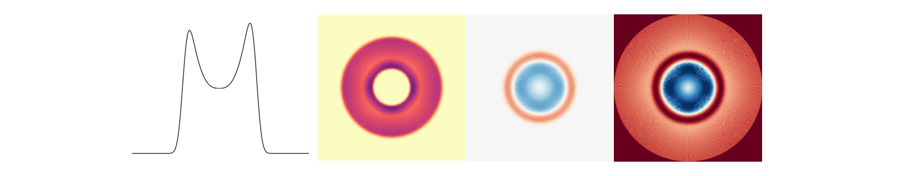
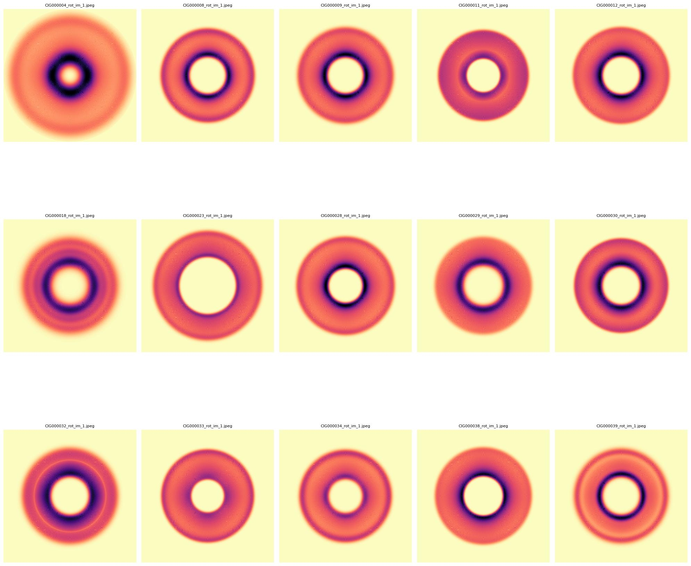
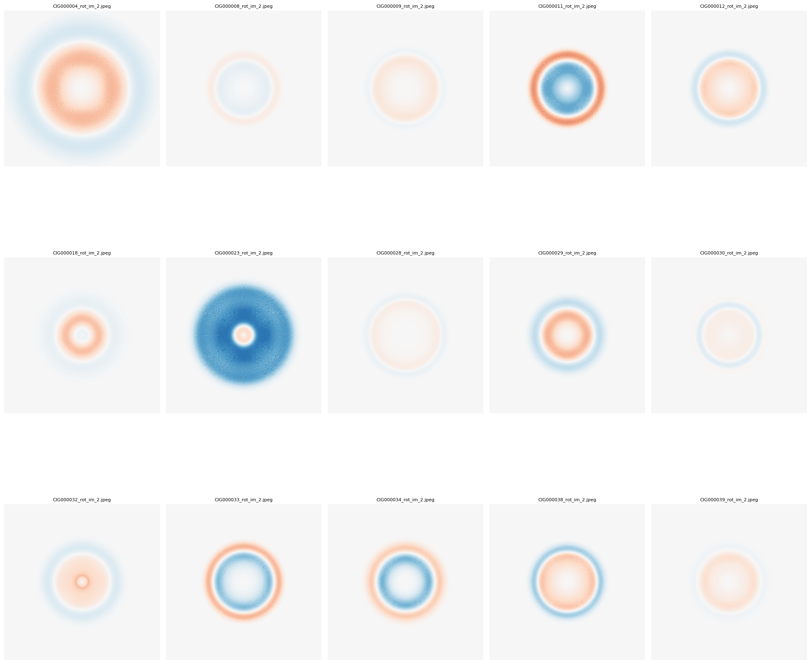
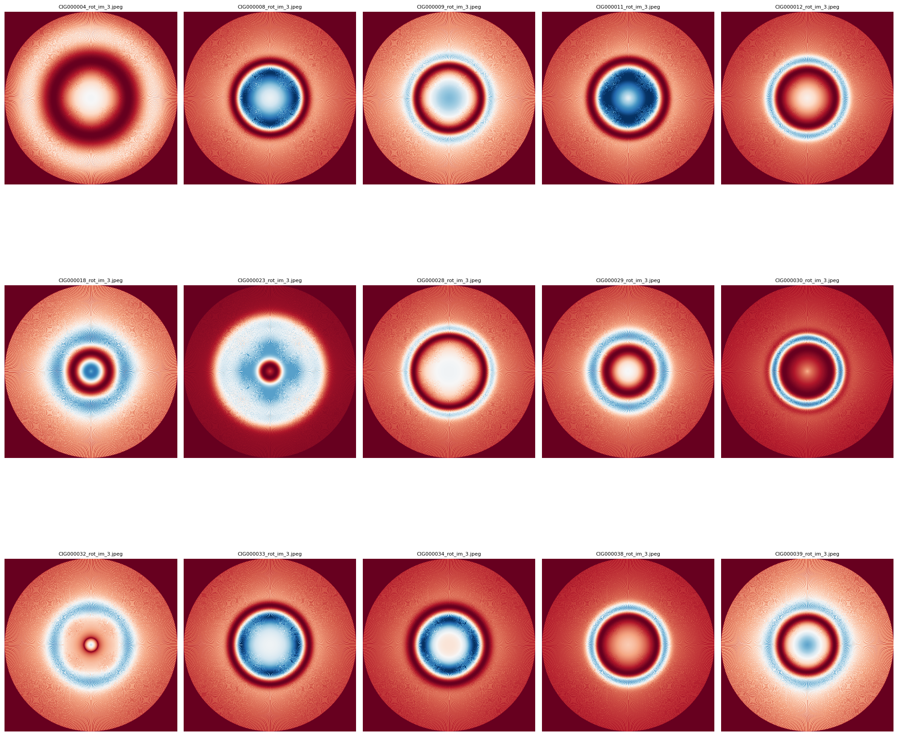
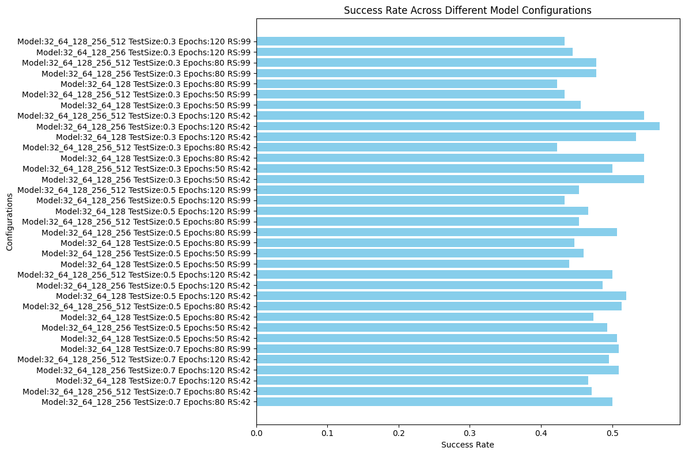

# 4. 2D Image Modelling and CNN-Classification

To enhance the classification process, we introduced an innovative approach by transforming the 1D HI profiles into 2D images. This transformation was aimed at capturing *asymmetries* within the profiles, which are often indicative of underlying galactic processes. We generated three distinct 2D image models, each designed to highlight different features of the HI profiles. CNN techniques were then applied to these images to perform a more nuanced classification, leading to improved accuracy and deeper insights into the data. The results of this 2D analysis were compared with previous classifications, offering a comprehensive evaluation of our methodology.

# Step 1: Inspection of Spectrum | CIG - AMIGA

In this part, the script processes and visualizes spectral data from a FITS file. It loads the spectrum, normalizes it, and then plots two types of visualizations. The first plot shows the normalized spectrum across all pixels. The second plot displays the spectrum split into right and left halves, with the left half inverted and negative, and also shows their combined form. The script uses `matplotlib` for plotting and `astropy` for reading FITS files. It is designed to be simple yet effective for analyzing spectral data.

```python
# 1.---------Importation of Libraries------
import matplotlib.pyplot as plt
import numpy as np
from astropy.io import fits

# 2.---------Load and Normalize Spectrum Function------
def plot_spectra(file_path):
    # Load and normalize the spectrum
    spectrum = fits.getdata(file_path)[0]
    spectrum_normalized = (spectrum - spectrum.min()) / (spectrum.max() - spectrum.min())
    
    # Create the x-axis and split the spectrum
    x = np.arange(len(spectrum_normalized))
    center = len(x) // 2
    spectrum_right = spectrum_normalized[center:]
    spectrum_left = -spectrum_normalized[center-1::-1]
    x_right = np.arange(len(spectrum_right))
    
    # Combine right and left spectra
    spectrum_combined = spectrum_right + spectrum_left
    
    # Create the plot
    plt.figure(figsize=(10, 5))
    
    # Plot normalized spectrum
    plt.subplot(2, 1, 1)
    plt.plot(x, spectrum_normalized, label='Normalized Spectrum')
    plt.xlabel('Pixel')
    plt.ylabel('Normalized Flux')
    plt.title(f'Normalized Spectrum from {file_path}')
    plt.grid(True)
    plt.legend()

    # Plot separated and combined spectra
    plt.subplot(2, 1, 2)
    plt.plot(x_right, spectrum_right, label='Right Spectrum')
    plt.plot(np.arange(len(spectrum_left)), spectrum_left, label='Left Spectrum (inverted, negative)', linestyle='--')
    plt.plot(x_right, spectrum_combined, label='Combined Spectrum', linestyle='-.')
    plt.xlabel('Pixel')
    plt.ylabel('Normalized Flux')
    plt.title('Separated and Combined Spectra')
    plt.grid(True)
    plt.legend()
    
    plt.tight_layout()
    plt.show()

# 3.---------File Path and Function Call------
# Path to the FITS file
file_path = 'D:/1. JAE Intro ICU/sp_im_busyfit/A005580.fits_busyfit_2.fits'

# Call the function to plot the spectra
plot_spectra(file_path)
```
Ouput Example:


# Step 2: 2D Image Modelling | BusyFit - CIG - AMIGA

This code processes a set of FITS files from a specified directory, focusing on files that match a particular naming convention. The code extracts spectral data from each FITS file, normalizes the spectra, and generates ring-like images based on the spectral data. It then creates combined plots that display the original spectrum, its right and left halves, and their combined form. The code saves these plots and ring images as JPEG files and also compiles them into a single PDF document. The entire process is managed by specifying an index range to select which FITS files to process, allowing for flexible analysis of large datasetTion. Three distinct 2D image models were generated for the symmetry study:

- *Model 1*: A rotation of the fitted spectrum.
- *Model 2*: A rotated spectrum with subtracted right and left profiles to highlight asymmetry.
- *Model 3*: A normalized version of the second model, with adjusted pixel intensity to emphasize specific features.
Methodology: The study applies current Machine Learning (ML) techniques and explores extrapolating this approach to the ALFALFA survey.



```python
    # 1.---------Importation of Libraries------
    import os
    import re
    import matplotlib.pyplot as plt
    import numpy as np
    from astropy.io import fits
    from matplotlib.backends.backend_pdf import PdfPages

    # 2.---------Function to Get the List of Files---------
    def get_fits_files(directory, file_pattern):
        pattern = re.compile(file_pattern)
        files = []
        for file in os.listdir(directory):
            match = pattern.match(file)
            if match:
                num = int(match.group(1))
                files.append((num, file))
        files.sort()
        return files

    # 3.---------Functions to Process FITS Files---------
    def load_fits_spectrum(file_path):
        with fits.open(file_path) as hdul:
            data = hdul[0].data
        return data

    def normalize_spectrum(spectrum):
        min_val = np.min(spectrum)
        max_val = np.max(spectrum)
        
        # Avoid division by zero
        if max_val - min_val == 0:
            return np.zeros_like(spectrum)  # Return an array of zeros if the spectrum is flat
        else:
            normalized = (spectrum - min_val) / (max_val - min_val)
            return normalized

    def create_ring_image_1(ax, spectrum, cmap='magma_r'):
        spectrum_length = len(spectrum)
        image_size = 2 * spectrum_length  # Image size
        image = np.zeros((image_size, image_size))  # Initialize the image
        center = image_size // 2  # Image center

        # Handling negative values in the spectrum
        if np.any(spectrum < 0):
            print("Warning: The spectrum contains negative values. Taking absolute values.")
            spectrum = np.abs(spectrum)  # Option to take absolute values

        # Normalize the spectrum between 0 and 1
        spectrum_min = np.min(spectrum)
        spectrum_range = np.max(spectrum) - spectrum_min
        if spectrum_range > 0:
            normalized_spectrum = (spectrum - spectrum_min) / spectrum_range
        else:
            normalized_spectrum = np.zeros_like(spectrum)

        for r in range(spectrum_length):
            theta = np.linspace(0, 2 * np.pi, image_size)  # Angles from 0 to 360 degrees
            x = center + r * np.cos(theta)  # x coordinates on the circle
            y = center + r * np.sin(theta)  # y coordinates on the circle
            for i in range(len(x)):
                xi = int(round(x[i]))
                yi = int(round(y[i]))
                if 0 <= xi < image_size and 0 <= yi < image_size:
                    # Scale the intensity logarithmically for better uniformity
                    scaled_intensity = normalized_spectrum[r]
                    # Ensure the values are between 0 and 1
                    image[yi, xi] = min(scaled_intensity, 1)

        # Normalize the image after value assignment
        image_min = np.min(image)
        image_max = np.max(image)
        if image_max > image_min:
            image = (image - image_min) / (image_max - image_min)

        # Display the image with a continuous colormap
        norm = plt.Normalize(vmin=0, vmax=1)
        ax.imshow(image, cmap='magma_r', norm=norm, origin='lower')
        ax.axis('off')


    def create_ring_image_2(ax, spectrum, vmin, vmax, cmap):
        spectrum_length = len(spectrum)
        image_size = 2 * spectrum_length
        image = np.zeros((image_size, image_size))
        center = image_size // 2
        for r in range(spectrum_length):
            theta = np.linspace(0, 2 * np.pi, image_size)  # Corrected line
            x = center + r * np.cos(theta)
            y = center + r * np.sin(theta)
            for i in range(len(x)):
                xi = int(round(x[i]))
                yi = int(round(y[i]))
                image[yi, xi] = spectrum[r]
        norm = plt.Normalize(vmin=vmin, vmax=vmax)
        ax.imshow(image, cmap=cmap, norm=norm, origin='lower')
        ax.axis('off')

    def create_ring_image_3(ax, spectrum, cmap):
        # Normalize image 2 to create image 3
        norm = plt.Normalize(vmin=0, vmax=1)
        spectrum_normalized = normalize_spectrum(spectrum)
        create_ring_image_2(ax, spectrum_normalized, vmin=0, vmax=1, cmap=cmap)

    def plot_and_save_figures(ax_spectrum, ax_image1, ax_image2, ax_image3, file_path, file_name, cmap, output_dir, num):
        data = load_fits_spectrum(file_path)
        if data.ndim == 2 and data.shape[0] == 1:
            spectrum = data[0]
        else:
            raise ValueError("The FITS file does not contain one-dimensional spectral data.")
        
        spectrum_normalized = normalize_spectrum(spectrum)
        x = np.arange(len(spectrum_normalized))
        center = len(spectrum_normalized) // 2
        spectrum_right = spectrum_normalized[center:]
        x_right = np.arange(center, len(spectrum_normalized))
        spectrum_left = -spectrum_normalized[:center][::-1]
        x_left = np.arange(center, center - len(spectrum_left), -1)
        min_length = min(len(spectrum_right), len(spectrum_left))
        spectrum_right = spectrum_right[:min_length]
        spectrum_left = spectrum_left[:min_length]
        x_right = x_right[:min_length]
        x_left = x_left[:min_length]
        spectrum_combined = spectrum_right + spectrum_left

        ax_spectrum.plot(x, spectrum_normalized, label='Normalized Spectrum', color='deepskyblue')
        ax_spectrum.plot(x_right, spectrum_right, label='Right Spectrum', color='orange')
        ax_spectrum.plot(x_right, spectrum_left, label='Left Spectrum', linestyle='--', color='green')
        ax_spectrum.plot(x_right, spectrum_combined, label='Combined Spectrum', linestyle='-.', color='red')
        ax_spectrum.set_title(file_name, fontsize=10)
        ax_spectrum.set_xlabel('Pixel', fontsize=8)
        ax_spectrum.set_ylabel('Normalized Flux', fontsize=8)
        ax_spectrum.legend(fontsize=6)
        ax_spectrum.grid(True)

        create_ring_image_1(ax_image1, spectrum_normalized, cmap=cmap)
        create_ring_image_2(ax_image2, spectrum_combined, vmin=-1, vmax=1, cmap=cmap)
        create_ring_image_3(ax_image3, spectrum_combined, cmap=cmap)

        if not os.path.exists(output_dir):
            os.makedirs(output_dir)
        
        num_str = f'{num:06}'

        fig1, ax1 = plt.subplots()
        ax1.imshow(ax_image1.images[0].get_array(), cmap='magma_r', vmin=0, vmax=1, origin='lower')
        ax1.axis('off')
        fig1.savefig(os.path.join(output_dir, f'CIG{num_str}_rot_im_1.jpeg'), bbox_inches='tight', pad_inches=0)
        plt.close(fig1)
        
        fig2, ax2 = plt.subplots()
        ax2.imshow(ax_image2.images[0].get_array(), cmap=cmap, vmin=-1, vmax=1, origin='lower')
        ax2.axis('off')
        fig2.savefig(os.path.join(output_dir, f'CIG{num_str}_rot_im_2.jpeg'), bbox_inches='tight', pad_inches=0)
        plt.close(fig2)
        
        fig3, ax3 = plt.subplots()
        ax3.imshow(ax_image3.images[0].get_array(), cmap=cmap, vmin=0, vmax=1, origin='lower')
        ax3.axis('off')
        fig3.savefig(os.path.join(output_dir, f'CIG{num_str}_rot_im_3.jpeg'), bbox_inches='tight', pad_inches=0)
        plt.close(fig3)

    def main(directory, output_dir, start_index, end_index, file_pattern, cmap, pdf_path):
        fits_files = get_fits_files(directory, file_pattern)
        fits_files = [file for file in fits_files if start_index <= file[0] <= end_index]
        num_files_to_process = len(fits_files)

        if num_files_to_process == 0:
            print("No FITS files found within the specified index range.")
            return

        num_rows = (num_files_to_process + 4) // 5
        num_cols = 5

        fig_spectra, axes_spectra = plt.subplots(num_rows, num_cols, figsize=(30, 20), constrained_layout=True)
        fig_image1, axes_image1 = plt.subplots(num_rows, num_cols, figsize=(20, 20), constrained_layout=True)
        fig_image2, axes_image2 = plt.subplots(num_rows, num_cols, figsize=(20, 20), constrained_layout=True)
        fig_image3, axes_image3 = plt.subplots(num_rows, num_cols, figsize=(20, 20), constrained_layout=True)

        for i, (num, file_name) in enumerate(fits_files):
            file_path = os.path.join(directory, file_name)
            print(f"Processing file: {file_path}")
            
            row = i // num_cols
            col = i % num_cols
            
            plot_and_save_figures(axes_spectra[row, col], axes_image1[row, col], axes_image2[row, col], axes_image3[row, col], file_path, file_name, cmap, output_dir, num)
            
            axes_image1[row, col].set_title(f'CIG{num:06}_rot_im_1.jpeg', fontsize=8)
            axes_image2[row, col].set_title(f'CIG{num:06}_rot_im_2.jpeg', fontsize=8)
            axes_image3[row, col].set_title(f'CIG{num:06}_rot_im_3.jpeg', fontsize=8)

        fig_spectra.tight_layout()
        fig_image1.tight_layout()
        fig_image2.tight_layout()
        fig_image3.tight_layout()

        with PdfPages(pdf_path) as pdf_pages:
            pdf_pages.savefig(fig_spectra)
            pdf_pages.savefig(fig_image1)
            pdf_pages.savefig(fig_image2)
            pdf_pages.savefig(fig_image3)

        plt.show()

        print(f"PDF saved at: {pdf_path}")

    # 4.---------Input Parameters---------
    directory = 'D:/1. JAE Intro ICU/CIG/ascii-files/sp_busyfit/'
    output_dir = 'D:/1. JAE Intro ICU/CIG/ascii-files/sp_busyfit/rot_2D_im'
    start_index = 0
    end_index = 20  #Not listed, rather the actual CIG Naming of Object
    file_pattern = r'CIG(\d+)_.*_busyfit_3\.fits'
    cmap = 'RdBu'
    pdf_path = os.path.join(output_dir, '2DImageModel_OutputFigures.pdf')

    # Run the main function with the specified parameters
    main(directory, output_dir, start_index, end_index, file_pattern, cmap, pdf_path)
```


Output example:





PDF saved at: D:/rot_2D_im\2DImageModel_OutputFigures.pdf

# Step 3: Asymmetry Classification | CIG - AMIGA

This script is designed for image classification tasks using convolutional neural networks (CNNs). It processes images from a specified directory, builds a CNN model, and tunes hyperparameters (like test size, random state, and epochs) to find the best configuration. The script also includes steps for data visualization, success rate calculation, and model performance evaluation. The results, including classification success rates and visualizations, are saved in a specified results directory. The script is highly configurable, with key variables set at the beginning for easy adaptation to different datasets and scenarios.

The Symmetry Study:
- Classifications made for a selected model (Models 1, 2 or 3) based on: *_X.jpeg* termination of selected model files.
- Comparison: The resulting classification was compared with a profile classification previously conducted by the AMIGA scientific group (Espada, 2011).

Example of parametrization:  
``` python 
    file_suffix = "_rot_im_2.jpeg"
    ...
    num_groups = 3
    test_size_options = [0.7, 0.5, 0.3]
    random_state_options = [42, 99]
    epochs_options = [50, 80, 120]
    model_configs = 
        [32, 64, 128],      # Simple model
        [32, 64, 128, 256], # Medium model
        [32, 64, 128, 256, 512] # Complex model
```
The script:
```python

    # 1.---------Importation of Libraries------
    import os
    import numpy as np
    import matplotlib.pyplot as plt
    from matplotlib.artist import Artist, allow_rasterization
    import tensorflow as tf
    from tensorflow.keras.models import Sequential
    from tensorflow.keras.layers import Conv2D, MaxPooling2D, Flatten, Dense, Dropout, BatchNormalization
    from tensorflow.keras.preprocessing import image
    import matplotlib.pyplot as plt
    from sklearn.model_selection import train_test_split
    import pandas as pd
    from tensorflow.keras.optimizers import AdamW

    # 2.---------Configuration Variables------
    file_suffix = "_rot_im_2.jpeg"  #Selected 2D Image Model
    directory = 'D:/1. JAE Intro ICU/CIG/ascii-files/sp_busyfit/rot_im_busyfit_3' # Select Output Directory
    results_directory = os.path.join(directory, 'results_TDE5_2') # Select output file
    num_groups = 3  #Selec Number of Groups to be Classified, related to "espada2011_table1"
    espada2011_table1 = pd.read_csv(os.path.join(directory, 'Espada2011_Table1_5.csv'), delimiter=';') # Select Comparison Clasification

    # 3.---------Image Loading Function------
    def load_images(directory, file_suffix):
        images = []
        file_names = []
        for file in os.listdir(directory):
            if file.endswith(file_suffix):
                img_path = os.path.join(directory, file)
                img = image.load_img(img_path, target_size=(128, 128))
                img_array = image.img_to_array(img)
                images.append(img_array)
                file_names.append(file)
        images = np.array(images)
        return images, file_names

    # 4.---------Image Preprocessing Function------
    def preprocess_images(images):
        images = images / 255.0
        return images

    # 5.---------Model Building Function------
    def build_model(num_groups, layer_config):
        model = Sequential()
        model.add(Conv2D(layer_config[0], (3, 3), activation='relu', input_shape=(128, 128, 3)))
        model.add(BatchNormalization())
        model.add(MaxPooling2D((2, 2)))
        model.add(Dropout(0.25))
        
        for filters in layer_config[1:]:
            model.add(Conv2D(filters, (3, 3), activation='relu'))
            model.add(BatchNormalization())
            model.add(MaxPooling2D((2, 2)))
            model.add(Dropout(0.25))

        model.add(Flatten())
        model.add(Dense(512, activation='relu'))
        model.add(BatchNormalization())
        model.add(Dropout(0.5))
        model.add(Dense(num_groups, activation='softmax'))

        optimizer = AdamW(learning_rate=0.001, weight_decay=1e-5)
        model.compile(optimizer=optimizer, loss='sparse_categorical_crossentropy', metrics=['accuracy'])
        
        return model

    # 6.---------Image Classification Function------
    def classify_images(images, model):
        predictions = model.predict(images)
        predicted_classes = np.argmax(predictions, axis=1)
        return predicted_classes

    # 7.---------Visualization Function------
    def visualize_random_spectra(images, file_names, predicted_classes, num_samples=60):
        if num_samples > len(images):
            raise ValueError(f'The requested number of samples ({num_samples}) exceeds the test set size ({len(images)}).')
        
        # Ensure we don't exceed the maximum allowed subplots (10 rows * 6 columns = 60)
        num_samples = min(num_samples, 60)
        
        indices = np.random.choice(len(images), num_samples, replace=False)
        plt.figure(figsize=(20, 20))
        for i, idx in enumerate(indices):
            plt.subplot(10, 6, i + 1)
            plt.imshow(images[idx])
            plt.title(f'{file_names[idx]} - Class {predicted_classes[idx]}')
            plt.axis('off')
        plt.tight_layout()
        plt.show()

    # 8.---------Label Assignment Function------
    def assign_labels(num_samples, num_groups):
        labels = np.random.randint(0, num_groups, num_samples)
        return labels

    # 9.---------Main Function (Execution of the Experiment)------
    def main():
        os.makedirs(results_directory, exist_ok=True)  # Create the directory if it doesn't exist

        images, file_names = load_images(directory, file_suffix)
        images = preprocess_images(images)
        labels = assign_labels(len(images), num_groups)

        test_size_options = [0.7, 0.5, 0.3]
        random_state_options = [42, 99]
        epochs_options = [50, 80, 120]
        model_configs = [
            [32, 64, 128],      # Simple model
            [32, 64, 128, 256], # Medium model
            [32, 64, 128, 256, 512] # Complex model
        ]

        best_success_rate = 0
        best_model_config = None
        best_test_size = None
        best_random_state = None
        best_epochs = None

        success_rates = []  # List to store success rates for all combinations
        configurations = []  # List to store configuration details

        # 10.---------Hyperparameter Tuning Loop------
        for test_size in test_size_options:
            for random_state in random_state_options:
                for epochs in epochs_options:
                    for model_config in model_configs:
                        X_train, X_test, y_train, y_test, file_names_train, file_names_test = train_test_split(
                            images, labels, file_names, test_size=test_size, random_state=random_state
                        )
                        
                        model = build_model(num_groups, model_config)
                        model.fit(X_train, y_train, epochs=epochs, validation_data=(X_test, y_test))

                        predicted_classes = classify_images(X_test, model)

                        model_config_str = '_'.join(map(str, model_config))
                        save_path = os.path.join(results_directory, f'classification_results_{model_config_str}_testsize{test_size}_epochs{epochs}_rs{random_state}.xlsx')
                        results_df = pd.DataFrame({'File Name': file_names_test, 'Class': predicted_classes})
                        results_df.to_excel(save_path, index=False)
                        print(f'Results saved to {os.path.abspath(save_path)}')

                        classification_results = results_df

                        classification_results['cig'] = classification_results['File Name'].str.extract(r'CIG(\d+)_')[0].astype(float)
                        classification_results = classification_results.dropna(subset=['cig'])
                        classification_results['cig'] = classification_results['cig'].astype(int)

                        merged_df = pd.merge(classification_results, espada2011_table1, on='cig', how='inner')
                        merged_df['coincidence'] = (merged_df['Class_x'] == merged_df['Class_y']).astype(int)

                        # Definir transformaciones basadas en el valor de num_groups
                        if num_groups == 2:
                            transformations = {
                                'Class_y_v1': lambda x: x,
                                'Class_y_v2': lambda x: x.map({0: 1, 1: 0}),
                            }
                        elif num_groups == 3:
                            transformations = {
                                'Class_y_v1': lambda x: x,
                                'Class_y_v2': lambda x: x.map({0: 1, 1: 2, 2: 0}),
                                'Class_y_v3': lambda x: x.map({0: 2, 1: 0, 2: 1}),
                                'Class_y_v4': lambda x: x.map({0: 0, 1: 2, 2: 1}),
                                'Class_y_v5': lambda x: x.map({0: 1, 1: 0, 2: 2}),
                                'Class_y_v6': lambda x: x.map({0: 2, 1: 1, 2: 0})
                            }
                        else:
                            raise ValueError("El valor de num_groups no es válido. Debe ser 2 o 3.")

                        results = []

                        # 11.---------Transformation and Success Rate Calculation------
                        for label, transform in transformations.items():
                            merged_df[label] = transform(merged_df['Class_y'])
                            coincidence_col = (merged_df['Class_x'] == merged_df[label]).astype(int)
                            success_rate = coincidence_col.mean()
                            # Check if all classes are the same
                            unique_classes = merged_df['Class_x'].nunique()
                            results.append({
                                'Transformation': label,
                                'Success Rate': success_rate,
                                'Total Matches': coincidence_col.sum(),
                                'Total Samples': len(merged_df),
                                'Unique Classes': unique_classes
                            })

                        results_df = pd.DataFrame(results)
                        # Exclude models where all samples are classified the same
                        filtered_results_df = results_df[results_df['Unique Classes'] > 1]

                        if not filtered_results_df.empty:
                            best_transformation = filtered_results_df.loc[filtered_results_df['Success Rate'].idxmax()]
                        else:
                            continue  # Skip if all classifications are the same

                        # Store the success rate and configuration for the final plot
                        success_rates.append(best_transformation['Success Rate'])
                        configurations.append(f'Model:{model_config_str} TestSize:{test_size} Epochs:{epochs} RS:{random_state}')

                        if best_transformation['Success Rate'] > best_success_rate:
                            best_success_rate = best_transformation['Success Rate']
                            best_model_config = model_config
                            best_test_size = test_size
                            best_random_state = random_state
                            best_epochs = epochs

                        results_save_path = os.path.join(results_directory, f'transformation_results_{model_config_str}_testsize{test_size}_epochs{epochs}_rs{random_state}.xlsx')
                        with pd.ExcelWriter(results_save_path) as writer:
                            filtered_results_df.to_excel(writer, sheet_name='Transformation_Summary', index=False)
                            merged_df.to_excel(writer, sheet_name='Merged_Data', index=False)

                        print(f'Results file saved at: {os.path.abspath(results_save_path)}')

        print(f"Best configuration: Model Config: {best_model_config}, Test Size: {best_test_size}, Random State: {best_random_state}, Epochs: {best_epochs}, Success Rate: {best_success_rate}")

        # 12.---------Plot of Success Rates Across All Configurations------
        plt.figure(figsize=(12, 8))
        plt.barh(configurations, success_rates, color='skyblue')
        plt.xlabel('Success Rate')
        plt.ylabel('Configurations')
        plt.title('Success Rate Across Different Model Configurations')
        plt.tight_layout()
        plot_image_path = os.path.join(results_directory, 'success_rate_across_configurations.jpeg')
        plt.savefig(plot_image_path, format='jpeg')
        plt.show()

        # 13.---------Visualization of Samples for the Best Configuration------
        X_train, X_test, y_train, y_test, file_names_train, file_names_test = train_test_split(
            images, labels, file_names, test_size=best_test_size, random_state=best_random_state
        )
        
        model = build_model(num_groups, best_model_config)
        model.fit(X_train, y_train, epochs=best_epochs, validation_data=(X_test, y_test))
        predicted_classes = classify_images(X_test, model)
        num_samples = min(300, len(X_test))
        visualize_random_spectra(X_test, file_names_test, predicted_classes, num_samples=num_samples)

    if __name__ == "__main__":
        main()
```

Output example:


Best configuration: Model Config: [32, 64, 128, 256], Test Size: 0.3, Random State: 42, Epochs: 120, Success Rate: 0.5666666666666667



# Step 4: Asymmetry Classification - Spectrums | CIG - AMIGA

In this part we performs automated data analysis focused on classifying and clustering ASCII-encoded images. It loads and preprocesses image data, applies multiple clustering methods (e.g., K-Means, DBSCAN) and classification algorithms (e.g., KNN, SVM, Random Forest), and evaluates their performance. The script also merges results with an external dataset to assess the accuracy of predictions, testing different configurations and transformations to find the optimal model. The results, including success rates and visualizations of random samples, are saved to Excel and plotted for further analysis.

```python
    import os
    import numpy as np
    import pandas as pd
    from sklearn.preprocessing import StandardScaler
    from sklearn.cluster import KMeans, SpectralClustering, DBSCAN, AgglomerativeClustering
    from sklearn.mixture import GaussianMixture
    from sklearn.neighbors import KNeighborsClassifier
    from sklearn.svm import SVC
    from sklearn.ensemble import RandomForestClassifier
    import matplotlib.pyplot as plt
    from sklearn.model_selection import train_test_split
    from tslearn.shapelets import LearningShapelets

    # 1.---------Variable Configuration------
    file_suffix = ".asc"  # ASCII file extension
    directory = 'D:/1. JAE Intro ICU/CIG/ascii-files'
    results_directory = os.path.join(directory, 'results_Shapelets_TDE5_3')  # Results directory
    num_groups = 3  # Number of groups for classification
    espada2011_table1 = pd.read_csv(os.path.join(directory, 'sp_busyfit/rot_im_busyfit_3/Espada2011_Table1_5.csv'), delimiter=';')

    # 2.---------Function to Load ASCII Files------
    def load_fits_data(directory, file_suffix):
        images = []
        file_names = []
        for file in os.listdir(directory):
            if file.endswith(file_suffix):
                file_path = os.path.join(directory, file)
                try:
                    data = np.loadtxt(file_path)
                    if data.ndim == 2:  # Check if data has 2 dimensions
                        images.append(data.flatten())  # Flatten data to 1D
                        file_names.append(file)
                except Exception as e:
                    print(f"Error loading {file}: {e}")
        return images, file_names

    # 3.---------Function for Preprocessing Files------
    def preprocess_images(images, target_length=None):
        if target_length is None:
            target_length = max(len(image) for image in images)
        
        scaler = StandardScaler()
        images_scaled = []
        for image in images:
            image = np.pad(image, (0, max(0, target_length - len(image))), 'constant')[:target_length]
            image_scaled = scaler.fit_transform(image.reshape(-1, 1)).flatten()
            images_scaled.append(image_scaled)
        
        return images_scaled

    # 4.---------Function for Visualization------
    def visualize_random_spectra(images, file_names, predicted_classes, num_samples=60):
        if num_samples > len(images):
            raise ValueError(f'The requested number of samples ({num_samples}) exceeds the test set size ({len(images)}).')
        
        num_samples = min(num_samples, 60)
        
        indices = np.random.choice(len(images), num_samples, replace=False)
        plt.figure(figsize=(20, 20))
        for i, idx in enumerate(indices):
            plt.subplot(10, 6, i + 1)
            plt.plot(images[idx])  # Visualize as spectrum
            plt.title(f'{file_names[idx]} - Class {predicted_classes[idx]}')
            plt.axis('off')
        plt.tight_layout()
        plt.show()

    # 5.---------Function to Assign Labels------
    def assign_labels(num_samples, num_groups):
        labels = np.random.randint(0, num_groups, num_samples)
        return labels

    # 6.---------Function to Apply Clustering and Classification Models------
    def apply_clustering(images, method):
        if method == 'kmeans':
            model = KMeans(n_clusters=num_groups, random_state=42)
        elif method == 'spectral':
            model = SpectralClustering(n_clusters=num_groups, random_state=42)
        elif method == 'dbscan':
            model = DBSCAN(eps=0.5, min_samples=5)
        elif method == 'agglomerative':
            model = AgglomerativeClustering(n_clusters=num_groups)
        elif method == 'gaussian_mixture':
            model = GaussianMixture(n_components=num_groups, random_state=42)
        
        predicted_classes = model.fit_predict(images)
        
        return predicted_classes

    def apply_classification(X_train, y_train, X_test, method):
        if method == 'knn':
            model = KNeighborsClassifier(n_neighbors=5)
        elif method == 'svm':
            model = SVC(kernel='linear', probability=True)
        elif method == 'random_forest':
            model = RandomForestClassifier(n_estimators=100, random_state=42)
        elif method == 'shapelets':
            model = LearningShapelets(n_shapelets_per_size={100: 10, 50: 8, 30: 5, 10: 3}, max_iter=350, batch_size=10, scale=True)
        
        model.fit(X_train, y_train)
        predicted_classes = model.predict(X_test)
        
        return predicted_classes

    # 7.---------Main Function (Experiment Execution)------
    def main():
        os.makedirs(results_directory, exist_ok=True)  # Create directory if it doesn't exist

        images, file_names = load_fits_data(directory, file_suffix)
        images = preprocess_images(images)
        labels = assign_labels(len(images), num_groups)

        test_size_options = [0.7, 0.5, 0.3]
        random_state_options = [42, 99]
        methods = ['kmeans', 'spectral', 'dbscan', 'agglomerative', 'gaussian_mixture', 'knn', 'svm', 'random_forest', 'shapelets']

        best_success_rate = 0
        best_method = None
        best_test_size = None
        best_random_state = None

        success_rates = []
        configurations = []

        for test_size in test_size_options:
            for random_state in random_state_options:
                for method in methods:
                    X_train, X_test, y_train, y_test, file_names_train, file_names_test = train_test_split(
                        images, labels, file_names, test_size=test_size, random_state=random_state
                    )

                    if method in ['kmeans', 'spectral', 'dbscan', 'agglomerative', 'gaussian_mixture']:
                        predicted_classes = apply_clustering(X_test, method)
                    else:
                        predicted_classes = apply_classification(X_train, y_train, X_test, method)

                    results_df = pd.DataFrame({'File Name': file_names_test, 'Class': predicted_classes})
                    save_path = os.path.join(results_directory, f'classification_results_{method}_testsize{test_size}_rs{random_state}.xlsx')
                    results_df.to_excel(save_path, index=False)
                    print(f'Results saved to {os.path.abspath(save_path)}')

                    classification_results = results_df
                    classification_results['cig'] = classification_results['File Name'].str.extract(r'CIG(\d+)_')[0].astype(float)
                    classification_results = classification_results.dropna(subset=['cig'])
                    classification_results['cig'] = classification_results['cig'].astype(int)

                    merged_df = pd.merge(classification_results, espada2011_table1, on='cig', how='inner')
                    merged_df['coincidence'] = (merged_df['Class_x'] == merged_df['Class_y']).astype(int)

                    transformations = {
                        'Class_y_v1': lambda x: x,
                        'Class_y_v2': lambda x: x.map({0: 1, 1: 2, 2: 0}),
                        'Class_y_v3': lambda x: x.map({0: 2, 1: 0, 2: 1}),
                        'Class_y_v4': lambda x: x.map({0: 0, 1: 2, 2: 1}),
                        'Class_y_v5': lambda x: x.map({0: 1, 1: 0, 2: 2}),
                        'Class_y_v6': lambda x: x.map({0: 2, 1: 1, 2: 0})
                    }

                    results = []

                    for label, transform in transformations.items():
                        merged_df[label] = transform(merged_df['Class_y'])
                        coincidence_col = (merged_df['Class_x'] == merged_df[label]).astype(int)
                        success_rate = coincidence_col.mean()
                        results.append({
                            'Transformation': label,
                            'Success Rate': success_rate,
                            'Total Matches': coincidence_col.sum(),
                            'Total Samples': len(merged_df)
                        })

                    results_df = pd.DataFrame(results)
                    best_transformation = results_df.loc[results_df['Success Rate'].idxmax()]

                    success_rates.append(best_transformation['Success Rate'])
                    configurations.append(f'Method:{method} TestSize:{test_size} RS:{random_state}')

                    if best_transformation['Success Rate'] > best_success_rate:
                        best_success_rate = best_transformation['Success Rate']
                        best_method = method
                        best_test_size = test_size
                        best_random_state = random_state

                    results_save_path = os.path.join(results_directory, f'transformation_results_{method}_testsize{test_size}_rs{random_state}.xlsx')
                    with pd.ExcelWriter(results_save_path) as writer:
                        results_df.to_excel(writer, sheet_name='Transformation_Summary', index=False)
                        merged_df.to_excel(writer, sheet_name='Merged_Data', index=False)

                    print(f'Results file saved at: {os.path.abspath(results_save_path)}')

        print(f"Best configuration: Method: {best_method}, Test Size: {best_test_size}, Random State: {best_random_state}, Success Rate: {best_success_rate}")

        plt.figure(figsize=(12, 8))
        plt.barh(configurations, success_rates, color='skyblue')
        plt.xlabel('Success Rate')
        plt.ylabel('Configurations')
        plt.title('Success Rate Across Different Configurations')
        plt.tight_layout()
        plot_image_path = os.path.join(results_directory, 'success_rate_across_configurations.jpeg')
        plt.savefig(plot_image_path, format='jpeg')
        plt.show()

        X_train, X_test, y_train, y_test, file_names_train, file_names_test = train_test_split(
            images, labels, file_names, test_size=best_test_size, random_state=best_random_state
        )
        
        predicted_classes = apply_classification(X_train, y_train, X_test, best_method)
        visualize_random_spectra(X_test, file_names_test, predicted_classes, num_samples=min(300, len(X_test)))

    if __name__ == "__main__":
        main()
```