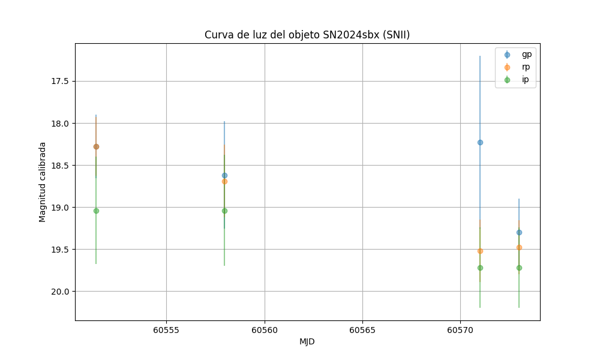
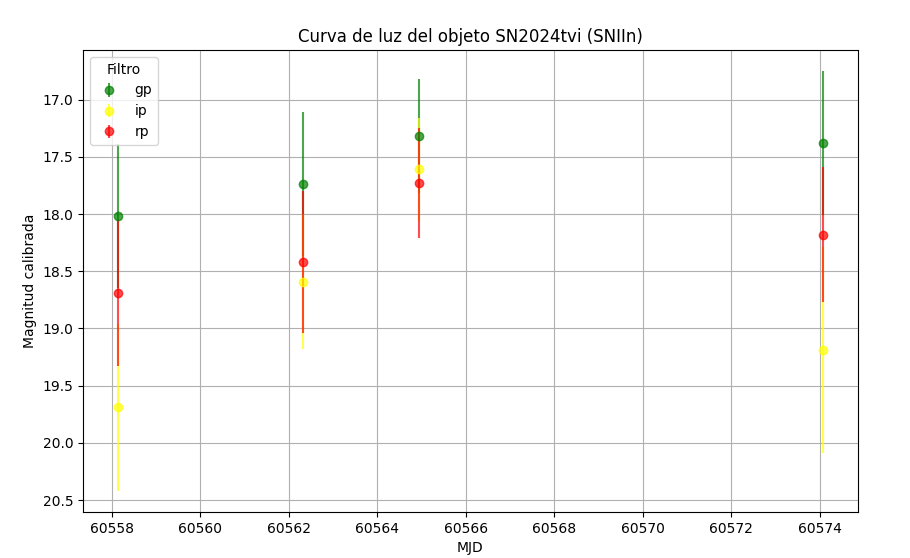
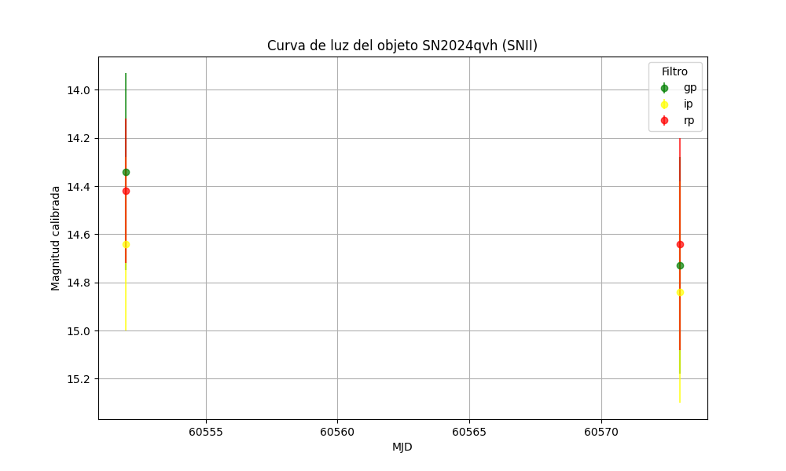
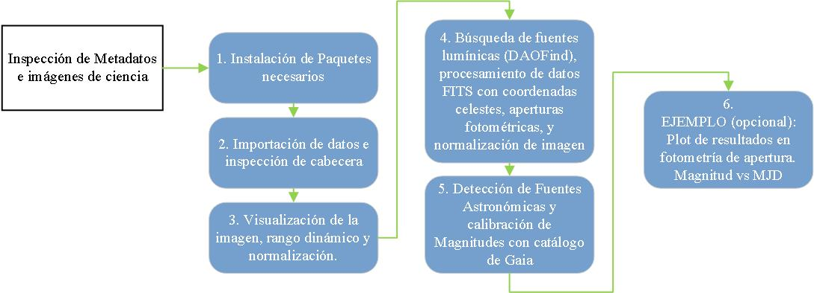
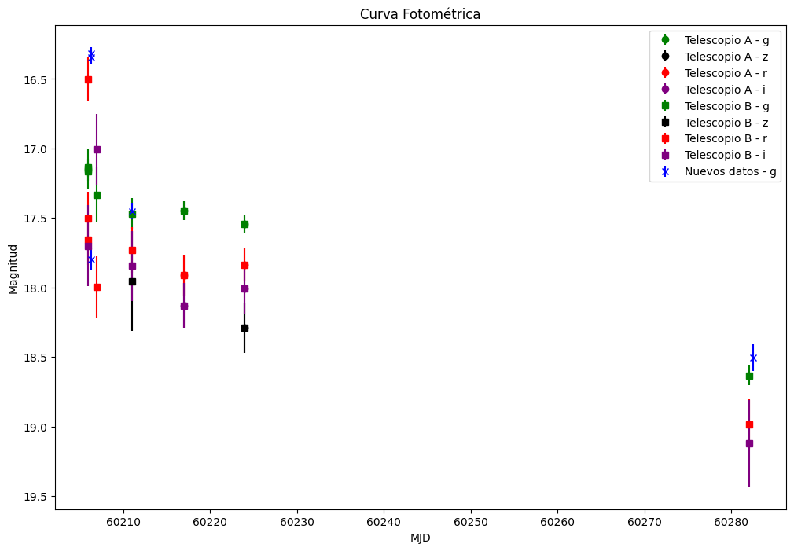

## Science of the Bolivian Virtual Observatory (BVO)

---

### A. Light Curves | SN II - LCO Data

---

The data generated by the project are used for the study of Type II supernovae, specifically in the construction of their light curves, which track the evolution of brightness over time for these explosive events. Observations made through remote telescopes are processed to obtain precise graphs reflecting changes in magnitude and emitted energy. These studies are essential for gaining a deeper understanding of the physics behind supernovae and their role in stellar evolution.

#### SN2024sbx



#### SN2024tvi



#### SN2024qvh




---

### B. Code Repository

---

In this section, we develop code for training purposes within the project, using the acquired data to foster the integration of participants into coding environments such as Python, Jupyter Notebooks, and Binder, which are currently of great importance to modern science. We present a Jupyter Notebook repository designed for training programs in the study of transient astronomical phenomena under the Bolivian Virtual Observatory (BVO) project. This code is intended for academic purposes only.

---

#### Photometry Pipeline for Training | LCO Data

[GitHub Respostory (Spanish) - Photometry BVO Notebook](https://github.com/GabrielJaimes-AstroDev/Bolivian-Virtual-Observatory-BVO-/blob/main/1.Photometry_BVO.ipynb)


---

**[EN]**  
We present a Jupyter Notebook repository for training programs in the study of transient astronomical phenomena for the Bolivian Virtual Observatory (BVO) project. This code is for academic purposes only.

The AstroPy package is used in Python 3.0 environments, along with the "Photutils: Photometry Tools" software.  
(Bradley, Larry, et al. Astropy Project. Last modified 2024. [https://photutils.readthedocs.io/en/stable/](https://photutils.readthedocs.io/en/stable/).)

Developed by G. Jaimes (gabrieljaimes@upb.edu) using proprietary metadata from the Bolivian Virtual Observatory (BVO) project acquired through the Las Cumbres Observatory (LCO) remote telescope network.  
The use of this repository for commercial purposes or university training is prohibited without BVO's project consent.

---

The pipeline flow is shown below:



**1. Installation of Required Libraries.**

A functioning Jupyter Notebook repository requires related data libraries, dedicated databases, and Python 3.0 processing functions installed in the environment. The following installation command refers to the upgrade and installation of several main packages for astronomical analysis: `photutils` for image analysis, `pytest-astropy` for testing, `astropy` for astronomical data, `matplotlib` for plotting, `acstools` for Hubble Space Telescope data, and `astroquery` for querying the astronomical database.

```python
    !pip install photutils pandas scipy pytest-astropy astropy matplotlib acstools astroquery --upgrade
```

**2. Import Data and Header Inspection**

In astrophysics, it is very common to use .fits files from telescope and instrument data acquisition. The image contains important information in the file header. This part reads and processes a FITS (Flexible Image Transport System) file. First, the necessary libraries for manipulating FITS files, tabular data, and presenting results in an HTML table format in a Jupyter Notebook environment are imported. Then, a list is created to store the header keys and values, and the path to the FITS file is set. For easy analysis, the file is opened, the header of the first extension is extracted, the keys and values are stored in a list, and this DataFrame is displayed in tabular format.

``` python
    # ACTION: PARAMETERIZATION

    #---------2.- Define Path and Initialize Variables---------
    # Path to the FITS file
    file_path = 'C:/Users/Usuario/Downloads/2024sbx/E2/lsc0m476-sq34-20240904-0086-e91.fits'

```

``` python
    #---------1.- Import Libraries---------
    from astropy.io import fits
    import pandas as pd
    from astropy.coordinates import Angle
    from astropy import units as u
    from IPython.display import display, HTML
    import numpy as np

    # List to store header keys and values
    header_list = []

    #---------2.- Process the FITS File---------
    # Open the FITS file
    with fits.open(file_path) as hdul:
        # Get the header of the first extension
        header = hdul[0].header
        data = hdul[0].data
        
        # Extract specific values
        origname = header.get('ORIGNAME', 'Unavailable')
        project = header.get('GROUPID', 'Unavailable')
        mjd_obs = header.get('MJD-OBS', 'Unavailable')
        exptime = header.get('EXPTIME', 'Unavailable')
        filter1 = header.get('FILTER1', 'Unavailable')
        location = header.get('SITE', 'Unavailable')
        
        # Extract and convert RA and DEC to decimal format
        ra = header.get('RA', 'Unavailable')
        dec = header.get('DEC', 'Unavailable')

        if ra != 'Unavailable' and dec != 'Unavailable':
            ra_angle = Angle(ra, unit=u.hourangle)  # RA usually comes in hours
            dec_angle = Angle(dec, unit=u.deg)      # DEC usually comes in degrees

            ra_decimal = ra_angle.deg  # Convert RA to decimal degrees
            dec_decimal = dec_angle.deg  # DEC is already in decimal degrees
        else:
            ra_decimal = 'Unavailable'
            dec_decimal = 'Unavailable'

        # Add RA and DEC to the important data
        important_data = {
            'Key': ['ORIGNAME', 'GROUPID', 'MJD-OBS', 'EXPTIME', 'FILTER1', 'LOCATION', 'RA (deg)', 'DEC (deg)'],
            'Value': [origname, project, mjd_obs, exptime, filter1, location, ra_decimal, dec_decimal]
        }
        important_df = pd.DataFrame(important_data)

        # Display the table with specific values
        display(HTML("<h3>IMPORTANT HEADER DATA:</h3>"))
        display(HTML(important_df.to_html(index=False)))

        # Save header keys and values to the list
        for key in list(header.keys())[:40]:  # You can limit to the first 40 keys if desired
            header_list.append((key, header[key]))

    # Create a DataFrame with the key-value list
    header_df = pd.DataFrame(header_list, columns=['Key', 'Value'])

    # Display the DataFrame more visually like an Excel-style table
    display(HTML("<h3>COMPLETE HEADER:</h3>"))
    display(HTML(header_df.to_html(index=False)))

```


``` python
    # ACTION: PARAMETERIZATION 
    # The RA and DEC coordinates must be specifically assigned for our celestial object of study. (The previous ones are from the Image)
    ob_ra = 302.724469875    # Coordinate (decimal): Right Ascension
    ob_de = -27.4591675625   # Coordinate (decimal): Declination 
    exptime = 120      # Exposure time in seconds
```

**3. Image Visualization, Dynamic Range, and Normalization**

This section handles showing the data from a FITS file. The necessary libraries for visualization (`matplotlib`), image normalization (`astropy.visualization`), and reading FITS files (`astropy.io.fits`) are imported. First, the necessary packages are imported. Then, the image data is extracted, and the path to the FITS file is set. To improve visualization, image normalization parameters are established using a square root stretch. Finally, an image is created and displayed with the applied normalization, using a specific color scale and a color bar to determine intensity.

``` python
    # ACTION: PARAMETERIZATION
    vmin = 10  # or some small value representing the background noise
    vmax = np.percentile(data, 99)  # adjust as needed
```

``` python
    #---------1.- Import Libraries---------
    import matplotlib.pyplot as plt
    from astropy.visualization import SqrtStretch, ImageNormalize
    from astropy.io import fits
    import numpy as np

    #---------3.- Visualize Data---------
    # Create normalization with manual limits and sqrt stretch
    norm = ImageNormalize(vmin=vmin, vmax=vmax, stretch=SqrtStretch())

    # Visualize the data with the applied stretch
    plt.figure(figsize=(30, 15))
    plt.imshow(data, cmap='RdYlBu', norm=norm, origin='lower')
    plt.colorbar()
    plt.show()

```
**4. Light Source Detection (DAOFind), FITS Data Processing with Celestial Coordinates, Photometric Apertures, and Image Normalization**

This process focuses on identifying and analyzing light sources in an astronomical image and visualizing these sources using advanced photometry and image normalization techniques.

First, the necessary libraries are imported, such as `numpy` and `IPython.display` for handling numerical data and visualization in Jupyter Notebook, `astropy.stats` for statistical analysis, `photutils.datasets` for loading image datasets, and `photutils.detection` for star detection. Also, `matplotlib` is used for image visualization, `astropy.visualization` for normalization, and `photutils.aperture` for aperture photometry. In addition, `astropy.coordinates`, `astropy.wcs`, and `astropy.io.fits` are used for celestial coordinate manipulation and FITS file reading. Next, the data from a FITS file is loaded, and both the image data and header are extracted, creating a WCS object that allows conversion from celestial coordinates to image pixels. From these data, background statistics, such as mean, median, and standard deviation, are calculated.

The next step is to apply the DAOStarFinder algorithm to identify stellar sources in the image. The signal-to-noise ratio (SNR) of the identified sources is calculated, as well as the magnitude error associated with each source. This information is organized into a table, which is formatted and visualized in HTML. Finally, the image with the identified sources is visualized. Circular apertures and rings are defined for photometry around the sources and at a new position based on celestial coordinates. The image is normalized for better visualization, and the apertures and rings are overlaid on the image. The final result is shown as a visually enriched image with the highlighted apertures and rings.


``` python
    # ACTION: PARAMETERIZATION

    sigma = 3  # Standard deviation (sigma) used in the background statistics. Dimensionless value.
            # It is used to calculate the statistics of the image background (such as the mean and noise).
            
    threshold = 4.0  # Threshold in sigma units, used for source detection.
                    # Defines how many standard deviations above the background a source must be
                    # to be detected.

    fwhm = 3.0  # Full Width at Half Maximum (FWHM) in pixels, refers to the characteristic size
                # of sources in the image. It represents the width of the source at half of its
                # maximum brightness value. Indicates the degree of "


```


``` python
    #---------1.- Import Libraries---------
    import numpy as np
    import matplotlib.pyplot as plt
    from astropy.visualization import SqrtStretch
    from astropy.visualization.mpl_normalize import ImageNormalize
    from photutils.aperture import CircularAperture, CircularAnnulus, ApertureStats, aperture_photometry
    from astropy.coordinates import SkyCoord
    from astropy.wcs import WCS
    from astropy.io import fits
    from astropy.stats import sigma_clipped_stats
    from photutils.datasets import load_star_image
    from photutils.detection import DAOStarFinder
    from IPython.display import display, HTML

    #---------2.- Load FITS Data and Header---------
    # Read the FITS file and extract the data
    with fits.open(file_path) as hdul:
        data = hdul[0].data
        
    # Create the WCS object from the header
    wcs = WCS(hdul[0].header)

    #---------3.- Define Object Coordinates and Convert to Pixels---------
    ra_dec_positions = SkyCoord(ob_ra, ob_de, unit='deg', frame='icrs')
    pixel_positions = np.array(ra_dec_positions.to_pixel(wcs)).T
    print(f"Celestial object position: xpix = {pixel_positions[0]:.20f} [pix], ypix = {pixel_positions[1]:.20f}")  

    #---------4.- Background Statistics---------
    mean, median, std = sigma_clipped_stats(data, sigma=sigma)  
    print(f"Mean: {mean:.20f}, Median: {median:.20f}, Standard Deviation: {std:.20f}")  

    #---------5.- Source Detection---------
    daofind = DAOStarFinder(fwhm=fwhm, threshold=threshold*std)  
    sources = daofind(data - median)  

    # Estimate SNR as flux divided by the square root of flux (simple Poisson error estimate)
    snr = sources['flux'] / np.sqrt(sources['flux'])

    # Limit SNR values to avoid very high numbers
    snr = np.where(snr > 0, snr, 1)  # Avoid null or negative values

    # Calculate magnitude error based on SNR
    mag_error = 2.5 / np.log(10) * (1 / snr)

    # Add the 'mag_err' column (magnitude error) to the table
    sources['mag_err'] = mag_error

    # Format columns for printing
    for col in sources.colnames:  
        if col not in ('id', 'npix'):
            sources[col].info.format = '%.2f'  # Consistency in table output

    #---------6.- Load Source Positions, Create Circular Apertures and Annuli---------
    positions = np.transpose((sources['xcentroid'], sources['ycentroid']))
    apertures = CircularAperture(positions, r=fwhm)  # Use FWHM for apertures

    # Create additional circular apertures at the object's pixel position
    additional_apertures = CircularAperture(pixel_positions, r=fwhm * 1.5)  # Larger radius for additional apertures

    # Define the annulus with inner and outer radii
    annulus_aperture = CircularAnnulus(positions, r_in=fwhm, r_out=fwhm * 1.5)

    #---------7.1.- Calculate Distances from Sources to Target Position---------
    # Calculate distances of each detected source to the target coordinates
    distances = np.sqrt((sources['xcentroid'] - pixel_positions[0])**2 + (sources['ycentroid'] - pixel_positions[1])**2)

    # Find the closest source
    closest_idx = np.argmin(distances)
    closest_source = sources[closest_idx]

    # Extract values of interest
    closest_flux = closest_source['flux']
    closest_mag_err = closest_source['mag_err']

    # Calculate the magnitude of the closest source
    closest_magnitude = -2.5 * np.log10(closest_flux)

    #---------7.- Visualize Data with Applied Stretching---------
    # Define normalization and stretching for visualization
    norm = ImageNormalize(vmin=vmin, vmax=vmax, stretch=SqrtStretch())

    plt.figure(figsize=(30, 15))
    plt.imshow(data, cmap='RdYlBu', norm=norm, origin='lower')
    plt.colorbar()

    # Plot original apertures
    apertures.plot(color='red', lw=1.5, alpha=0.5)

    # Plot annuli
    annulus_aperture.plot(color='blue', lw=3.5, alpha=0.2)

    # Plot the aperture of our celestial object (Supernova)
    additional_apertures.plot(color='black', lw=9.5, alpha=0.5)

    plt.show()

    #---------7.2.- Display Information of the Closest Source---------
    print(f"<b>Closest source:</b><br>Position (x, y): ({closest_source['xcentroid']:.2f}, {closest_source['ycentroid']:.2f})<br>Magnitude: {closest_magnitude:.2f}<br>Magnitude error: {closest_mag_err:.2f}")

    #---------8.- Display Table as HTML---------
    html_table = sources._repr_html_()

    # Display the table as HTML in a compatible environment
    display(HTML(html_table))

```
**5. Detection of Astronomical Sources and Magnitude Calibration with Gaia Catalog**

This process involves detecting and analyzing astronomical sources using FITS images and data from the Gaia catalog. The workflow begins by importing essential libraries such as `numpy`, `matplotlib`, and specific tools from `astropy` and `photutils` for handling FITS data and performing astronomical coordinate analysis. The FITS data is loaded and both the data and header are extracted to build a WCS (World Coordinate System) object, which enables the conversion of celestial coordinates to pixels. Basic background statistics like mean, median, and standard deviation are computed, crucial for accurate object detection. Celestial sources in the image are then identified, and parameters such as signal-to-noise ratio (SNR) and magnitude error are calculated and stored in a table. 

A query is made to the Gaia catalog using an ADQL query to locate stars within a specific radius around the coordinates of interest. The code then compares detected sources with Gaia stars, assessing the accuracy of matches using a tolerance threshold and magnitude error. Finally, the Zero Point (ZP) is calculated for filtered matches, an HTML table with refined results is generated, and the image is visualized with apertures and matches plotted, providing a comprehensive representation of detected sources and their comparison with the Gaia catalog.


``` python
    # ACTION: PARAMETERIZATION

    tolerance_radius = 3  # Pixel tolerance for matches between detected sources
                        # and Gaia star positions. Defines the maximum distance
                        # in pixels to consider a detected source and a Gaia star
                        # as the same.

    radius = 0.25  # Radius in degrees for searching stars in the Gaia catalog.
                    # Defines the size of the area around the celestial object's
                    # coordinates within which Gaia stars will be sought.

```

``` python
    #---------1.- Import Libraries---------
    import numpy as np
    import matplotlib.pyplot as plt
    from astropy.visualization import SqrtStretch
    from astropy.visualization.mpl_normalize import ImageNormalize
    from photutils.aperture import CircularAperture, CircularAnnulus
    from astropy.coordinates import SkyCoord
    from astropy.wcs import WCS
    from astropy.io import fits
    from astropy.stats import sigma_clipped_stats
    from astroquery.gaia import Gaia
    from astropy.table import Table
    from IPython.display import display, HTML
    import astropy.units as u

    #---------2.- Load FITS Data and Header---------
    # Read the FITS file and extract data
    with fits.open(file_path) as hdul:
        data = hdul[0].data
        
    # Create the WCS object from the image header
    wcs = WCS(hdul[0].header)

    # Check that coordinates are aligned correctly with Gaia
    ra_dec_positions = SkyCoord(ob_ra, ob_de, unit='deg', frame='icrs')

    #---------3.- Define Object Coordinates and Convert to Pixels---------
    pixel_positions = np.array(ra_dec_positions.to_pixel(wcs)).T
    # Information about the celestial object
    celestial_x = pixel_positions[0]
    celestial_y = pixel_positions[1]

    #---------4.- Background Statistics---------
    mean, median, std = sigma_clipped_stats(data, sigma=sigma)  

    #---------5.- Source Detection---------
    daofind = DAOStarFinder(fwhm=fwhm, threshold=threshold*std)  
    sources = daofind(data - median)  

    # Print the number of detected sources

    # Estimate SNR as flux divided by the square root of the flux (simple Poisson error estimation)
    snr = sources['flux'] / np.sqrt(sources['flux'])

    # Limit SNR values to avoid very high numbers
    snr = np.where(snr > 0, snr, 1)  # Avoid null or negative values

    # Calculate magnitude error based on SNR
    mag_error = 2.5 / np.log(10) * (1 / snr)

    # Add the 'mag_err' (magnitude error) column to the table
    sources['mag_err'] = mag_error

    #---------6.- Calculate Distance from Sources to the Object of Interest---------
    positions = np.transpose((sources['xcentroid'], sources['ycentroid']))
    distances = np.sqrt((sources['xcentroid'] - celestial_x)**2 + (sources['ycentroid'] - celestial_y)**2)

    # Find the closest source
    closest_idx = np.argmin(distances)
    closest_source = sources[closest_idx]
    closest_flux = closest_source['flux']
    closest_mag_err = closest_source['mag_err']
    closest_magnitude = -2.5 * np.log10(closest_flux)
    distance_to_closest = distances[closest_idx]

    # ---------7.- Query Gaia Catalog with ADQL---------
    adql_query = f"""
    SELECT * 
    FROM gaiadr3.gaia_source 
    WHERE CONTAINS(
        POINT('ICRS', ra, dec), 
        CIRCLE('ICRS', {ra_dec_positions.ra.deg}, {ra_dec_positions.dec.deg}, {radius})
    )=1
    """

    # Execute the query with ADQL
    job = Gaia.launch_job_async(adql_query)
    gaia_result = job.get_results()

    # Filter Gaia stars with available magnitudes in the G filter (limit to magnitude 30 if necessary)
    gaia_stars = gaia_result[gaia_result['phot_g_mean_mag'] < 30]

    # Convert Gaia coordinates to pixels
    gaia_coords = SkyCoord(gaia_stars['ra'], gaia_stars['dec'], unit='deg', frame='icrs')
    gaia_pixel_positions = np.array(gaia_coords.to_pixel(wcs)).T

    # ---------8.- Matches with Gaia---------
    matches = []
    gaia_matched_indices = set()  

    for i, (x, y) in enumerate(positions):
        distances_gaia = np.sqrt((gaia_pixel_positions[:, 0] - x)**2 + (gaia_pixel_positions[:, 1] - y)**2)
        match_idx = np.argmin(distances_gaia)
        
        if distances_gaia[match_idx] < tolerance_radius and sources['mag_err'][i] <= 1:
            if match_idx not in gaia_matched_indices:
                matches.append((sources[i], gaia_stars[match_idx]))
                gaia_matched_indices.add(match_idx)

    matches_filtered = [(source, gaia_star) for source, gaia_star in matches if source['mag_err'] < 1.0]

    # ---------9.- Calculation of Zero Point (ZP)---------
    filtered_zp_values = []
    for source, gaia_star in matches_filtered:
        flux = source['flux']
        gaia_mag = gaia_star['phot_g_mean_mag']
        zp = gaia_mag + 2.5 * np.log10(flux)
        filtered_zp_values.append(zp)

    filtered_zp_mean = np.mean(filtered_zp_values)
    filtered_zp_std = np.std(filtered_zp_values)

    # Calculate the Calibrated Magnitude
    calibrated_magnitude = closest_magnitude + filtered_zp_mean

    # ---------10.- Create HTML Tables---------
    # Additional information for the table
    info_rows = [
        ("Celestial Object Position (x, y)", f"({celestial_x:.20f}, {celestial_y:.20f})"),
        ("Mean", f"{mean:.20f}"),
        ("Median", f"{median:.20f}"),
        ("Standard Deviation", f"{std:.20f}"),
        ("Number of Detected Sources", f"{len(sources)}"),
        ("Position of Closest Source (x, y)", f"({closest_source['xcentroid']:.2f}, {closest_source['ycentroid']:.2f})"),
        ("Instrumental Magnitude of Celestial Object", f"{closest_magnitude:.2f}"),
        ("Magnitude Error", f"{closest_mag_err:.2f}"),
        ("Distance to Closest Source (pixels)", f"{distance_to_closest:.2f}"),
        ("Number of Gaia Stars Found", f"{len(gaia_result)}"),
        ("Total Number of Matches", f"{len(matches)}"),
        ("Number of Matches with Magnitude Error < 1.0", f"{len(matches_filtered)}"),
        ("Average Zero Point (ZP)", f"{filtered_zp_mean:.2f}"),
        ("Standard Deviation of Calibrated Magnitude", f"{filtered_zp_std:.2f}"),
        ("CALIBRATED MAGNITUDE", f"{calibrated_magnitude:.2f}")
    ]

    # Create table for general information
    info_table = Table(rows=info_rows, names=["Description", "Value"])

    # Display HTML table
    html_info_table = info_table._repr_html_()
    display(HTML(html_info_table))

    # Table for filtered matches
    filtered_matched_sources = Table(rows=[(source['id'], source['xcentroid'], source['ycentroid'], gaia_star['ra'], gaia_star['dec'], gaia_star['phot_g_mean_mag'], zp, source['mag_err']) 
                                        for (source, gaia_star), zp in zip(matches_filtered, filtered_zp_values)],
                                    names=('Source ID', 'X Centroid', 'Y Centroid', 'Gaia RA', 'Gaia DEC', 'Gaia G Mag', 'Zero Point', 'Source Error'))

    # Display HTML table for filtered matches
    html_filtered_table = filtered_matched_sources._repr_html_()
    display(HTML(html_filtered_table))

    #---------11.- Create HTML Tables for Results---------
    # Create table with filtered matches and their ZP values
    filtered_matched_sources = Table(rows=[(source['id'], source['xcentroid'], source['ycentroid'],

```

**6. EXAMPLE (optional): Aperture Photometry Results Plot. Magnitude vs MJD.**

This section involves importing libraries for plotting data and handling dates. Several datasets of magnitudes and errors for different observatories and filters are defined, each using specific colors for different filters. The `plot_data()` function extracts and plots these data, including error bars, with customization in colors and markers. Finally, a comparative graph is generated with labels and a legend, showing magnitudes against dates and adjusting the y-axis for inversion, providing a clear visualization of the photometric data.

```python
    # ACTION: PARAMETERIZATION
    # Add your new Photometry data for the light curve: ('filter', Calibrated Magnitude, Magnitude Error, MJD)
    new_data = [
        ('g', 16.3424, 0.052, 60206.3009),
        ('g', 17.7973, 0.076, 60206.3106),
        ('g', 16.3175, 0.048, 60206.3487),
        ('g', 18.507, 0.096, 60282.4850),
        ('g', 17.45, 0.059, 60211.0333),  # last added data
    ]
```

``` python
    #---------1.- Import Libraries---------
    import matplotlib.pyplot as plt
    from datetime import datetime
    from astropy.time import Time

    #---------2.- Observation Data - IAC80---------
    # Telescope A
    data1 = [
        ('g', 17.4465, 0.066313, '30/09/23'),
        ('r', 17.9111, 0.145501, '30/09/23'),
        ('i', 18.1306, 0.160799, '30/09/23'),
        ('g', 17.5424, 0.065164, '07/10/23'),
        ('r', 17.8354, 0.120038, '07/10/23'),
        ('i', 18.0045, 0.18543, '07/10/23'),
        ('z', 18.2896, 0.179689, '07/10/23'),
    ]

    #---------3.- Observation Data - LCO---------
    # Telescope B
    data2 = [
        ('g', 17.1387, 0.065504, '19/09/23'),
        ('r', 16.50033, 0.163263, '19/09/23'),
        ('g', 17.1458, 0.147975, '19/09/23'),
        ('r', 17.5026, 0.193064, '19/09/23'),
        ('g', 17.1667, 0.0634, '19/09/23'),
        ('r', 17.6591, 0.177887, '19/09/23'),
        ('i', 17.6995, 0.291464, '19/09/23'),
        ('g', 17.3341, 0.199078, '20/09/23'),
        ('r', 17.9976, 0.225018, '20/09/23'),
        ('i', 17.0077, 0.253974, '20/09/23'),
        ('g', 17.4686, 0.110465, '24/09/23'),
        ('r', 17.7296, 0.165102, '24/09/23'),
        ('i', 17.8439, 0.25196, '24/09/23'),
        ('z', 17.9534, 0.36095, '24/09/23'),
        ('g', 18.633, 0.069477, '04/12/23'),
        ('r', 18.9848, 0.177824, '04/12/23'),
        ('i', 19.1234, 0.31248, '04/12/23'),
        ('g', 17.4465, 0.066313, '30/09/23'),
        ('r', 17.9111, 0.145501, '30/09/23'),
        ('i', 18.1306, 0.160799, '30/09/23'),
        ('g', 17.5424, 0.065164, '07/10/23'),
        ('r', 17.8354, 0.120038, '07/10/23'),
        ('i', 18.0045, 0.18543, '07/10/23'),
        ('z', 18.2896, 0.179689, '07/10/23'),
    ]

    #---------4.- Color Definition for Filters---------
    # Define a dictionary for specific filter colors
    filter_colors = {
        'g': 'green',
        'r': 'red',
        'i': 'purple',
        'z': 'black',
    }

    #---------5.- Function to Plot Data---------
    def plot_data(data, marker, base_color, label, specific_color=None):
        # Extract unique filters
        filters = set(d[0] for d in data)
        for filt in filters:
            # Extract data for the specific filter
            filt_data = [(d[1], d[2], d[3]) if len(d) > 3 else (d[1], d[2], None) for d in data if d[0] == filt]
            # Filter entries with None values for MJD
            filt_data = [d for d in filt_data if d[2] is not None]

            if filt_data and isinstance(filt_data[0][2], float):
                # Data is in MJD format
                magnitudes = [d[0] for d in filt_data]
                errores = [d[1] for d in filt_data]
                fechas_mjd = [float(d[2]) for d in filt_data]
                fechas = fechas_mjd  # Use MJD directly for the x-axis
            else:
                # Data has four elements, it's the string date format
                fechas = [Time(datetime.strptime(d[2], '%d/%m/%y')).mjd for d in filt_data]
                magnitudes = [d[0] for d in filt_data]
                errores = [d[1] for d in filt_data]

            # Use the specific color if provided, otherwise, use the filter's specific color or the base color
            color = specific_color if specific_color else filter_colors.get(filt, base_color)

            # Plot data with error bars
            ax.errorbar(
                fechas,
                magnitudes,
                yerr=errores,
                fmt=marker,
                label=f'{label} - {filt}',
                color=color
            )

    #---------6.- Create Plot---------
    # Example of plot usage with increased size
    fig, ax = plt.subplots(figsize=(12, 8))

    #---------7.- Plot Multiple Datasets---------
    # Plot multiple datasets
    plot_data(data1, 'o', 'blue', 'Telescope A')
    plot_data(data2, 's', 'green', 'Telescope B')
    plot_data(new_data, 'x', 'orange', 'New Data', specific_color='blue')  # Ensure new data is plotted in blue

    #---------8.- Customize Plot---------
    # Customize plot
    ax.set_xlabel('MJD')
    ax.set_ylabel('Magnitude')
    ax.set_title('Photometric Curve')
    # Invert the y-axis
    plt.gca().invert_yaxis()
    ax.legend()

    #---------9.- Show Plot---------
    plt.show()

```

