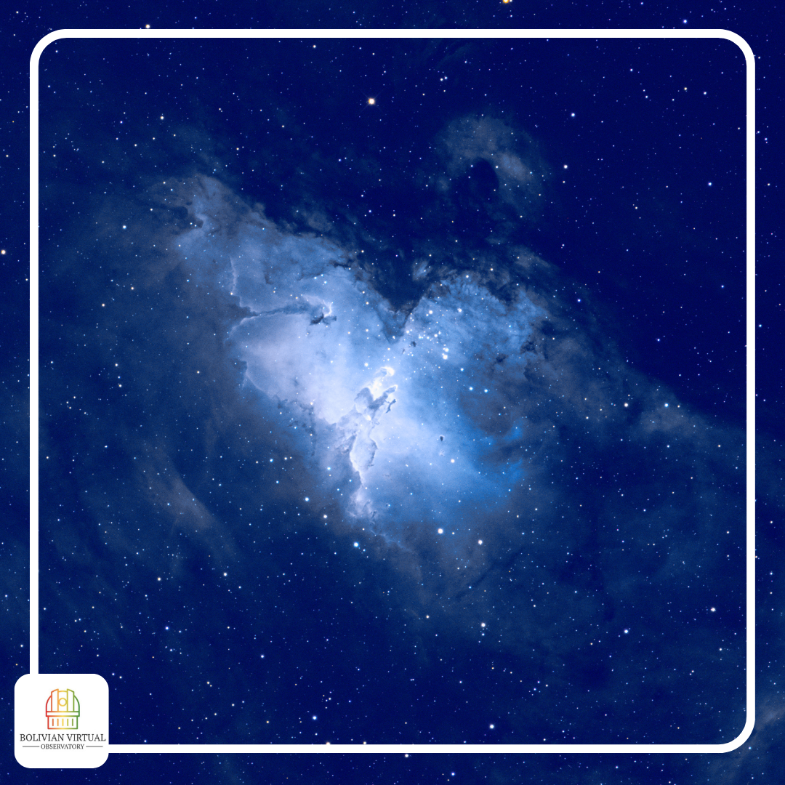
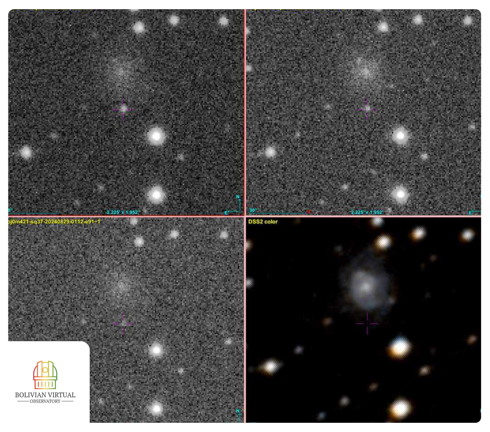

## Astrophotography Gallery

---

This repository showcases the astrophotography developed by the Bolivian Virtual Observatory project. Here, you'll find various imaging data, research findings, and visualizations that highlight our efforts in astronomical observation and photometry. We invite you to explore the collected works and contribute to the ongoing advancements in the field.

---

### PILLARS OF CREATION - M16 | EAGLE NEBULAE

---

  <strong>Acquisition Data:</strong>
  <ul>
    <li>HAlpha: 180 s</li>
    <li>OIII: 180 s</li>
    <li>SII: 180 s</li>
  </ul>

  <strong>Equipment:</strong> 0.4 PlaneWave & QHY CMOS - Las Cumbres Observatory

    <strong>Description:</strong>
  
<em>"M16, known as the Eagle Nebula, is a vast cloud of gas (mainly hydrogen) and dust located in the constellation Serpens, specifically in the region of Serpens Cauda (the tail of the Serpent), approximately 7,000 light-years away. Its diameter is estimated to be between 70 and 80 light-years. Additionally, it has an associated open cluster."</em>

---

### NGC 6523 | LAGOON NEBULA

---

  <strong>Acquisition Data:</strong>
  <ul>
    <li>HAlpha: 180 s</li>
    <li>OIII: 180 s</li>
    <li>SII: 180 s</li>
  </ul>

  <strong>Equipment:</strong> 0.4 PlaneWave & QHY CMOS - Las Cumbres Observatory

    <strong>Description:</strong>
  
<em>"The Lagoon Nebula NGC 6523 is a cloud of interstellar gas predominantly in Hydrogen alpha where some variable stars in its center modify their brightness. It is an emission nebula part of the Sagittarius constellation at a distance of 1250 Parsecs."</em>

---

### SN 2024sbx

---

  <strong>Acquisition Data:</strong>
  <ul>
    <li>gp: 120 s</li>
    <li>rp: 120 s</li>
    <li>ip: 120 s</li>
  </ul>

  <strong>Equipment:</strong> 0.4 PlaneWave & QHY CMOS - Las Cumbres Observatory

    <strong>Description:</strong>
  
<em>"The first scientific images of 2024sbx, a Type II Supernova, were obtained by the Bolivian Virtual Observatory. Three images taken through Sloan photometric filters (r, g, i) are shown, along with a fourth from the DSS catalog. In the center, the Supernova is observed with an increase in brightness, and above it, its associated galaxy."</em>

