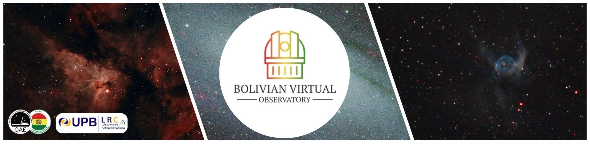

# BVO Academic Content Repository

---

This repository contains a series of educational lessons aimed at providing foundational knowledge in astronomy, particularly focused on photometry. Below are the lessons along with their descriptions and links.

**This is our YouTube channel!** You can follow us at: [Bolivian Virtual Observatory (BVO)](https://www.youtube.com/@BolivianVirtualObservatoryBVO)

## Introduction + Lesson 0
[Introduction to the Project and Basic Astronomy Concepts](https://youtu.be/PLA-RdNK7gc?si=TwBEJyUrZaXNgrgd)  
This lesson provides an overview of the project and introduces basic concepts in astronomy, laying the groundwork for further studies in photometry.  
<iframe width="560" height="315" src="https://www.youtube.com/embed/PLA-RdNK7gc" frameborder="0" allow="accelerometer; autoplay; clipboard-write; encrypted-media; gyroscope; picture-in-picture" allowfullscreen></iframe>

## Lesson 1
[What is a Supernova?](https://youtu.be/n036BpVg2vI?si=Ej90l4gRiNizs3Tz)  
In this lesson, we explore the phenomenon of supernovae, their types, and their significance in the universe.  
<iframe width="560" height="315" src="https://www.youtube.com/embed/n036BpVg2vI" frameborder="0" allow="accelerometer; autoplay; clipboard-write; encrypted-media; gyroscope; picture-in-picture" allowfullscreen></iframe>

## Lesson 2
[Inspecting FITSLIBERATOR Image Headers](https://youtu.be/F-yp5UHL_WY?si=56cX7Zz9SoQ1beX4)  
This lesson covers how to inspect the headers of astronomical images using FITSLIBERATOR, including the interpretation of metadata for image analysis.  
<iframe width="560" height="315" src="https://www.youtube.com/embed/F-yp5UHL_WY" frameborder="0" allow="accelerometer; autoplay; clipboard-write; encrypted-media; gyroscope; picture-in-picture" allowfullscreen></iframe>

## Lesson 3
[Using ALADIN for Astronomical Image Analysis](https://youtu.be/YDCUXFjihJU?si=JEZqczXxW2KCpa4f)  
This lesson focuses on the use of ALADIN, a tool for astronomical image visualization and analysis, and explains how to handle and inspect astronomical data.  
<iframe width="560" height="315" src="https://www.youtube.com/embed/YDCUXFjihJU" frameborder="0" allow="accelerometer; autoplay; clipboard-write; encrypted-media; gyroscope; picture-in-picture" allowfullscreen></iframe>

## Lesson 4
[Fundamentals of Photometry](https://youtu.be/HBD40Mj0XOI?si=aEdvR91fGOSca4NQ)  
An introduction to the fundamental principles of photometry, this lesson explains the techniques and methods used to measure the brightness of astronomical objects.  
<iframe width="560" height="315" src="https://www.youtube.com/embed/HBD40Mj0XOI" frameborder="0" allow="accelerometer; autoplay; clipboard-write; encrypted-media; gyroscope; picture-in-picture" allowfullscreen></iframe>

## Lesson 5
[Using Jupyter Notebooks, GitHub, Binder, and the Photometry Pipeline](https://youtu.be/KuxjXcB4Ecw?si=9KAPb0nTE-mHZ2W9)  
In this lesson, we demonstrate how to utilize Jupyter Notebooks for data analysis, the role of GitHub for collaboration, and how Binder can be used to create reproducible environments. Additionally, we introduce the photometry pipeline.  
<iframe width="560" height="315" src="https://www.youtube.com/embed/KuxjXcB4Ecw" frameborder="0" allow="accelerometer; autoplay; clipboard-write; encrypted-media; gyroscope; picture-in-picture" allowfullscreen></iframe>

## Lesson 6
[Astrophotography Using FITSWORK](https://youtu.be/4Y48TNFikHU?si=7gV3T4lAbGI9YCS5)  
This lesson delves into the Vizier database, a vast repository of astronomical data, and provides step-by-step instructions on how to access and interpret the information effectively.

<iframe width="560" height="315" src="https://www.youtube.com/embed/4Y48TNFikHU" frameborder="0" allow="accelerometer; autoplay; clipboard-write; encrypted-media; gyroscope; picture-in-picture" allowfullscreen></iframe>

---
